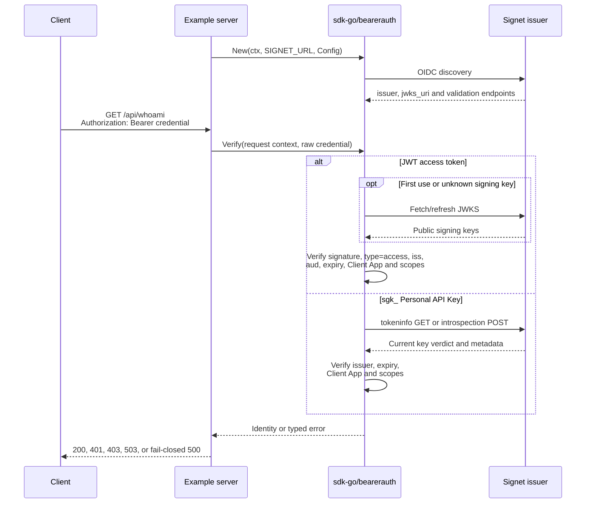

# Go Bearer Authentication — JWT + Personal API Key

This example protects one Go HTTP endpoint with
[`github.com/go-signet/sdk-go/bearerauth`](https://github.com/go-signet/sdk-go/tree/v1.1.0/bearerauth)
**v1.1.0**. The same route accepts either:

- a Signet JWT access token, verified locally against the issuer's JWKS; or
- a complete Signet Personal API Key (`sgk_…`), verified online through
  Signet's tokeninfo or introspection endpoint.

Both paths produce the same normalized `bearerauth.Identity` and must pass the
same exact issuer, Client App, and all-of scope policy. The module uses the
released GitHub dependency directly; it has no `replace` directive or
dependency on a sibling SDK checkout.

## What the package does

Construct one verifier when the service starts, then pass only the credential
value after the `Bearer` scheme to `Verify`:

```go
ctx := context.Background()
verifier, err := bearerauth.New(ctx, os.Getenv("SIGNET_URL"), bearerauth.Config{
    Audience:       os.Getenv("EXPECTED_AUDIENCE"),
    ClientID:       os.Getenv("CLIENT_ID"),
    RequiredScopes: strings.Fields(os.Getenv("REQUIRED_SCOPES")),
})
if err != nil {
    log.Fatal(err)
}

identity, err := verifier.Verify(ctx, rawCredential)
```

It classifies and verifies a raw credential, normalizes the result, applies the
shared policy, and returns one of five stable error categories. It does **not**
parse `*http.Request`, remove the `Bearer` scheme, register middleware, put an
identity in a request context, or write an HTTP response. `server/main.go`
demonstrates that framework adapter; `client/main.go` demonstrates sending the
credential without printing it.

`server/main.go` also shows audience opt-out, optional introspection
credentials, HTTP header parsing, context propagation, and complete typed-error
mapping. Build one verifier at startup and share it. `bearerauth.Verifier` is
immutable and concurrency-safe, while constructing one per request adds
discovery traffic and can trigger Signet rate limits.

## Request flow



After OIDC discovery and JWKS loading, normal JWT verification performs local
signature math and does not call tokeninfo or introspection per request. An
unknown signing key may cause a JWKS refresh. A Personal API Key is opaque and
has no signature, so every `sgk_…` request needs a current online verdict; the
SDK deliberately does not cache or coalesce those verdicts.

## Prerequisites

- Go 1.25.10 or a compatible Go 1.25+ toolchain.
- A reachable Signet issuer with OIDC discovery and asymmetric JWT signing.
- A Signet Client App whose ID, audience, and scopes you control.
- For the Personal API Key path, Signet Personal API Keys must be enabled.
- A JWT access token and/or a complete Personal API Key for manual testing.

## Project layout and endpoints

```text
go-bearerauth/
├── client/          # Sends one bounded GET with Authorization: Bearer …
├── server/          # net/http adapter around bearerauth.Verifier
├── .env.example
├── go.mod           # Pins github.com/go-signet/sdk-go v1.1.0
└── README.md
```

| Endpoint          | Authentication | Description                               |
| ----------------- | -------------- | ----------------------------------------- |
| `GET /health`     | None           | Returns `{"status":"ok"}`.                |
| `GET /api/whoami` | Bearer         | Returns the normalized verified identity. |

## Prepare Signet

### 1. Configure the Client App and policy

In Signet, create or select the Client App that callers will use:

1. Copy its exact Client ID into `CLIENT_ID`.
2. Configure the audience emitted in JWT access tokens, then copy that exact
   value into `EXPECTED_AUDIENCE`.
3. Grant every scope listed in `REQUIRED_SCOPES`. This is an **all-of** policy:
   a credential must contain every configured scope, with exact
   case-sensitive matching.
4. Keep the app active. Disabling or deleting it prevents normal new
   authorization and causes its Personal API Keys to fail their online check.
   Already-issued JWTs are verified offline and may remain valid until `exp`.

The issuer value is compared byte-for-byte. Use the issuer URL advertised by
Signet discovery for `SIGNET_URL`; a trailing-slash mismatch is significant.

### 2. Obtain a JWT access token

Use any supported Signet OAuth flow. To obtain a complete token with the
examples in this repository, use [`go-tui`](../go-tui): its `token get`
subcommand intentionally prints the raw access token, while the smaller
`go-cli`, `bash-cli`, and `go-m2m` examples mask it or consume it internally.
This block starts from the `examples/` repository root:

```bash
cd go-tui
export SIGNET_URL=https://auth.example.com
export CLIENT_ID=orders-api
export SCOPE="orders.read profile"

# Complete the interactive Auth Code or Device Code login.
go run .

# Keep the raw token in an unexported shell variable until the client runs.
JWT_ACCESS_TOKEN="$(go run . token get)"
cd ..
```

For a confidential Client App, configure `CLIENT_SECRET` as described in the
`go-tui` README. Treat the captured token as a secret and
`unset JWT_ACCESS_TOKEN` when testing is finished.

The token must be an **access token** with signed `type=access`, the configured
audience, the exact Client ID, and all required scopes. ID tokens and refresh
tokens are rejected even if they use the issuer's signing key.

### 3. Create a Personal API Key

1. Sign in to Signet and open
   `https://auth.example.com/account/api-keys`, replacing the host with
   `SIGNET_URL`.
2. Create a key, bind it to the **same Client App** used by `CLIENT_ID`, choose
   a short suitable expiry, and give it a recognizable name.
3. Copy the complete plaintext value from the one-time reveal page. It has the
   form `sgk_` plus 52 lowercase base32 characters.
4. Store it in a secret manager or the local ignored `.env` immediately. The
   plaintext cannot be recovered later; Signet stores only a hash and displays
   a shortened hint. If it is lost or exposed, revoke it and create a new one.

A Personal API Key inherits the selected Client App's scopes. It does not have
per-key scope selection, is not a JWT, and cannot be verified offline.

## Configuration

The command blocks below that begin with `cd go-bearerauth` are independent and
start from the `examples/` repository root. Copy the documented template and
edit the local copy:

```bash
cd go-bearerauth
cp .env.example .env
chmod 600 .env
```

The programs load `.env` when present. Existing process environment variables
take precedence. A populated `.env` is ignored by this repository, but still
treat it as a secret-bearing local file.

| Variable                      | Required by | Default                            | Meaning                                                            |
| ----------------------------- | ----------- | ---------------------------------- | ------------------------------------------------------------------ |
| `SIGNET_URL`                  | Server      | —                                  | Exact Signet issuer URL used for discovery and issuer policy.      |
| `CLIENT_ID`                   | Server      | —                                  | Exact Client App accepted for both JWTs and Personal API Keys.     |
| `EXPECTED_AUDIENCE`           | Server\*    | —                                  | Required JWT `aud` value.                                          |
| `SKIP_AUDIENCE_CHECK`         | Server\*    | `0`                                | Empty/`0` checks JWT audience; exactly `1` explicitly disables it. |
| `REQUIRED_SCOPES`             | Server      | empty                              | Whitespace-separated scopes; every listed scope is required.       |
| `INTROSPECTION_CLIENT_ID`     | Server      | empty                              | With the secret, switches Personal API Keys to introspection.      |
| `INTROSPECTION_CLIENT_SECRET` | Server      | empty                              | Confidential secret paired with the introspection Client ID.       |
| `SERVER_ADDR`                 | Server      | `:8080`                            | Address passed to the HTTP server.                                 |
| `API_URL`                     | Client      | `http://localhost:8080/api/whoami` | URL called by the example client.                                  |
| `BEARER_TOKEN`                | Client      | —                                  | One full JWT access token or full `sgk_…` key.                     |

\* Set a non-empty `EXPECTED_AUDIENCE` **or**
`SKIP_AUDIENCE_CHECK=1`, never both. Omitting both, setting both, or setting
only one introspection credential is a startup error. Audience opt-out weakens
service binding and should only be used when the issuer genuinely emits no
audience.

Example secure-default policy:

```dotenv
SIGNET_URL=https://auth.example.com
CLIENT_ID=orders-api
EXPECTED_AUDIENCE=api://orders
SKIP_AUDIENCE_CHECK=0
REQUIRED_SCOPES=orders.read profile
SERVER_ADDR=:8080
```

## Run the server

In terminal 1:

```bash
cd go-bearerauth
go mod download
go run ./server
```

Startup performs discovery and constructs one shared verifier. A successful
startup log looks like this (the resolved address may differ):

```text
2026/07/30 12:34:56 server listening addr=[::]:8080 personal_api_key_verification=tokeninfo
```

The mode is `introspection` when both introspection settings are present. Logs
never contain tokens, keys, or client secrets.

Check the unauthenticated endpoint:

```bash
curl -i http://localhost:8080/health
```

## Call with the Go client

Put one credential in the local `.env`:

```dotenv
# First test a JWT, then replace it with the complete sgk_ key.
BEARER_TOKEN=replace-with-one-complete-credential
```

In terminal 2:

```bash
cd go-bearerauth

# Use BEARER_TOKEN from .env:
go run ./client

# Or, if the earlier go-tui block set JWT_ACCESS_TOKEN, expose it only to this
# process instead of storing it in .env:
BEARER_TOKEN="$JWT_ACCESS_TOKEN" go run ./client
unset JWT_ACCESS_TOKEN
```

The client sends:

```http
GET /api/whoami HTTP/1.1
Authorization: Bearer <BEARER_TOKEN>
```

It has a 10-second request timeout and prints the HTTP status, a
`WWW-Authenticate` challenge when one exists, and at most 1 MiB of response
body. It refuses every redirect so the credential is sent only to `API_URL`;
a `3xx` is displayed as a non-success response. A successful run begins:

```text
Status: 200 OK
Body: {"subject":"client:orders-api",...,"credential_type":"jwt"}
```

It never intentionally prints `BEARER_TOKEN`; if a hostile server or transport
echoes the exact credential in an error, the client replaces it with
`[REDACTED]`. A body over the cap is followed by:

```text
(response body truncated to 1 MiB)
```

Non-2xx statuses return exit code 1 after safe response details are shown.
Transport failures return exit code 1 without response details. Invalid local
configuration—such as a non-HTTP(S) `API_URL`, embedded URL userinfo, or a
missing/line-broken `BEARER_TOKEN`—returns exit code 2.

## Call with curl

Read the credential without terminal echo, then feed the header to curl over
standard input. Unlike `curl -H "Authorization: Bearer $BEARER_TOKEN"`, this
keeps the expanded credential out of curl's process arguments and shell
history:

```bash
read -rsp "Bearer credential: " BEARER_TOKEN
echo

printf 'Authorization: Bearer %s\n' "$BEARER_TOKEN" \
  | curl --header @- --include http://localhost:8080/api/whoami

unset BEARER_TOKEN
```

Run the same command once with a JWT and once with the complete `sgk_…` key.
Both are accepted by the same endpoint and policy.

### JWT success

```http
HTTP/1.1 200 OK
Cache-Control: no-store
Content-Type: application/json
```

```json
{
  "subject": "client:orders-api",
  "subject_type": "client",
  "issuer": "https://auth.example.com",
  "client_id": "orders-api",
  "scopes": ["orders.read", "profile"],
  "expires_at": "2026-07-30T12:34:56Z",
  "credential_type": "jwt"
}
```

### Personal API Key success

```http
HTTP/1.1 200 OK
Cache-Control: no-store
Content-Type: application/json
```

```json
{
  "subject": "user-uuid-1234",
  "subject_type": "user",
  "issuer": "https://auth.example.com",
  "client_id": "orders-api",
  "scopes": ["orders.read", "profile"],
  "expires_at": "2026-07-30T12:34:56Z",
  "credential_type": "personal_api_key"
}
```

The values are illustrative. Scope output is de-duplicated and sorted.
Personal API Keys always normalize to `subject_type: "user"`; a JWT whose
subject is `client:<client_id>` normalizes to `"client"`.

## Identity returned to handlers

`/api/whoami` serializes only the normalized identity:

| JSON field        | Source/meaning                                                      |
| ----------------- | ------------------------------------------------------------------- |
| `subject`         | JWT `sub`, tokeninfo `user_id`, or introspection `sub`.             |
| `subject_type`    | `user`, or `client` for a JWT `client:<client_id>` subject.         |
| `issuer`          | Verified issuer after exact policy matching.                        |
| `client_id`       | Client App that owns the credential.                                |
| `scopes`          | Sorted, de-duplicated verified scopes.                              |
| `expires_at`      | Credential expiry encoded by `time.Time` as RFC 3339/RFC 3339 Nano. |
| `credential_type` | `jwt` or `personal_api_key`.                                        |

The identity deliberately contains no raw credential, audience, arbitrary JWT
claims, username, JTI, or client secret. Application handlers do not need to
branch by credential type unless their business rules intentionally differ.

## Error flows

The adapter follows RFC 6750-style challenges and fails closed:

| Condition                                                     | Status | `WWW-Authenticate`                                     |
| ------------------------------------------------------------- | -----: | ------------------------------------------------------ |
| Header missing, empty, malformed, or not Bearer               |    401 | `Bearer`                                               |
| Invalid/expired credential, wrong issuer, or wrong Client App |    401 | `Bearer error="invalid_token"`                         |
| Valid credential missing a required scope                     |    403 | `Bearer error="insufficient_scope", scope="<missing>"` |
| Online verifier cannot establish a verdict                    |    503 | Absent; retry instead of re-authenticating             |
| Unexpected adapter error or missing context identity          |    500 | Absent; fail closed                                    |

All adapter-generated auth errors have `Content-Type: application/json` and
`Cache-Control: no-store`. The Bearer scheme is matched case-insensitively, but
the request must contain exactly one `Authorization` value with exactly one
non-empty credential.

The 500 case is an adapter invariant failure rather than a credential failure.
It has no challenge and returns `{"error":"internal_server_error"}` without
exposing internal details.

### 401: missing header

```bash
curl -i http://localhost:8080/api/whoami
```

```http
HTTP/1.1 401 Unauthorized
WWW-Authenticate: Bearer
Cache-Control: no-store
Content-Type: application/json

{"error":"unauthorized"}
```

### 401: malformed or invalid credential

```bash
curl -i \
  -H "Authorization: Basic not-bearer" \
  http://localhost:8080/api/whoami

curl -i \
  -H "Authorization: Bearer not-a-valid-token" \
  http://localhost:8080/api/whoami
```

The first request gets a bare `Bearer` challenge. The second gets
`Bearer error="invalid_token"`. An expired/revoked key, invalid JWT, JWT with
the wrong `type`, untrusted issuer, and credential from another Client App are
also mapped to `401 invalid_token` without revealing which check failed.

For the second request, the Go client reports the safe response before
returning a non-zero status:

```text
Status: 401 Unauthorized
WWW-Authenticate: Bearer error="invalid_token"
Body: {"error":"unauthorized"}
error: server returned HTTP 401 Unauthorized
```

### 403: insufficient scope

Set, for example, `REQUIRED_SCOPES=orders.admin`, restart the server, and call
it with an otherwise valid credential that does not contain `orders.admin`:

```bash
read -rsp "Bearer credential: " BEARER_TOKEN
echo

printf 'Authorization: Bearer %s\n' "$BEARER_TOKEN" \
  | curl --header @- --include http://localhost:8080/api/whoami

unset BEARER_TOKEN
```

```http
HTTP/1.1 403 Forbidden
WWW-Authenticate: Bearer error="insufficient_scope", scope="orders.admin"
Cache-Control: no-store
Content-Type: application/json

{"error":"forbidden"}
```

Every configured scope is required. The challenge contains the first missing
scope from the canonical sorted policy, not data copied from the credential.

### 503: verifier unavailable

This status means the server could not establish whether an online credential
is valid. To exercise it:

1. Start this server while Signet is reachable so discovery succeeds.
2. Make Signet unreachable, or make its validation endpoint return an
   exhausted `429`/`5xx`.
3. Repeat a request with a syntactically complete Personal API Key.

```bash
read -rsp "Complete sgk_ credential: " BEARER_TOKEN
echo

printf 'Authorization: Bearer %s\n' "$BEARER_TOKEN" \
  | curl --header @- --include http://localhost:8080/api/whoami

unset BEARER_TOKEN
```

```http
HTTP/1.1 503 Service Unavailable
Retry-After: 1
Cache-Control: no-store
Content-Type: application/json

{"error":"service_unavailable"}
```

There is no `invalid_token` challenge: the verdict is unknown, so the caller
should retry with backoff instead of replacing a potentially valid credential.
`Retry-After: 1` asks the caller to wait at least one second before trying
again.
Transport errors, refused redirects, rejected introspection client
credentials, and malformed/oversized/incomplete online responses are also
unavailable failures.

Signet's tokeninfo endpoint intentionally collapses some key-validation and
store failures into `401 invalid_token`; in that mode the SDK cannot always
distinguish a server-side fault from a bad key. Use monitoring around Signet
and consider introspection when your deployment needs its RFC 7662 semantics.

## Tokeninfo versus introspection

The mode is selected once when the server starts; there is no request-time
fallback.

|                       | Default tokeninfo                  | Optional introspection                 |
| --------------------- | ---------------------------------- | -------------------------------------- |
| SDK selection         | Both introspection variables empty | Both introspection variables set       |
| Signet request        | `GET /oauth/tokeninfo`             | `POST /oauth/introspect`               |
| Key transport         | `Authorization: Bearer sgk_…`      | Form field `token=sgk_…`               |
| Client authentication | None                               | Client ID and secret                   |
| Inactive-key behavior | Uniform `401 invalid_token`        | `{"active":false}`                     |
| Ownership             | No introspection client            | Client must normally own the key's app |

To enable introspection:

```dotenv
INTROSPECTION_CLIENT_ID=orders-api
INTROSPECTION_CLIENT_SECRET=replace-with-confidential-client-secret
```

Normally `INTROSPECTION_CLIENT_ID`, `CLIENT_ID`, and the Client App selected
when creating the key identify the same app. With Signet's default ownership
gate, a different app can receive metadata-stripped `{"active":true}`. That
response cannot form a complete identity, so the SDK fails closed with
`ErrVerifierUnavailable` and this server returns 503.

Never put the introspection secret or key in a URL. The SDK's default online
client refuses redirects, caps responses, and retries transport errors, `429`,
and `5xx`; it does not retry other `4xx` responses or an inactive verdict.

## Security notes

- Use HTTPS for Signet and for this API outside local development. Bearer
  credentials grant access to whoever possesses them.
- Keep audience checking enabled. `SKIP_AUDIENCE_CHECK=1` explicitly accepts
  JWTs without binding them to this API.
- Use least-privilege scopes and short JWT/key lifetimes. All scopes in
  `REQUIRED_SCOPES` are exact, case-sensitive requirements.
- Never commit `.env`, paste credentials into source/tests, log
  `Authorization`, or include secrets in error bodies, metrics labels, URLs,
  screenshots, tickets, or shell history.
- Resolve `API_URL` directly and keep redirect refusal enabled in the example
  client; a redirect must never forward the Bearer credential elsewhere.
- A Personal API Key is shown once. Store it in a secret manager, rotate it
  before expiry, and revoke it immediately after suspected exposure.
- JWT revocation or permission changes are not visible to offline verification
  until token expiry. Personal API Key lifecycle is checked online on every
  request, subject to Signet's own cache configuration.
- Reuse one verifier per immutable policy. Create separate verifier/server
  adapters when different routes intentionally require different policies.
- The example emits no production metrics. Add credential-free counters,
  latency, tracing, and alerts around stable failure categories in a real
  service; redact headers and form bodies.

## Troubleshooting

### Server exits before listening

- `SIGNET_URL`, `CLIENT_ID`, or the audience policy is missing.
- Both `EXPECTED_AUDIENCE` and `SKIP_AUDIENCE_CHECK=1` were set.
- Only one of the two `INTROSPECTION_*` values was set.
- OIDC discovery failed, its issuer does not exactly match `SIGNET_URL`, or
  Signet returned an invalid/cross-origin introspection endpoint.
- The issuer is unreachable or rate-limiting repeated construction. Construct
  one verifier at startup and reuse it.

### A JWT gets 401

- Decode it locally and verify `type=access`, `iss`, `aud`, `client_id`, `exp`,
  and scopes. Do not paste a production token into a third-party decoder.
- Ensure `EXPECTED_AUDIENCE` matches one entry in `aud`.
- Check clock synchronization and token expiry.
- Confirm the token belongs to `CLIENT_ID`; matching issuer and signature are
  not sufficient.
- An unknown signing key may require a successful JWKS refresh.

### A Personal API Key gets 401

- Use the complete one-time plaintext, not the shortened `sgk_ab12…wxyz`
  display hint.
- Confirm the key is active, unexpired, and bound to the configured Client App.
- Confirm its owner and Client App are active and Personal API Keys are enabled
  in Signet.
- Ensure no surrounding spaces or newline were copied into `BEARER_TOKEN`.
- Revoke and recreate a key whose plaintext was lost or may have leaked.

### A credential gets 403

Compare `REQUIRED_SCOPES` with the verified Client App's scopes. Matching is
exact and case-sensitive, and all configured values are required. For a
Personal API Key, scopes follow its Client App and may be subject to Signet's
validation-cache propagation.

### A Personal API Key gets 503

- Verify network/TLS reachability from the resource server to Signet.
- Check Signet validation endpoint health, rate limits, and `5xx` responses.
- In introspection mode, confirm the client secret is current and both
  credentials belong to the key-owning Client App.
- A JWT may continue working after its JWKS is cached while `sgk_…` requests
  return 503; this is expected because only the key path requires a per-request
  online verdict.

## Verify the example

```bash
go mod tidy -diff
go mod verify
test -z "$(gofmt -l client/*.go server/*.go)"
go vet ./...
go test -race ./...
go build ./...
```

For a real Signet smoke test, run `/health`, call `/api/whoami` with a matching
JWT, call it again with a matching Personal API Key, exercise the documented
401 and 403 cases, then optionally restart in introspection mode and repeat the
key request.
