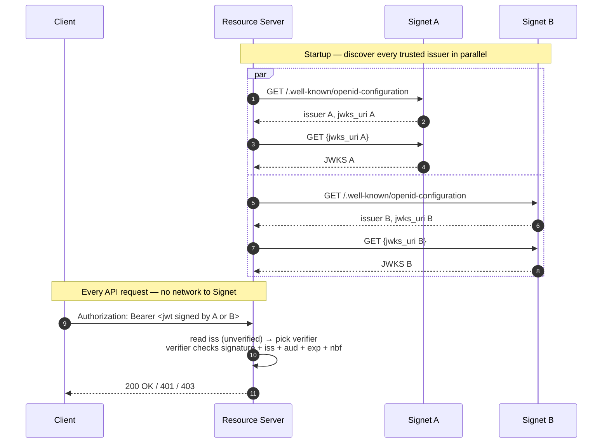

# Go Resource Server — Multi-Issuer Offline JWKS Validation

[English](README.md) | [繁體中文](README.zh-TW.md) | [简体中文](README.zh-CN.md)

Accept JWT access tokens signed by **multiple Signet instances** in a single resource server. Each issuer is discovered independently, gets its own cached JWKS, and routes are dispatched per token's `iss` claim. Per-route allowlists then enforce the **server-attested Signet claims**: `Domain` (top-level partition short code), `ServiceAccount`, and `Project` — emitted on the JWT under the configured prefix (default `extra`, so `extra_domain` / `extra_service_account` / `extra_project`).

This is the multi-issuer extension of [`../go-jwks`](../go-jwks). If you only ever need to trust **one** issuer with no claim-based routing, use that simpler example instead.

## When to Use This

| Scenario                   | Why multi-issuer helps                                                                                                               |
| -------------------------- | ------------------------------------------------------------------------------------------------------------------------------------ |
| **Multi-region**           | One Signet per region for latency / data residency; the API accepts users authenticated in any region.                             |
| **Multi-domain SaaS**      | One Signet per domain (often required for compliance or per-domain SSO); the shared API accepts tokens from any domain's Signet. |
| **Migration / cutover**    | During the move from old Signet → new Signet, both must be trusted concurrently so existing tokens don't break.                  |
| **B2B federation**         | Trust a partner organization's Signet without proxying their auth through your own.                                                |
| **Blue/green of Signet** | Run two Signet revisions side-by-side and shift traffic gradually.                                                                 |

If your scenario is just "one Signet, many resource servers", that's [go-jwks](../go-jwks) — not this.

## Flow



## Security: Why "Read `iss` Before Verifying" Is Safe

The middleware decodes the JWT payload _without verifying the signature_ to read the `iss` claim, then uses that to select which verifier to call.

This is safe because:

- `iss` is used **only to pick a verifier**, not to make a trust decision.
- The chosen verifier authoritatively re-checks `iss` against its own configured issuer, validates the RS256/ES256 signature against that issuer's JWKS, and enforces `aud`, `exp`, `nbf`.
- An attacker who claims `iss=https://auth-a.example.com` but signs the token with their own key fails signature verification — they don't have Signet A's private key.
- An attacker who claims an untrusted `iss` is rejected before any signature check.

The unverified `iss` is **never** logged back to the client (it's attacker-controlled and could be used to enumerate which issuers you trust) and never used in trust decisions.

## Trade-offs vs. Single Issuer

Same offline benefits as [go-jwks](../go-jwks): zero per-request round-trips, horizontally scalable, survives auth-server outages. Additional considerations:

- **JWKS cache per issuer** — modest memory cost (a few keys × N issuers).
- **Discovery at startup is N×** — done in parallel, but slowest issuer dominates startup time. The example bounds total discovery at 15 s.
- **Independent failure modes** — if one issuer's JWKS becomes unreachable, only that issuer's tokens fail validation; others keep working.
- **Issuer-string equality** — an issuer's `iss` must match the URL you list in `TRUSTED_ISSUERS` exactly (after OIDC discovery normalization). Trailing slashes matter.

## Prerequisites

- Go 1.25+
- Two or more Signet issuers, each with `/.well-known/openid-configuration` exposing `jwks_uri` and asymmetric (RS256 / ES256 / PS256) signing.

## Environment Variables

| Variable                   | Required | Description                                                                                                                                                                                                                                  |
| -------------------------- | -------- | -------------------------------------------------------------------------------------------------------------------------------------------------------------------------------------------------------------------------------------------- |
| `TRUSTED_ISSUERS`          | Yes      | Comma-separated list of issuer URLs. Each must match its discovery document's `issuer` field byte-for-byte. Duplicates are rejected.                                                                                                         |
| `EXPECTED_AUDIENCE`        | \*       | Required value in the `aud` claim — applied to **all** issuers. Mandatory unless `SKIP_AUDIENCE_CHECK=1` is set.                                                                                                                             |
| `SKIP_AUDIENCE_CHECK`      | \*       | Set to `1` to explicitly disable `aud` enforcement. Only for issuers that don't emit `aud` on access tokens.                                                                                                                                 |
| `ISSUER_DOMAINS`           | No       | Cross-domain defense map: `iss1=domainA,domainB;iss2=domainC,domainD`. When set, every `TRUSTED_ISSUERS` entry must appear with ≥1 domain. Domains are lower-cased. Strongly recommended in production multi-domain deployments — see below. |
| `JWT_PRIVATE_CLAIM_PREFIX` | No       | Overrides the SDK default of `extra` for the Signet server-attested claim prefix. Applied uniformly to every entry in `TRUSTED_ISSUERS`; if your fleet runs different prefixes per issuer, see "Custom-Claim Validation" below.            |

\* Exactly one of `EXPECTED_AUDIENCE` or `SKIP_AUDIENCE_CHECK=1` must be set — the server refuses to start otherwise.

## Usage

```bash
export TRUSTED_ISSUERS=https://auth-a.example.com,https://auth-b.example.com
export EXPECTED_AUDIENCE=https://api.example.com   # or SKIP_AUDIENCE_CHECK=1
go run main.go
```

Or create a `.env` file in this directory:

```bash
TRUSTED_ISSUERS=https://auth-a.example.com,https://auth-b.example.com
EXPECTED_AUDIENCE=https://api.example.com
```

The server listens on port **8089** (one off from `go-jwks`'s 8088 so you can run both side-by-side during a migration test).

## API Endpoints

| Endpoint           | Auth | Scopes  | Domain allowlist | Service-account allowlist | Project allowlist |
| ------------------ | ---- | ------- | ---------------- | ------------------------- | ----------------- |
| `GET /api/profile` | Yes  | —       | (any)            | (any)                     | (any)             |
| `GET /api/data`    | Yes  | `email` | `oa`, `hwrd`     | (any)                     | (any)             |
| `GET /api/admin`   | Yes  | —       | (any)            | `sync-bot@oa.local`       | `admin-tools`     |
| `GET /health`      | No   | —       | —                | —                         | —                 |

These rules live in `main()` as `jwksauth.AccessRule{...}` literals — replace them with values from your config service if rules need to change without a redeploy. Responses include `issuer` + `domain` so you can confirm which Signet signed the token and which domain it carries.

## Custom-Claim Validation (`Domain` / `ServiceAccount` / `Project`)

The SDK exposes the three server-attested Signet claims on
`info.Claims` and reads them from the JWT under a configurable prefix
(default `extra`):

| `info.Claims` field | Wire-level JWT key (default prefix) | Notes                                       |
| ------------------- | ----------------------------------- | ------------------------------------------- |
| `Domain`            | `extra_domain`                      | Top-level partition short code, e.g. `"oa"` |
| `ServiceAccount`    | `extra_service_account`             | OAuth-app-bound SA identifier               |
| `Project`           | `extra_project`                     | Project the OAuth app belongs to            |

Set `JWT_PRIVATE_CLAIM_PREFIX` (and pair it byte-for-byte with the
Signet server-side value) to consume tokens minted under a different
prefix — `acme_domain`, `<your-prefix>_project`, etc.

Caller-supplied JWT keys (anything else the issuer emits — e.g. a custom
`tenant` value, OIDC standard claims like `email` / `name`) surface on
`info.Claims.Extras` and are accessible via `info.Extra("tenant")`. They
are **not** part of the `AccessRule` allowlist surface or the
cross-domain pinning below; gate on them inside the handler if needed.

Per-route policy is expressed via `jwksauth.AccessRule`:

```go
mux.Handle("/api/profile", jwksauth.Middleware(mv, jwksauth.AccessRule{})(http.HandlerFunc(profileHandler))) // any valid token
mux.Handle("/api/data", jwksauth.Middleware(mv, jwksauth.AccessRule{
    Scopes:  []string{"email"},
    Domains: []string{"oa", "hwrd"},                                  // OA + HWRD domains only
})(http.HandlerFunc(dataHandler)))
mux.Handle("/api/admin", jwksauth.Middleware(mv, jwksauth.AccessRule{
    ServiceAccounts: []string{"sync-bot@oa.local"},
    Projects:        []string{"admin-tools"},
})(http.HandlerFunc(adminHandler)))
```

Semantics:

- **Empty slice = "don't check this dimension"** — let users opt in per route.
- **AND-combined** — token must pass every configured allowlist.
- **Fail-closed on missing claim** — if a route requires `Domains: []string{"oa"}` and the token carries no `extra_domain` claim (under the default prefix), the empty string isn't `"oa"` → reject. The same holds when `JWT_PRIVATE_CLAIM_PREFIX` and the token's wire-level prefix disagree.
- **Domain compares case-insensitively** — allowlist values must be lower-case, token side is folded automatically.
- **`ServiceAccount` / `Project` compared exactly** — they're treated as opaque identifiers, no normalization.
- **Reject reasons go to server log only** — clients see a generic `401 invalid_token` so allowlists aren't inferable from outside.

## Cross-Domain Defense (`ISSUER_DOMAINS`)

Short domain codes like `oa` / `hwrd` carry no DNS-style trust boundary, so a compromised Signet A could otherwise mint a token claiming `Domain=swrd` (which actually belongs to Signet B). The optional `ISSUER_DOMAINS` map pins each issuer to the domains it owns:

```bash
ISSUER_DOMAINS='https://auth-a.example.com=oa,hwrd;https://auth-b.example.com=swrd,cdomain'
```

When set, after `Verify()` succeeds, the middleware looks up the **issuer that signed the token** in this map and rejects the token if its decoded `Domain` (read from `extra_domain` under the default prefix) isn't in that issuer's allowed set. Strongly recommended for production multi-domain deployments. Properties:

- **Opt-in.** Unset → no cross-domain check (suits single-domain deploys or those where domains have natural DNS structure).
- **Strict when on.** Every `TRUSTED_ISSUERS` entry must appear in `ISSUER_DOMAINS` — a missing entry is a startup error, so a typo can't silently disable the check for one issuer.
- **Lower-cased.** Allowlist values are folded at parse time; token side is folded before lookup.
- **Operates on canonical issuer strings.** The keys must match the `issuer` field returned by each issuer's discovery document (which is what `iss` claims carry). The startup error lists the canonical strings if you typed the wrong one.

## Threat Model Summary

| Attack                                                                    | Defense in this example                                      |
| ------------------------------------------------------------------------- | ------------------------------------------------------------ |
| Forged token (no valid signature)                                         | `Verify()` signature check via cached JWKS                   |
| Token from a never-trusted issuer                                         | `iss` lookup in `multiValidator.verifiers` map               |
| Token from trusted issuer A but `iss` claims to be B                      | `Verify()` re-checks `iss` against the per-issuer verifier   |
| Token for a different audience reused against this API                    | `aud` check (`EXPECTED_AUDIENCE`)                            |
| Compromised issuer A signs a token with `Domain=swrd` (owned by issuer B) | `ISSUER_DOMAINS` cross-domain map                            |
| Valid token from `Domain=swrd` calling a route restricted to `Domain=oa`  | Per-route `jwksauth.AccessRule.Domains`                      |
| Valid SA token reused on a route requiring a different SA / project       | Per-route `jwksauth.AccessRule.ServiceAccounts` / `Projects` |
| Replay of revoked token before `exp`                                      | **Not defended** — keep access-token TTLs short (5–15 min)   |

## Testing

Two options, depending on whether you have real Signets handy.

### Option A — local fake issuers (`testissuer/`)

The [`testissuer/`](testissuer/) sub-tool spins up two fake Signets (auth-a on `:9001`, auth-b on `:9002`) with ephemeral RSA keypairs and an open `/sign` endpoint that mints arbitrary JWTs. Lets you exercise every code path including the security ones (cross-domain rejection, route policy, fail-closed on missing claims) without standing up real Signets.

```bash
# Terminal 1 — start the two fake issuers
go run ./testissuer

# Terminal 2 — start the resource server with the env block testissuer prints
TRUSTED_ISSUERS=http://127.0.0.1:9001,http://127.0.0.1:9002 \
EXPECTED_AUDIENCE=https://api.example.com \
ISSUER_DOMAINS='http://127.0.0.1:9001=oa,hwrd;http://127.0.0.1:9002=swrd,cdomain' \
go run .

# Terminal 3 — mint tokens and call the API
TOK=$(curl -s 'http://127.0.0.1:9001/sign?domain=oa&sa=sync-bot@oa.local&project=admin-tools&scope=email+profile')
curl -i -H "Authorization: Bearer $TOK" http://localhost:8089/api/profile
```

See [`testissuer/README.md`](testissuer/README.md) for the full scenario list (cross-domain attack, route policy reject, missing claims, expired tokens, etc.).

### Option B — real Signets

Use [`../go-jwks/get-token.sh`](../go-jwks/get-token.sh) twice — once per Signet — by pointing `ISSUER_URL` / `CLIENT_ID` / `CLIENT_SECRET` at each Signet in turn:

```bash
# Token from Signet A
ISSUER_URL=https://auth-a.example.com \
CLIENT_ID=app-a CLIENT_SECRET=secret-a \
  TOKEN_A=$(bash ../go-jwks/get-token.sh)

# Token from Signet B
ISSUER_URL=https://auth-b.example.com \
CLIENT_ID=app-b CLIENT_SECRET=secret-b \
  TOKEN_B=$(bash ../go-jwks/get-token.sh)

# Both should succeed against the same resource server
curl -H "Authorization: Bearer $TOKEN_A" http://localhost:8089/api/profile
curl -H "Authorization: Bearer $TOKEN_B" http://localhost:8089/api/profile
```

Note: real Signet-issued tokens carry the server-attested `Domain` / `ServiceAccount` / `Project` values your Signet populates, on the wire as `<JWT_PRIVATE_CLAIM_PREFIX>_domain` etc. — if you don't control issuance, route allowlists in `main()` may need to match what's actually in the tokens, and the resource server's prefix env var must match the Signet server's.

## How It Works

1. **Parallel discovery** — at startup, one goroutine per issuer fetches `/.well-known/openid-configuration` and caches the JWKS via `oidc.NewProvider`. Total discovery is bounded at 15 s; one slow issuer doesn't multiply startup time.
2. **Per-issuer verifier** — a `map[issuer]*oidc.IDTokenVerifier` is built once and is read-only on the hot path (no locking).
3. **Per-request routing** — the middleware decodes the JWT payload (unverified) to read `iss`, looks up the matching verifier, and calls `Verify`. The verifier authoritatively checks signature, `iss`, `aud`, `exp`, `nbf`.
4. **Cross-domain pin (optional)** — if `ISSUER_DOMAINS` is set, the validated token's decoded `Domain` (read from `extra_domain` under the default prefix, or `<JWT_PRIVATE_CLAIM_PREFIX>_domain` if overridden) is checked against the allowlist for the issuer that signed it. Stops a compromised issuer from minting tokens for a domain it doesn't own.
5. **Per-route allowlists** — `jwksauth.AccessRule` enforces required scopes plus `Domain` / `ServiceAccount` / `Project` allowlists, read from the prefixed wire-level claims. Empty slice = "don't check"; non-empty = fail-closed.
6. **Untrusted issuer / failed allowlist** → `401 invalid_token` (details logged server-side, never echoed in the response).
7. **Key rotation** — on a token carrying an unknown `kid`, the relevant issuer's JWKS is refreshed transparently.
8. **RFC 6750 errors** — `WWW-Authenticate` challenges for missing/invalid token and insufficient scope (the latter advertises the missing scope).

## Extension Points

- **Per-issuer audience.** If your Signets issue tokens with **different** `aud` values, change `buildVerifiers` to pass a per-entry audience into its own `oidc.Config`:

  ```go
  // Parse a richer config (e.g. TRUSTED_ISSUERS=iss1|aud1,iss2|aud2) and
  // construct each verifier with its own ClientID:
  provider.Verifier(&oidc.Config{ClientID: perIssuerAud})
  ```

- **Per-issuer claim policies.** `mv.IssuerDomains()` proves the pattern: the same `map[issuer][]string` shape extends to per-issuer allowed projects or service accounts.
- **Dynamic allowlists.** Replace the hard-coded `jwksauth.AccessRule` literals in `main()` with a lookup against your config service / database, and cache the result so the hot path stays allocation-free.
- **Custom private-claim prefix.** Set `JWT_PRIVATE_CLAIM_PREFIX` to whatever your Signet deployment uses; the SDK's `WithPrivateClaimPrefix` is wired through transparently. The prefix is shared across every issuer in this `MultiVerifier` — if your fleet runs different prefixes per issuer, build one `Verifier` per prefix and dispatch yourself rather than passing them all to a single `MultiVerifier`.

## Example Responses

**`GET /api/profile`** (token from Signet A, `extra_domain=oa`, `extra_service_account=sync-bot@oa.local`, `extra_project=admin-tools`):

```json
{
  "issuer": "https://auth-a.example.com",
  "subject": "user-uuid-1234",
  "client_id": "app-a",
  "audience": ["https://api.example.com"],
  "scope": "email profile",
  "domain": "oa",
  "service_account": "sync-bot@oa.local",
  "project": "admin-tools",
  "expires": "2026-04-25T12:34:56Z"
}
```

**Untrusted issuer**:

```text
HTTP/1.1 401 Unauthorized
WWW-Authenticate: Bearer error="invalid_token", error_description="invalid token"
```

(Server log: `token verification failed: untrusted issuer: iss="https://attacker.example.com"`.)

**Cross-domain violation** (token from Signet A but `extra_domain=swrd`, which only Signet B owns):

```text
HTTP/1.1 401 Unauthorized
WWW-Authenticate: Bearer error="invalid_token", error_description="invalid token"
```

(Server log: `token verification failed: issuer not permitted for this domain: iss="https://auth-a.example.com" domain="swrd" allowed=[oa hwrd]`.)

**Wrong domain for route** (`/api/data` allows `oa,hwrd` only, token has `extra_domain=swrd`):

```text
HTTP/1.1 401 Unauthorized
WWW-Authenticate: Bearer error="invalid_token", error_description="token not authorized for this resource"
```

(Server log: `policy reject: domain="swrd" not in allowlist (sub=user-... iss=https://auth-b.example.com)`.)
