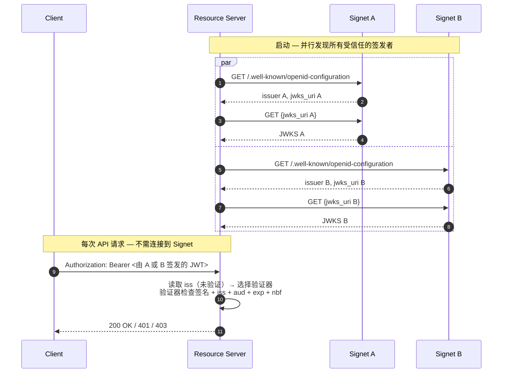

# Go 资源服务器 — 多签发者离线 JWKS 验证

[English](README.md) | [繁體中文](README.zh-TW.md) | [简体中文](README.zh-CN.md)

在单一资源服务器中接受由**多个 Signet 实例**签发的 JWT 访问令牌。每个签发者各自独立进行发现、拥有自己的 JWKS 缓存，并依据每个令牌的 `iss` claim 分派到对应的路由。接着由各路由的允许列表来强制检查**服务器端证实的 Signet claims**：`Domain`（顶层分区简码）、`ServiceAccount` 与 `Project` — 这些都会以配置的前缀（默认为 `extra`，即 `extra_domain` / `extra_service_account` / `extra_project`）发送在 JWT 内。

这是 [`../go-jwks`](../go-jwks) 的多签发者扩展版本。如果你只需要信任**单一**签发者且不需要基于 claim 进行路由，请改用较简单的示例。

## 适用场景

| 场景                  | 为何多签发者有帮助                                                                                |
| --------------------- | ------------------------------------------------------------------------------------------------- |
| **多区域**            | 出于延迟 / 数据驻留考量，每个区域配置一个 Signet；API 接受任一区域认证过的用户。                |
| **多域 SaaS**         | 每个域配置一个 Signet（往往是合规或各域 SSO 所必需）；共享 API 接受任何域 Signet 签发的令牌。 |
| **迁移 / 切换**       | 从旧 Signet 迁移到新 Signet 期间，必须同时信任两者，避免现有令牌失效。                        |
| **B2B 联邦**          | 信任合作组织的 Signet，而无须代理他们的认证流量。                                               |
| **Signet 蓝绿部署** | 同时运行两个 Signet 版本，逐步切换流量。                                                        |

如果你的场景是「一个 Signet、多个资源服务器」，那是 [go-jwks](../go-jwks) — 不是这个示例。

## 流程



## 安全性：为何「验证前先读取 `iss`」是安全的

中间件在**未验证签名**的情况下解码 JWT 载荷以读取 `iss` claim，再以此选择要调用的验证器。

这是安全的，因为：

- `iss` **仅用于选择验证器**，不参与信任决策。
- 所选验证器会权威地以其本身配置的签发者重新检查 `iss`、依该签发者的 JWKS 验证 RS256/ES256 签名，并强制检查 `aud`、`exp`、`nbf`。
- 攻击者声称 `iss=https://auth-a.example.com` 但用自己的密钥签名，会在签名验证时失败 — 他们没有 Signet A 的私钥。
- 攻击者声称未受信任的 `iss` 会在任何签名检查之前被拒绝。

未验证的 `iss` **永远不会**被回写到客户端（它由攻击者控制，可能用来枚举你信任哪些签发者），也绝不参与信任决策。

## 与单一签发者的权衡

与 [go-jwks](../go-jwks) 享有相同的离线优势：每次请求零往返、可水平扩展、即使认证服务器宕机也能存活。额外考量：

- **每个签发者一份 JWKS 缓存** — 适度的内存成本（每个签发者数把密钥 × N 个签发者）。
- **启动时的发现是 N 倍** — 并行进行，但启动时间取决于最慢的签发者。本示例将总发现时间限制为 15 秒。
- **独立的失效模式** — 若某个签发者的 JWKS 不可达，仅该签发者的令牌验证失败；其他仍正常工作。
- **签发者字符串相等比对** — 签发者的 `iss` 必须与 `TRUSTED_ISSUERS` 列出的 URL（在 OIDC 发现规范化之后）完全一致，连尾随斜杠都会影响比对。

## 先决条件

- Go 1.25+
- 两个或更多 Signet 签发者，每个都需公开 `/.well-known/openid-configuration` 并暴露 `jwks_uri`，使用非对称（RS256 / ES256 / PS256）签名。

## 环境变量

| 变量                       | 必填 | 说明                                                                                                                                                                            |
| -------------------------- | ---- | ------------------------------------------------------------------------------------------------------------------------------------------------------------------------------- |
| `TRUSTED_ISSUERS`          | 是   | 以逗号分隔的签发者 URL 列表。每个都必须与其发现文档的 `issuer` 字段逐字节相符。重复项会被拒绝。                                                                                 |
| `EXPECTED_AUDIENCE`        | \*   | `aud` claim 中所要求的值 — 适用于**所有**签发者。除非设置 `SKIP_AUDIENCE_CHECK=1`，否则为必填。                                                                                 |
| `SKIP_AUDIENCE_CHECK`      | \*   | 设为 `1` 以明确停用 `aud` 检查。仅适用于不会在访问令牌中发出 `aud` 的签发者。                                                                                                   |
| `ISSUER_DOMAINS`           | 否   | 跨域防御映射：`iss1=domainA,domainB;iss2=domainC,domainD`。设置时，每个 `TRUSTED_ISSUERS` 条目都必须出现并至少对应一个域。域会转小写。在多域生产部署中强烈建议启用 — 详见下文。 |
| `JWT_PRIVATE_CLAIM_PREFIX` | 否   | 覆盖 SDK 默认的 Signet 服务器端证实 claim 前缀 `extra`。会一致地应用到 `TRUSTED_ISSUERS` 中所有条目；若你的集群各签发者使用不同前缀，请见下文「自定义 Claim 验证」。          |

\* `EXPECTED_AUDIENCE` 或 `SKIP_AUDIENCE_CHECK=1` 必须恰好设置其中之一 — 否则服务器会拒绝启动。

## 使用方式

```bash
export TRUSTED_ISSUERS=https://auth-a.example.com,https://auth-b.example.com
export EXPECTED_AUDIENCE=https://api.example.com   # 或 SKIP_AUDIENCE_CHECK=1
go run main.go
```

或在此目录下创建 `.env`：

```bash
TRUSTED_ISSUERS=https://auth-a.example.com,https://auth-b.example.com
EXPECTED_AUDIENCE=https://api.example.com
```

服务器监听 **8089** 端口（与 `go-jwks` 的 8088 相差 1，方便你在迁移测试时让两者并行运行）。

## API 端点

| 端点               | 认证 | Scopes  | Domain 允许列表 | Service-account 允许列表 | Project 允许列表 |
| ------------------ | ---- | ------- | --------------- | ------------------------ | ---------------- |
| `GET /api/profile` | 是   | —       | （任意）        | （任意）                 | （任意）         |
| `GET /api/data`    | 是   | `email` | `oa`, `hwrd`    | （任意）                 | （任意）         |
| `GET /api/admin`   | 是   | —       | （任意）        | `sync-bot@oa.local`      | `admin-tools`    |
| `GET /health`      | 否   | —       | —               | —                        | —                |

这些规则以 `jwksauth.AccessRule{...}` 字面量的形式存在于 `main()` 中 — 若需在不重新部署的情况下变更规则，请改为从你的配置服务读取。响应中包含 `issuer` 与 `domain`，以便你确认是哪个 Signet 签发了令牌以及承载的域为何。

## 自定义 Claim 验证（`Domain` / `ServiceAccount` / `Project`）

SDK 在 `info.Claims` 上提供三个服务器端证实的 Signet claims，并以可配置的前缀（默认 `extra`）从 JWT 中读取：

| `info.Claims` 字段 | JWT 线级别的键（默认前缀） | 备注                          |
| ------------------ | -------------------------- | ----------------------------- |
| `Domain`           | `extra_domain`             | 顶层分区简码，例如 `"oa"`     |
| `ServiceAccount`   | `extra_service_account`    | 与 OAuth 应用绑定的 SA 标识符 |
| `Project`          | `extra_project`            | OAuth 应用所属的项目          |

设置 `JWT_PRIVATE_CLAIM_PREFIX`（并与 Signet 服务端值逐字节对齐），即可消费以不同前缀铸造的令牌 — 例如 `acme_domain`、`<your-prefix>_project` 等。

调用方额外提供的 JWT 键（签发者额外发出的任何字段 — 例如自定义 `tenant` 值、`email` / `name` 之类的 OIDC 标准 claims）会出现在 `info.Claims.Extras`，可通过 `info.Extra("tenant")` 访问。它们**不**属于 `AccessRule` 允许列表面，也不在下文的跨域固定范围内；若需要，请在处理函数内自行检查。

每路由策略以 `jwksauth.AccessRule` 表达：

```go
mux.Handle("/api/profile", jwksauth.Middleware(mv, jwksauth.AccessRule{})(http.HandlerFunc(profileHandler))) // 任何有效令牌
mux.Handle("/api/data", jwksauth.Middleware(mv, jwksauth.AccessRule{
    Scopes:  []string{"email"},
    Domains: []string{"oa", "hwrd"},                                  // 仅 OA 与 HWRD 域
})(http.HandlerFunc(dataHandler)))
mux.Handle("/api/admin", jwksauth.Middleware(mv, jwksauth.AccessRule{
    ServiceAccounts: []string{"sync-bot@oa.local"},
    Projects:        []string{"admin-tools"},
})(http.HandlerFunc(adminHandler)))
```

语义：

- **空切片＝「不检查此维度」** — 由各路由自行选择启用。
- **AND 组合** — 令牌必须通过所有配置过的允许列表。
- **缺失 claim 即关闭** — 若某路由要求 `Domains: []string{"oa"}` 而令牌未携带 `extra_domain` claim（在默认前缀下），空字符串不等于 `"oa"` → 拒绝。`JWT_PRIVATE_CLAIM_PREFIX` 与令牌线前缀不一致时亦同。
- **Domain 不区分大小写** — 允许列表值需为小写，令牌端会自动折叠。
- **`ServiceAccount` / `Project` 采精确比对** — 视为不透明标识符，不做任何规范化。
- **拒绝原因仅写入服务器日志** — 客户端只会看到通用的 `401 invalid_token`，避免从外部推断允许列表。

## 跨域防御（`ISSUER_DOMAINS`）

`oa` / `hwrd` 等简短域代码不具 DNS 级的信任边界，否则被入侵的 Signet A 可以铸造一个声称 `Domain=swrd`（实际属于 Signet B）的令牌。可选的 `ISSUER_DOMAINS` 映射把每个签发者固定到其拥有的域：

```bash
ISSUER_DOMAINS='https://auth-a.example.com=oa,hwrd;https://auth-b.example.com=swrd,cdomain'
```

设置后，在 `Verify()` 通过后，中间件会在此映射中查找**签发此令牌的签发者**，若解码出的 `Domain`（从默认前缀下的 `extra_domain` 读取）不在该签发者的允许集合中即拒绝。在多域生产部署中强烈建议启用。属性：

- **可选启用。** 未设置 → 不做跨域检查（适合单域部署或域已具自然 DNS 结构者）。
- **启用后即严格。** 每个 `TRUSTED_ISSUERS` 条目都必须出现在 `ISSUER_DOMAINS` 中 — 缺失为启动错误，避免拼写错误悄悄地对某签发者停用此检查。
- **转小写。** 允许列表值在解析时折叠；令牌端在查找前折叠。
- **以规范化签发者字符串运作。** 键必须与每个签发者发现文档返回的 `issuer` 字段（也就是 `iss` claim 中所携带的内容）相符。若你输入错误，启动错误会列出规范化字符串。

## 威胁模型摘要

| 攻击                                                         | 本示例的防御                                                |
| ------------------------------------------------------------ | ----------------------------------------------------------- |
| 伪造的令牌（无有效签名）                                     | `Verify()` 通过缓存的 JWKS 进行签名检查                     |
| 来自未受信任签发者的令牌                                     | 在 `multiValidator.verifiers` 映射中查找 `iss`              |
| 来自受信任签发者 A 但 `iss` 声称为 B                         | `Verify()` 以对应签发者的验证器重新检查 `iss`               |
| 不同 audience 的令牌被重用于此 API                           | `aud` 检查（`EXPECTED_AUDIENCE`）                           |
| 被入侵的签发者 A 签发 `Domain=swrd`（属签发者 B 拥有）的令牌 | `ISSUER_DOMAINS` 跨域映射                                   |
| 来自 `Domain=swrd` 的有效令牌调用限制 `Domain=oa` 的路由     | 每路由的 `jwksauth.AccessRule.Domains`                      |
| 有效的 SA 令牌被重用于需要不同 SA / 项目的路由               | 每路由的 `jwksauth.AccessRule.ServiceAccounts` / `Projects` |
| 在 `exp` 之前重放已撤销的令牌                                | **未防御** — 请将访问令牌 TTL 设短（5–15 分钟）             |

## 测试

依你是否有现成的真实 Signet，提供两种选项。

### 选项 A — 本地伪签发者（`testissuer/`）

[`testissuer/`](testissuer/) 子工具会启动两个伪 Signet（auth-a 在 `:9001`、auth-b 在 `:9002`），各使用临时 RSA 密钥对与一个开放的 `/sign` 端点来铸造任意 JWT。让你不需架设真实 Signet 就能演练每条代码路径，包含安全相关项目（跨域拒绝、路由策略、缺失 claim 即关闭等）。

```bash
# 终端 1 — 启动两个伪签发者
go run ./testissuer

# 终端 2 — 以 testissuer 打印的 env 块启动资源服务器
TRUSTED_ISSUERS=http://127.0.0.1:9001,http://127.0.0.1:9002 \
EXPECTED_AUDIENCE=https://api.example.com \
ISSUER_DOMAINS='http://127.0.0.1:9001=oa,hwrd;http://127.0.0.1:9002=swrd,cdomain' \
go run .

# 终端 3 — 铸造令牌并调用 API
TOK=$(curl -s 'http://127.0.0.1:9001/sign?domain=oa&sa=sync-bot@oa.local&project=admin-tools&scope=email+profile')
curl -i -H "Authorization: Bearer $TOK" http://localhost:8089/api/profile
```

完整场景列表（跨域攻击、路由策略拒绝、缺失 claim、过期令牌等）详见 [`testissuer/README.md`](testissuer/README.md)。

### 选项 B — 真实 Signet

使用 [`../go-jwks/get-token.sh`](../go-jwks/get-token.sh) 两次 — 每个 Signet 一次 — 将 `ISSUER_URL` / `CLIENT_ID` / `CLIENT_SECRET` 依次指向各个 Signet：

```bash
# 来自 Signet A 的令牌
ISSUER_URL=https://auth-a.example.com \
CLIENT_ID=app-a CLIENT_SECRET=secret-a \
  TOKEN_A=$(bash ../go-jwks/get-token.sh)

# 来自 Signet B 的令牌
ISSUER_URL=https://auth-b.example.com \
CLIENT_ID=app-b CLIENT_SECRET=secret-b \
  TOKEN_B=$(bash ../go-jwks/get-token.sh)

# 两者都应对同一个资源服务器成功通过
curl -H "Authorization: Bearer $TOKEN_A" http://localhost:8089/api/profile
curl -H "Authorization: Bearer $TOKEN_B" http://localhost:8089/api/profile
```

注：真实 Signet 签发的令牌会携带你 Signet 写入的服务器端证实 `Domain` / `ServiceAccount` / `Project` 值，线级别为 `<JWT_PRIVATE_CLAIM_PREFIX>_domain` 等等 — 若你不掌控签发端，`main()` 中的路由允许列表可能需与令牌实际内容对齐，且资源服务器的前缀环境变量必须与 Signet 服务端一致。

## 工作原理

1. **并行发现** — 启动时，每个签发者一个 goroutine 抓取 `/.well-known/openid-configuration` 并通过 `oidc.NewProvider` 缓存 JWKS。总发现时间限制为 15 秒；某个慢速签发者不会将启动时间放大数倍。
2. **每签发者验证器** — 一份 `map[issuer]*oidc.IDTokenVerifier` 在启动时建立完成，热路径上是只读的（无需锁）。
3. **每请求路由** — 中间件解码 JWT 载荷（未验证）以读取 `iss`，查找对应验证器并调用 `Verify`。验证器权威地检查签名、`iss`、`aud`、`exp`、`nbf`。
4. **跨域固定（可选）** — 若设置 `ISSUER_DOMAINS`，在验证通过后，会从默认前缀下的 `extra_domain`（或当覆盖时的 `<JWT_PRIVATE_CLAIM_PREFIX>_domain`）读取解码后的 `Domain`，并对照签发此令牌之签发者的允许列表。可阻止被入侵的签发者铸造其不拥有之域的令牌。
5. **每路由允许列表** — `jwksauth.AccessRule` 强制要求的 scopes 并从前缀后的线 claim 中读取 `Domain` / `ServiceAccount` / `Project` 允许列表。空切片＝「不检查」；非空＝缺失即拒绝。
6. **未受信任签发者 / 允许列表未通过** → `401 invalid_token`（细节记录于服务器端，永不在响应中回显）。
7. **密钥轮换** — 对于携带未知 `kid` 的令牌，会透明地刷新对应签发者的 JWKS。
8. **RFC 6750 错误** — 对缺失／无效令牌以及不足 scope 的情况响应 `WWW-Authenticate` 挑战（后者会公告所缺 scope）。

## 扩展点

- **每签发者 audience。** 若你的 Signet 签发的令牌具有**不同**的 `aud` 值，请修改 `buildVerifiers`，将每条目对应的 audience 传入各自的 `oidc.Config`：

  ```go
  // 解析较丰富的配置（例如 TRUSTED_ISSUERS=iss1|aud1,iss2|aud2），
  // 并以各自的 ClientID 构造各个验证器：
  provider.Verifier(&oidc.Config{ClientID: perIssuerAud})
  ```

- **每签发者 claim 策略。** `mv.IssuerDomains()` 证明了这一模式：相同的 `map[issuer][]string` 结构可延伸到每签发者允许的项目或服务帐号。
- **动态允许列表。** 将 `main()` 中硬编码的 `jwksauth.AccessRule` 字面量替换为对你的配置服务／数据库的查询，并缓存结果以保持热路径零分配。
- **自定义私有 claim 前缀。** 将 `JWT_PRIVATE_CLAIM_PREFIX` 设为你 Signet 部署所使用的值；SDK 的 `WithPrivateClaimPrefix` 已透明接通。此前缀在此 `MultiVerifier` 中所有签发者间共享 — 若你的集群各签发者使用不同前缀，请为每个前缀建立各自的 `Verifier` 并自行分派，而非全部交由单一 `MultiVerifier` 处理。

## 示例响应

**`GET /api/profile`**（来自 Signet A 的令牌，`extra_domain=oa`、`extra_service_account=sync-bot@oa.local`、`extra_project=admin-tools`）：

```json
{
  "issuer": "https://auth-a.example.com",
  "subject": "user-uuid-1234",
  "client_id": "app-a",
  "audience": ["https://api.example.com"],
  "scope": "email profile",
  "domain": "oa",
  "service_account": "sync-bot@oa.local",
  "project": "admin-tools",
  "expires": "2026-04-25T12:34:56Z"
}
```

**未受信任的签发者**：

```text
HTTP/1.1 401 Unauthorized
WWW-Authenticate: Bearer error="invalid_token", error_description="invalid token"
```

（服务器日志：`token verification failed: untrusted issuer: iss="https://attacker.example.com"`。）

**跨域违规**（来自 Signet A 但 `extra_domain=swrd`，而 swrd 仅由 Signet B 拥有）：

```text
HTTP/1.1 401 Unauthorized
WWW-Authenticate: Bearer error="invalid_token", error_description="invalid token"
```

（服务器日志：`token verification failed: issuer not permitted for this domain: iss="https://auth-a.example.com" domain="swrd" allowed=[oa hwrd]`。）

**路由的域错误**（`/api/data` 仅允许 `oa,hwrd`，但令牌带有 `extra_domain=swrd`）：

```text
HTTP/1.1 401 Unauthorized
WWW-Authenticate: Bearer error="invalid_token", error_description="token not authorized for this resource"
```

（服务器日志：`policy reject: domain="swrd" not in allowlist (sub=user-... iss=https://auth-b.example.com)`。）
