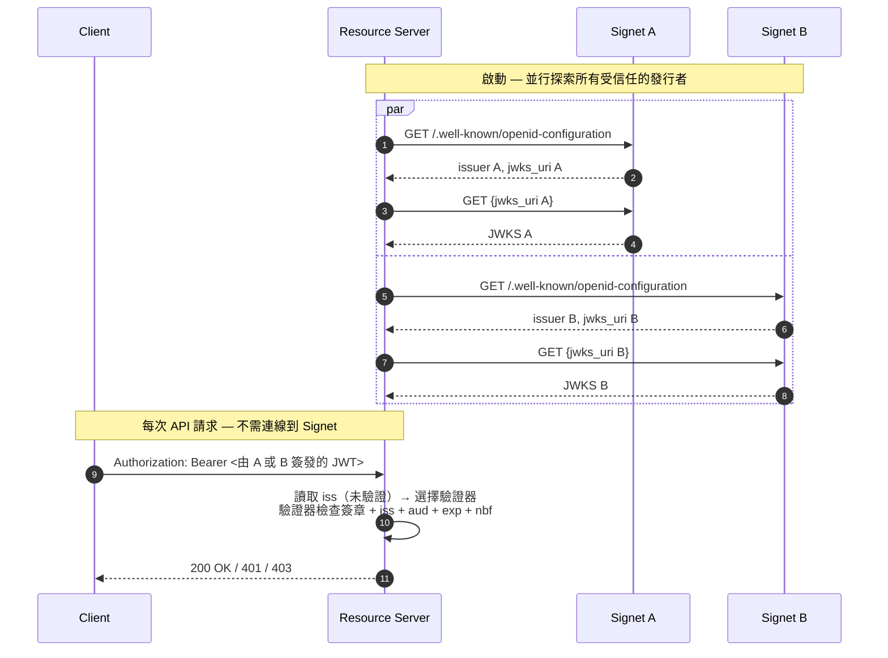

# Go 資源伺服器 — 多發行者離線 JWKS 驗證

[English](README.md) | [繁體中文](README.zh-TW.md) | [简体中文](README.zh-CN.md)

在單一資源伺服器中接受由**多個 Signet 實例**簽發的 JWT 存取權杖。每個發行者各自獨立進行探索、擁有自己的 JWKS 快取，並依據每個權杖的 `iss` claim 分派到對應的路由。接著由各路由的允許清單來強制檢查**伺服器端證實的 Signet claims**：`Domain`（頂層分區簡碼）、`ServiceAccount` 與 `Project` — 這些都會以設定的前綴（預設為 `extra`，亦即 `extra_domain` / `extra_service_account` / `extra_project`）發送在 JWT 內。

這是 [`../go-jwks`](../go-jwks) 的多發行者擴充版本。如果你只需要信任**單一**發行者且不需要以 claim 進行路由，請改用較簡單的範例。

## 適用情境

| 情境                  | 為何多發行者有幫助                                                                                      |
| --------------------- | ------------------------------------------------------------------------------------------------------- |
| **多區域**            | 為了延遲 / 資料駐留考量，每個區域配置一個 Signet；API 接受任一區域認證過的使用者。                    |
| **多網域 SaaS**       | 每個網域配置一個 Signet（往往是合規或各網域 SSO 所必需）；共用 API 接受任何網域 Signet 簽發的權杖。 |
| **遷移 / 切換**       | 從舊 Signet 遷移到新 Signet 期間，必須同時信任兩者，避免既有權杖失效。                              |
| **B2B 聯邦**          | 信任合作組織的 Signet，而無須代理他們的認證流量。                                                     |
| **Signet 藍綠部署** | 同時運行兩個 Signet 版本，逐步切換流量。                                                              |

如果你的情境是「一個 Signet、多個資源伺服器」，那是 [go-jwks](../go-jwks) — 不是這個範例。

## 流程



## 安全性：為何「驗證前先讀取 `iss`」是安全的

中介層在**未驗證簽章**的情況下解碼 JWT 載荷以讀取 `iss` claim，再以此選擇要呼叫的驗證器。

這是安全的，因為：

- `iss` **僅用於選擇驗證器**，不參與信任決策。
- 所選驗證器會權威地以其本身設定的發行者重新檢查 `iss`、依該發行者的 JWKS 驗證 RS256/ES256 簽章，並強制檢查 `aud`、`exp`、`nbf`。
- 攻擊者宣稱 `iss=https://auth-a.example.com` 但以自己的金鑰簽名，會在簽章驗證時失敗 — 他們沒有 Signet A 的私鑰。
- 攻擊者宣稱不受信任的 `iss` 會在任何簽章檢查之前被拒絕。

未驗證的 `iss` **永遠不會**被回寫到客戶端（它由攻擊者控制，可能用來枚舉你信任哪些發行者），也絕不參與信任決策。

## 與單一發行者的取捨

與 [go-jwks](../go-jwks) 享有相同的離線優勢：每次請求零來回、可水平擴展、即使認證伺服器斷線也能存活。額外考量：

- **每個發行者一份 JWKS 快取** — 適度的記憶體成本（每個發行者數把金鑰 × N 個發行者）。
- **啟動時的探索是 N 倍** — 並行進行，但啟動時間取決於最慢的發行者。本範例將總探索時間限制為 15 秒。
- **獨立的失效模式** — 若某個發行者的 JWKS 無法存取，僅該發行者的權杖驗證失敗；其他仍正常運作。
- **發行者字串相等比對** — 發行者的 `iss` 必須與 `TRUSTED_ISSUERS` 列出的 URL（在 OIDC 探索正規化之後）完全一致，連結尾斜線都會影響比對。

## 先決條件

- Go 1.25+
- 兩個或更多 Signet 發行者，每個都需公開 `/.well-known/openid-configuration` 並暴露 `jwks_uri`，使用非對稱（RS256 / ES256 / PS256）簽章。

## 環境變數

| 變數                       | 必填 | 說明                                                                                                                                                                                      |
| -------------------------- | ---- | ----------------------------------------------------------------------------------------------------------------------------------------------------------------------------------------- |
| `TRUSTED_ISSUERS`          | 是   | 以逗號分隔的發行者 URL 清單。每個都必須與其探索文件的 `issuer` 欄位逐位元組相符。重複者會被拒絕。                                                                                         |
| `EXPECTED_AUDIENCE`        | \*   | `aud` claim 中所要求的值 — 套用於**所有**發行者。除非設定 `SKIP_AUDIENCE_CHECK=1`，否則為必填。                                                                                           |
| `SKIP_AUDIENCE_CHECK`      | \*   | 設為 `1` 以明確停用 `aud` 檢查。僅適用於不會在存取權杖中發出 `aud` 的發行者。                                                                                                             |
| `ISSUER_DOMAINS`           | 否   | 跨網域防禦對應表：`iss1=domainA,domainB;iss2=domainC,domainD`。設定時，每個 `TRUSTED_ISSUERS` 條目都必須出現並至少對應一個網域。網域會轉小寫。在多網域生產部署中強烈建議啟用 — 詳見下文。 |
| `JWT_PRIVATE_CLAIM_PREFIX` | 否   | 覆蓋 SDK 預設的 Signet 伺服器端證實 claim 前綴 `extra`。會均一套用於 `TRUSTED_ISSUERS` 中所有條目；若你的服務群組各發行者使用不同前綴，請見下文「自訂 Claim 驗證」。                    |

\* `EXPECTED_AUDIENCE` 或 `SKIP_AUDIENCE_CHECK=1` 必須恰好設定其中之一 — 否則伺服器會拒絕啟動。

## 使用方式

```bash
export TRUSTED_ISSUERS=https://auth-a.example.com,https://auth-b.example.com
export EXPECTED_AUDIENCE=https://api.example.com   # 或 SKIP_AUDIENCE_CHECK=1
go run main.go
```

或在此目錄下建立 `.env`：

```bash
TRUSTED_ISSUERS=https://auth-a.example.com,https://auth-b.example.com
EXPECTED_AUDIENCE=https://api.example.com
```

伺服器監聽 **8089** 連接埠（與 `go-jwks` 的 8088 相差 1，方便你在遷移測試時讓兩者同時運行）。

## API 端點

| 端點               | 認證 | Scopes  | Domain 允許清單 | Service-account 允許清單 | Project 允許清單 |
| ------------------ | ---- | ------- | --------------- | ------------------------ | ---------------- |
| `GET /api/profile` | 是   | —       | （任意）        | （任意）                 | （任意）         |
| `GET /api/data`    | 是   | `email` | `oa`, `hwrd`    | （任意）                 | （任意）         |
| `GET /api/admin`   | 是   | —       | （任意）        | `sync-bot@oa.local`      | `admin-tools`    |
| `GET /health`      | 否   | —       | —               | —                        | —                |

這些規則以 `jwksauth.AccessRule{...}` 字面值的形式存在於 `main()` 中 — 若需在不重新部署的情況下變更規則，請改為從你的設定服務讀取。回應中包含 `issuer` 與 `domain`，以便你確認是哪個 Signet 簽發了權杖以及承載的網域為何。

## 自訂 Claim 驗證（`Domain` / `ServiceAccount` / `Project`）

SDK 在 `info.Claims` 上提供三個伺服器端證實的 Signet claims，並以可設定的前綴（預設 `extra`）從 JWT 中讀取：

| `info.Claims` 欄位 | JWT 連線層級的鍵（預設前綴） | 備註                          |
| ------------------ | ---------------------------- | ----------------------------- |
| `Domain`           | `extra_domain`               | 頂層分區簡碼，例如 `"oa"`     |
| `ServiceAccount`   | `extra_service_account`      | 與 OAuth 應用綁定的 SA 識別碼 |
| `Project`          | `extra_project`              | OAuth 應用所屬的專案          |

設定 `JWT_PRIVATE_CLAIM_PREFIX`（並與 Signet 伺服端值逐位元組對齊），即可消費以不同前綴鑄造的權杖 — 例如 `acme_domain`、`<your-prefix>_project` 等。

呼叫端額外提供的 JWT 鍵（發行者額外發出的任何欄位 — 例如自訂 `tenant` 值、`email` / `name` 之類的 OIDC 標準 claims）會出現在 `info.Claims.Extras`，可透過 `info.Extra("tenant")` 存取。它們**不**屬於 `AccessRule` 允許清單面板，也不在下文的跨網域固定範圍內；若需要，請在處理函式內自行檢查。

每路由策略以 `jwksauth.AccessRule` 表達：

```go
mux.Handle("/api/profile", jwksauth.Middleware(mv, jwksauth.AccessRule{})(http.HandlerFunc(profileHandler))) // 任何有效權杖
mux.Handle("/api/data", jwksauth.Middleware(mv, jwksauth.AccessRule{
    Scopes:  []string{"email"},
    Domains: []string{"oa", "hwrd"},                                  // 僅 OA 與 HWRD 網域
})(http.HandlerFunc(dataHandler)))
mux.Handle("/api/admin", jwksauth.Middleware(mv, jwksauth.AccessRule{
    ServiceAccounts: []string{"sync-bot@oa.local"},
    Projects:        []string{"admin-tools"},
})(http.HandlerFunc(adminHandler)))
```

語意：

- **空切片＝「不檢查此面向」** — 由各路由自行選擇加入。
- **AND 結合** — 權杖必須通過所有設定過的允許清單。
- **缺漏 claim 即關閉** — 若某路由要求 `Domains: []string{"oa"}` 而權杖未攜帶 `extra_domain` claim（在預設前綴下），空字串不等於 `"oa"` → 拒絕。`JWT_PRIVATE_CLAIM_PREFIX` 與權杖連線前綴不一致時亦同。
- **Domain 不分大小寫** — 允許清單值需為小寫，權杖端會自動折疊。
- **`ServiceAccount` / `Project` 採精確比對** — 視為不透明識別碼，不做任何正規化。
- **拒絕原因僅寫入伺服器日誌** — 客戶端只會看到通用的 `401 invalid_token`，避免從外部推斷允許清單。

## 跨網域防禦（`ISSUER_DOMAINS`）

`oa` / `hwrd` 等簡短網域代碼不具 DNS 等級的信任邊界，否則被入侵的 Signet A 可以鑄造一個宣稱 `Domain=swrd`（實際屬於 Signet B）的權杖。可選的 `ISSUER_DOMAINS` 對應表把每個發行者固定到其擁有的網域：

```bash
ISSUER_DOMAINS='https://auth-a.example.com=oa,hwrd;https://auth-b.example.com=swrd,cdomain'
```

設定後，在 `Verify()` 通過後，中介層會在此對應表中查找**簽發此權杖的發行者**，若解碼出的 `Domain`（從預設前綴下的 `extra_domain` 讀取）不在該發行者的允許集合中即拒絕。在多網域生產部署中強烈建議啟用。屬性：

- **選擇性啟用。** 未設定 → 不做跨網域檢查（適合單網域部署或網域已具自然 DNS 結構者）。
- **啟用後即嚴格。** 每個 `TRUSTED_ISSUERS` 條目都必須出現在 `ISSUER_DOMAINS` 中 — 缺漏為啟動錯誤，避免拼字錯誤悄悄地對某發行者停用此檢查。
- **轉小寫。** 允許清單值在解析時折疊；權杖端在查找前折疊。
- **以正規化的發行者字串運作。** 鍵必須與每個發行者探索文件回傳的 `issuer` 欄位（也就是 `iss` claim 中所攜帶的內容）相符。若你輸入錯誤，啟動錯誤會列出正規化字串。

## 威脅模型摘要

| 攻擊                                                         | 本範例的防禦                                                |
| ------------------------------------------------------------ | ----------------------------------------------------------- |
| 偽造的權杖（無有效簽章）                                     | `Verify()` 透過快取的 JWKS 進行簽章檢查                     |
| 來自未受信任發行者的權杖                                     | 在 `multiValidator.verifiers` 對應表中查找 `iss`            |
| 來自受信任發行者 A 但 `iss` 宣稱為 B                         | `Verify()` 以對應發行者的驗證器重新檢查 `iss`               |
| 不同 audience 的權杖被重用於此 API                           | `aud` 檢查（`EXPECTED_AUDIENCE`）                           |
| 被入侵的發行者 A 簽發 `Domain=swrd`（屬發行者 B 擁有）的權杖 | `ISSUER_DOMAINS` 跨網域對應表                               |
| 來自 `Domain=swrd` 的有效權杖呼叫限制 `Domain=oa` 的路由     | 每路由的 `jwksauth.AccessRule.Domains`                      |
| 有效的 SA 權杖被重用於需要不同 SA / 專案的路由               | 每路由的 `jwksauth.AccessRule.ServiceAccounts` / `Projects` |
| 在 `exp` 之前重放已撤銷的權杖                                | **未防禦** — 請將存取權杖 TTL 設短（5–15 分鐘）             |

## 測試

依你是否有現成的真實 Signet，提供兩種選項。

### 選項 A — 本機假發行者（`testissuer/`）

[`testissuer/`](testissuer/) 子工具會啟動兩個假 Signet（auth-a 在 `:9001`、auth-b 在 `:9002`），各使用臨時 RSA 金鑰對與一個開放的 `/sign` 端點來鑄造任意 JWT。讓你不需架設真實 Signet 就能演練每條程式路徑，包含安全相關項目（跨網域拒絕、路由策略、缺漏 claim 即關閉等）。

```bash
# 終端 1 — 啟動兩個假發行者
go run ./testissuer

# 終端 2 — 以 testissuer 印出的 env 區塊啟動資源伺服器
TRUSTED_ISSUERS=http://127.0.0.1:9001,http://127.0.0.1:9002 \
EXPECTED_AUDIENCE=https://api.example.com \
ISSUER_DOMAINS='http://127.0.0.1:9001=oa,hwrd;http://127.0.0.1:9002=swrd,cdomain' \
go run .

# 終端 3 — 鑄造權杖並呼叫 API
TOK=$(curl -s 'http://127.0.0.1:9001/sign?domain=oa&sa=sync-bot@oa.local&project=admin-tools&scope=email+profile')
curl -i -H "Authorization: Bearer $TOK" http://localhost:8089/api/profile
```

完整情境清單（跨網域攻擊、路由策略拒絕、缺漏 claim、過期權杖等）詳見 [`testissuer/README.md`](testissuer/README.md)。

### 選項 B — 真實 Signet

使用 [`../go-jwks/get-token.sh`](../go-jwks/get-token.sh) 兩次 — 每個 Signet 一次 — 將 `ISSUER_URL` / `CLIENT_ID` / `CLIENT_SECRET` 依序指到各個 Signet：

```bash
# 來自 Signet A 的權杖
ISSUER_URL=https://auth-a.example.com \
CLIENT_ID=app-a CLIENT_SECRET=secret-a \
  TOKEN_A=$(bash ../go-jwks/get-token.sh)

# 來自 Signet B 的權杖
ISSUER_URL=https://auth-b.example.com \
CLIENT_ID=app-b CLIENT_SECRET=secret-b \
  TOKEN_B=$(bash ../go-jwks/get-token.sh)

# 兩者都應對同一個資源伺服器成功通過
curl -H "Authorization: Bearer $TOKEN_A" http://localhost:8089/api/profile
curl -H "Authorization: Bearer $TOKEN_B" http://localhost:8089/api/profile
```

備註：真實 Signet 簽發的權杖會攜帶你 Signet 寫入的伺服器端證實 `Domain` / `ServiceAccount` / `Project` 值，連線層級為 `<JWT_PRIVATE_CLAIM_PREFIX>_domain` 等等 — 若你不掌控簽發端，`main()` 中的路由允許清單可能需與權杖實際內容對齊，且資源伺服器的前綴環境變數必須與 Signet 伺服端一致。

## 運作原理

1. **並行探索** — 啟動時，每個發行者一個 goroutine 抓取 `/.well-known/openid-configuration` 並透過 `oidc.NewProvider` 快取 JWKS。總探索時間限制為 15 秒；某個慢速發行者不會將啟動時間放大數倍。
2. **每發行者驗證器** — 一份 `map[issuer]*oidc.IDTokenVerifier` 在啟動時建立完成，熱路徑上是唯讀的（無需鎖）。
3. **每請求路由** — 中介層解碼 JWT 載荷（未驗證）以讀取 `iss`，查找對應驗證器並呼叫 `Verify`。驗證器權威地檢查簽章、`iss`、`aud`、`exp`、`nbf`。
4. **跨網域固定（選用）** — 若設定 `ISSUER_DOMAINS`，在驗證通過後，會從預設前綴下的 `extra_domain`（或當覆蓋時的 `<JWT_PRIVATE_CLAIM_PREFIX>_domain`）讀取解碼後的 `Domain`，並對照簽發此權杖之發行者的允許清單。可阻止被入侵的發行者鑄造其不擁有之網域的權杖。
5. **每路由允許清單** — `jwksauth.AccessRule` 強制要求的 scopes 並從前綴後的連線 claim 中讀取 `Domain` / `ServiceAccount` / `Project` 允許清單。空切片＝「不檢查」；非空＝缺漏即拒絕。
6. **未受信任發行者 / 允許清單未通過** → `401 invalid_token`（細節記錄於伺服器端，永不在回應中回顯）。
7. **金鑰輪替** — 對於攜帶未知 `kid` 的權杖，會透明地刷新對應發行者的 JWKS。
8. **RFC 6750 錯誤** — 對缺漏／無效權杖以及不足 scope 的情況回應 `WWW-Authenticate` 挑戰（後者會公告所缺 scope）。

## 擴充點

- **每發行者 audience。** 若你的 Signet 簽發的權杖具有**不同**的 `aud` 值，請修改 `buildVerifiers`，將每條目對應的 audience 傳入各自的 `oidc.Config`：

  ```go
  // 解析較豐富的設定（例如 TRUSTED_ISSUERS=iss1|aud1,iss2|aud2），
  // 並以各自的 ClientID 構造各個驗證器：
  provider.Verifier(&oidc.Config{ClientID: perIssuerAud})
  ```

- **每發行者 claim 策略。** `mv.IssuerDomains()` 證明了這個樣式：相同的 `map[issuer][]string` 結構可延伸到每發行者允許的專案或服務帳號。
- **動態允許清單。** 將 `main()` 中硬編碼的 `jwksauth.AccessRule` 字面值替換為對你的設定服務／資料庫的查詢，並快取結果以保持熱路徑零配置。
- **自訂私有 claim 前綴。** 將 `JWT_PRIVATE_CLAIM_PREFIX` 設為你 Signet 部署所使用的值；SDK 的 `WithPrivateClaimPrefix` 已透明接通。此前綴在此 `MultiVerifier` 中所有發行者間共用 — 若你的服務群組各發行者使用不同前綴，請為每個前綴建立各自的 `Verifier` 並自行分派，而非全部交由單一 `MultiVerifier` 處理。

## 範例回應

**`GET /api/profile`**（來自 Signet A 的權杖，`extra_domain=oa`、`extra_service_account=sync-bot@oa.local`、`extra_project=admin-tools`）：

```json
{
  "issuer": "https://auth-a.example.com",
  "subject": "user-uuid-1234",
  "client_id": "app-a",
  "audience": ["https://api.example.com"],
  "scope": "email profile",
  "domain": "oa",
  "service_account": "sync-bot@oa.local",
  "project": "admin-tools",
  "expires": "2026-04-25T12:34:56Z"
}
```

**未受信任的發行者**：

```text
HTTP/1.1 401 Unauthorized
WWW-Authenticate: Bearer error="invalid_token", error_description="invalid token"
```

（伺服器日誌：`token verification failed: untrusted issuer: iss="https://attacker.example.com"`。）

**跨網域違規**（來自 Signet A 但 `extra_domain=swrd`，而 swrd 僅由 Signet B 擁有）：

```text
HTTP/1.1 401 Unauthorized
WWW-Authenticate: Bearer error="invalid_token", error_description="invalid token"
```

（伺服器日誌：`token verification failed: issuer not permitted for this domain: iss="https://auth-a.example.com" domain="swrd" allowed=[oa hwrd]`。）

**路由的網域錯誤**（`/api/data` 僅允許 `oa,hwrd`，但權杖帶有 `extra_domain=swrd`）：

```text
HTTP/1.1 401 Unauthorized
WWW-Authenticate: Bearer error="invalid_token", error_description="token not authorized for this resource"
```

（伺服器日誌：`policy reject: domain="swrd" not in allowlist (sub=user-... iss=https://auth-b.example.com)`。）
