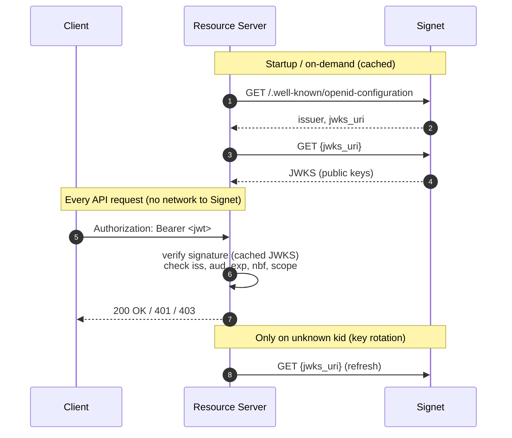

# Go Resource Server — Offline JWKS Validation

Protect HTTP endpoints by validating Signet-issued JWT access tokens **offline** using the provider's public keys (JWKS). No callback, introspection, or round-trip to Signet per request.

## Flow



## Pros & Cons of Offline JWKS Validation

### Pros

- **Zero per-request round-trips.** Verification is local signature math — microseconds, not a network call. Introspection typically adds 10–50 ms of latency plus whatever the auth server's tail looks like.
- **Horizontally scalable.** Stateless — any replica can validate any token. No sticky sessions, no cache coherence between instances.
- **Survives auth-server outages.** After the first JWKS fetch, resource servers keep validating tokens even if Signet is unreachable. Introspection-based services go down with the auth server.
- **Works at the edge.** CDNs, serverless functions, regions far from the auth server, and air-gapped networks can all validate tokens without egress.
- **No auth-server load from hot APIs.** A 10 k req/s resource server doesn't translate into 10 k req/s of introspection traffic.
- **Standard and portable.** Any OIDC provider that publishes `jwks_uri` works — you're not coupling your services to a specific vendor's introspection semantics.

### Cons

- **No immediate revocation.** A leaked, stolen, or logged-out token stays valid until its `exp`. Introspection can honor revocation within one call.
- **Requires short access-token lifetimes.** To bound the revocation window you have to set TTLs to minutes (typically 5–15) and lean on refresh tokens. Long-lived access tokens + JWKS = risk.
- **Permission changes lag.** If you demote a user or revoke a scope in the auth server, already-issued tokens still carry the old claims until they expire.
- **JWT tokens only.** Opaque (non-JWT) access tokens can't be validated offline — introspection is the only option. Some providers emit opaque tokens by default.
- **Asymmetric signing only.** HS256 (symmetric) would require sharing the signing secret with every resource server — use RS256 / ES256 / PS256.
- **Token bloat.** JWT access tokens with many claims can push the `Authorization` header past 4–8 KB, which trips some proxies and load balancers.
- **Clock-skew sensitivity.** `exp` / `nbf` are compared to each resource server's local clock. The `coreos/go-oidc` verifier gives `nbf` a 5-minute leeway but `exp` is strict — clock drift across regions can cause spurious rejects.
- **First-time-unknown-kid latency.** When the issuer rotates keys, the first request carrying the new `kid` triggers a synchronous JWKS refresh on the resource server.
- **No centralized audit trail per use.** The auth server sees token issuance but not every use; audit logs have to live at the resource-server layer.

### Common mitigations

- **Keep access-token TTLs short** (5–15 min) so the revocation-lag window is bounded.
- **Use refresh tokens** to keep the UX smooth despite short access-token lives.
- **Maintain a small revocation denylist** (e.g. `jti` set with TTL ≤ max access-token lifetime) if you need faster-than-`exp` revocation for specific incidents.
- **Hybrid: JWKS for read paths, introspection for sensitive mutations** — get latency on the hot path, get revocation on the actions that matter.

## When to Use This vs. Introspection

| Situation                                    | Prefer                                               |
| -------------------------------------------- | ---------------------------------------------------- |
| High RPS, latency-sensitive APIs             | **JWKS (this example)**                              |
| Multi-region / edge / air-gapped deployments | **JWKS (this example)**                              |
| Instant revocation required                  | Introspection ([../go-webservice](../go-webservice)) |
| Opaque (non-JWT) access tokens               | Introspection ([../go-webservice](../go-webservice)) |

## Prerequisites

- Go 1.25+
- An Signet issuer whose `/.well-known/openid-configuration` advertises `jwks_uri` and RS256 (or other asymmetric) signing.

## Environment Variables

| Variable                   | Required | Description                                                                                                                                                                                            |
| -------------------------- | -------- | ------------------------------------------------------------------------------------------------------------------------------------------------------------------------------------------------------ |
| `ISSUER_URL`               | Yes      | Signet issuer URL — must match the `iss` claim and the `issuer` field of the discovery document                                                                                                      |
| `EXPECTED_AUDIENCE`        | \*       | Required value in the `aud` claim. Mandatory unless `SKIP_AUDIENCE_CHECK=1` is set.                                                                                                                    |
| `SKIP_AUDIENCE_CHECK`      | \*       | Set to `1` to explicitly disable `aud` enforcement. Only use for issuers that don't emit `aud` on access tokens.                                                                                       |
| `JWT_PRIVATE_CLAIM_PREFIX` | No       | Overrides the SDK default of `extra` for the server-attested claim prefix. Must agree byte-for-byte with the Signet server's `JWT_PRIVATE_CLAIM_PREFIX`. Leave unset to use the default — see below. |

\* Exactly one of `EXPECTED_AUDIENCE` or `SKIP_AUDIENCE_CHECK=1` must be set — the server refuses to start otherwise, so a forgotten audience never silently disables validation.

## Server-attested private claims and the prefix

Signet emits up to three optional server-attested claims on a token —
`Domain`, `Project`, and `ServiceAccount` — under a configurable prefix
(default `extra`). The wire-level JWT keys are therefore `extra_domain`,
`extra_project`, and `extra_service_account`. The SDK reads them out of
the box; if your Signet deployment overrides `JWT_PRIVATE_CLAIM_PREFIX`,
set the same value here and the SDK will read `<prefix>_domain` etc.

Caller-supplied claims (anything else the issuer puts in the payload —
for example a custom `tenant` value) surface on `info.Claims.Extras` and
are accessible via `info.Extra("tenant")`. They are **not** part of the
`AccessRule` allowlist surface; if you need to gate on a caller-supplied
dimension, read it from `Extras` and check it inside the handler.

## Usage

```bash
export ISSUER_URL=https://auth.example.com
export EXPECTED_AUDIENCE=https://api.example.com   # or SKIP_AUDIENCE_CHECK=1
go run main.go
```

Or create a `.env` file in this directory:

```bash
ISSUER_URL=https://auth.example.com
EXPECTED_AUDIENCE=https://api.example.com
# or, for issuers that don't emit `aud` on access tokens:
# SKIP_AUDIENCE_CHECK=1
```

The server listens on port **8088**.

## API Endpoints

| Endpoint           | Auth | Scopes  | Domain allowlist | Service-account allowlist | Project allowlist |
| ------------------ | ---- | ------- | ---------------- | ------------------------- | ----------------- |
| `GET /api/profile` | Yes  | —       | (any)            | (any)                     | (any)             |
| `GET /api/data`    | Yes  | `email` | (any)            | (any)                     | (any)             |
| `GET /api/admin`   | Yes  | —       | `oa`             | `sync-bot@oa.local`       | `admin-tools`     |
| `GET /health`      | No   | —       | —                | —                         | —                 |

These rules live in `main()` as `jwksauth.AccessRule{...}` literals. The middleware enforces them with the following semantics:

- **Empty slice = "don't check this dimension"** — let routes opt in.
- **AND-combined** — token must pass every configured allowlist.
- **Fail-closed on missing claim** — if a route requires `Domains: []string{"oa"}` and the token has no `extra_domain` claim (under the default prefix), the empty string isn't `"oa"` → reject. The same holds when the configured prefix and the token's wire-level prefix disagree.
- **`Domain` compares case-insensitively** — allowlist values must be lower-case, the token side is folded automatically.
- **`service_account` / `project` compared exactly** — opaque identifiers, no normalization.
- **Reject reasons go to server log only** — clients see a generic `401 invalid_token` so allowlists aren't inferable from outside.

## Testing

### Quick path: `get-token.sh`

A tiny helper that runs the OAuth 2.0 **Client Credentials** grant and prints an access token you can paste into `curl`. Reads `ISSUER_URL` / `CLIENT_ID` / `CLIENT_SECRET` from this directory's `.env` (or the environment). Requires `curl` + `jq` (`--decode` is done in `jq`, no `base64` needed).

```bash
# Print just the access_token
TOKEN=$(bash get-token.sh)

# ...or see the full token response (useful to inspect `aud`, `scope`, `exp`)
bash get-token.sh --raw

# Decode the JWT header + payload locally (no network)
bash get-token.sh --decode

# Request specific scopes (default is "email profile")
bash get-token.sh --scope "read"

# For a self-signed Signet in development:
INSECURE=1 bash get-token.sh
```

`--decode` is handy for confirming what the resource server will actually see — `iss`, `aud`, `exp`, the granted `scope`, and the `kid` that selects the JWKS key.

### Other ways to get a token

- [`../go-cli`](../go-cli) — browser / device-code login (user token, not M2M)
- [`../go-m2m`](../go-m2m) — Go SDK version of client credentials (add `fmt.Println(tok.AccessToken)` after `ts.Token(ctx)` to print it)
- [`../bash-cli`](../bash-cli) — pure-shell device-code flow

### Calling the protected endpoints

```bash
# Any valid token
curl -H "Authorization: Bearer $TOKEN" http://localhost:8088/api/profile

# Requires "email" scope
curl -H "Authorization: Bearer $TOKEN" http://localhost:8088/api/data

# Requires domain=oa, service_account=sync-bot@oa.local, project=admin-tools
curl -H "Authorization: Bearer $TOKEN" http://localhost:8088/api/admin

# No auth
curl http://localhost:8088/health
```

## How It Works

1. **Discovery** — `oidc.NewProvider` fetches `/.well-known/openid-configuration` and verifies that the returned `issuer` matches `ISSUER_URL`. This defeats attackers who control DNS but not the issuer.
2. **JWKS cache** — `oidc.NewRemoteKeySet` lazily loads the signing keys from `jwks_uri` and automatically refreshes when a token carries an unknown `kid` (key rotation support).
3. **Per-request validation** — fully local, via `provider.Verifier(...)`:
   - RS256 signature against the cached public key (`alg=none` and HMAC-confusion attacks are rejected by the library)
   - `iss` equals `ISSUER_URL`
   - `aud` contains `EXPECTED_AUDIENCE`, or `SKIP_AUDIENCE_CHECK=1` is explicitly set (fail-closed default — the server refuses to start with `aud` validation silently disabled)
   - `exp` is strict; `nbf` has a built-in 5 min leeway
4. **Per-route allowlists** — `jwksauth.AccessRule` enforces required scopes plus `Domain` / `ServiceAccount` / `Project` allowlists, read from the prefixed wire-level claims (`extra_domain` etc. by default, `<JWT_PRIVATE_CLAIM_PREFIX>_*` if overridden). Empty slice = "don't check"; non-empty = fail-closed. Handlers may also call `info.HasScope("profile")` for finer-grained checks.
5. **RFC 6750 errors** — `401 invalid_token` / `403 insufficient_scope` responses include a proper `WWW-Authenticate` header.

## Example Responses

**`GET /api/profile`** (valid token):

```json
{
  "subject": "user-uuid-1234",
  "client_id": "your-client-id",
  "audience": ["https://api.example.com"],
  "scope": "email profile",
  "expires": "2026-04-24T12:34:56Z",
  "domain": "oa",
  "project": "admin-tools",
  "service_account": "sync-bot@oa.local",
  "extras": {
    "email": "user@example.com",
    "name": "Jane Doe"
  }
}
```

`domain` / `project` / `service_account` are `""` if Signet did not emit the corresponding `extra_*` claim on the token (or `<JWT_PRIVATE_CLAIM_PREFIX>_*` under a custom prefix). `extras` is `null` when the token carries no caller-supplied claims; otherwise it is a map of every payload key the SDK does not classify as reserved or server-attested (e.g. `email`, `name`, or any custom claim the issuer adds). The JSON field names in the response are handler-controlled — `main.go` chooses these regardless of the wire-level keys.

**`GET /api/data`** (valid token with `email` scope):

```json
{
  "message": "You have email-only access",
  "subject": "user-uuid-1234"
}
```

**`GET /api/admin`** (token with `extra_domain=oa`, `extra_service_account=sync-bot@oa.local`, `extra_project=admin-tools`):

```json
{
  "message": "admin endpoint",
  "domain": "oa",
  "service_account": "sync-bot@oa.local",
  "project": "admin-tools"
}
```

**Missing token** (no `Authorization` header):

```text
HTTP/1.1 401 Unauthorized
WWW-Authenticate: Bearer
```

RFC 6750 §3 reserves the `error` attribute for cases where credentials were supplied but rejected — a request with no credentials gets a bare challenge.

**Invalid token** (present but signature / issuer / audience / expiry fails):

```text
HTTP/1.1 401 Unauthorized
WWW-Authenticate: Bearer error="invalid_token", error_description="invalid token"
```

**Insufficient scope**:

```text
HTTP/1.1 403 Forbidden
WWW-Authenticate: Bearer error="insufficient_scope", error_description="required scope: email", scope="email"
```
