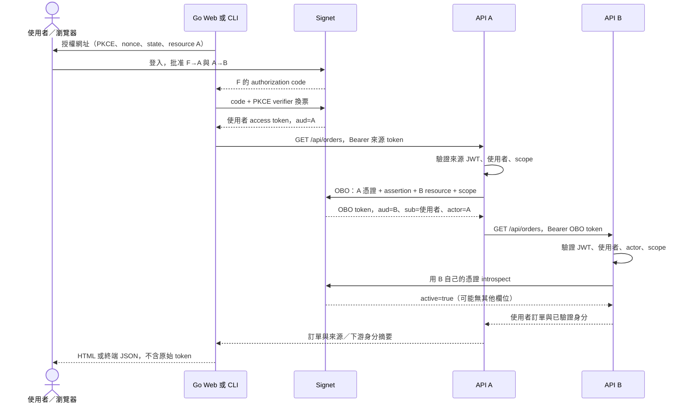

# Go On-behalf-of：Web、CLI、API A 與 API B

[English](README.md)

此範例使用 **Go 1.26+** 與
[`sdk-go v1.2.0`](https://github.com/go-signet/sdk-go/tree/v1.2.0)，示範：使用者從
Go Web 或 public Go CLI 登入，API A 用自己的憑證交換 OBO token，API B 驗證
使用者、代理 client、audience、scope 與即時有效性，再回傳該使用者的虛構訂單。

可執行主流程需要包含 [PR #66](https://github.com/go-signet/signet/pull/66) 與
[PR #81](https://github.com/go-signet/signet/pull/81) 的 Signet。兩者於 2026-09-12
合併，已核對參考 commit 為 `b7bf2f3e3ca4ebc7addca944dce46bd26462a9e6`。
使用包含此 commit 的版本，先完成 migration，並設定 RS256／ES256 簽章與公開 JWKS。
完整契約見[固定版本上游文件](https://github.com/go-signet/signet/blob/b7bf2f3e3ca4ebc7addca944dce46bd26462a9e6/docs/ON_BEHALF_OF_FLOW.md)。

## 元件與流程

| 指令                 | 角色                       | 本機位址                  | 必要憑證                        |
| -------------------- | -------------------------- | ------------------------- | ------------------------------- |
| `go run ./cmd/web`   | F-Web：Go HTML 前端／BFF   | `127.0.0.1:8090`          | Web client ID、secret           |
| `go run ./cmd/cli`   | F-CLI：public PKCE client  | callback `127.0.0.1:8093` | CLI client ID，不使用 secret    |
| `go run ./cmd/api-a` | API A：中介服務、OBO actor | `127.0.0.1:8091`          | A client ID、secret             |
| `go run ./cmd/api-b` | API B：訂單資源伺服器      | `127.0.0.1:8092`          | 獨立 B introspection ID、secret |

範例本身不需 Node、Bun、資料庫或瀏覽器 JavaScript。前端使用 Go `html/template`
與 `go:embed`。Token 只在程式記憶體，瀏覽器只有隨機 HttpOnly session cookie。
CLI 不使用 A／B secret，也不建立持久 token cache。



| 欄位             | 來源 token                              | OBO token                   |
| ---------------- | --------------------------------------- | --------------------------- |
| `sub`／`user_id` | 登入的使用者                            | 同一使用者                  |
| `client_id`      | F-Web 或 F-CLI                          | A                           |
| `aud`            | 唯一 A resource URI                     | 唯一 B resource URI         |
| Scope            | `orders.delegate.read`，以及登入 scopes | `orders.read`               |
| `act.sub`        | 無                                      | `client:<A_CLIENT_ID>`      |
| Issuer           | Signet                                  | 同一 Signet                 |
| 更新方式         | 此例重新登入取得                        | 使用有效來源 token 再次交換 |

OBO 是服務依使用者權限代為操作；Client Credentials 是應用程式以自己身分操作。
不要把 aud=A 的 token 直接交給 B、拿 ID token 存取 API，或在 OBO 被拒時改用機器
token 繞過授權。此功能是 Signet 單跳 OBO，不含 Entra/MSAL、Agent OBO 或
RFC 8693 token-exchange 請求格式。

## 1. 設定 Signet 測試環境

先完成上游 migration；範例不修改 Signet 資料庫或自動建立遠端 client／policy。
下列設定放在 **Signet 伺服器**，只填範例 `.env` 不會啟用伺服器功能：

```dotenv
OBO_ENABLED=true
OBO_POLICY_SOURCE=database
OBO_POLICIES_FILE=
OBO_COMBINED_CONSENT_ENABLED=true
LOGIN_SESSION_TRACKING_ENABLED=true
OBO_TOKEN_EXPIRATION=5m
INTROSPECTION_REQUIRE_OWNERSHIP=true
```

所有副本使用相同設定。若啟用 session tracking 前已登入，請先登出 Signet 再登入。

在 Client 管理頁建立四個 active、非 CIMD client：

| Client          | 類型／流程                        | Registered scopes             | Allowed resources           | Redirect URI                     |
| --------------- | --------------------------------- | ----------------------------- | --------------------------- | -------------------------------- |
| F-Web           | Confidential，Authorization Code  | `openid orders.delegate.read` | `https://api-a.example.com` | `http://127.0.0.1:8090/callback` |
| F-CLI           | Public，Authorization Code + PKCE | `openid orders.delegate.read` | `https://api-a.example.com` | `http://127.0.0.1:8093/callback` |
| A               | Confidential、active              | `orders.read`                 | `https://api-b.example.com` | 合併同意不需 callback            |
| B introspection | Confidential、active              | 此查詢不需 delegated scope    | 此查詢不需 token resource   | 不使用 callback                  |

若建立 client 的 UI 要求一般 grant 設定，保留合法設定；A 執行 OBO 本身不需要啟用
Client Credentials。教學初次操作先關閉 frontend 的 SkipConsent。請記錄實際 ID／secret，
不要把 F、A、B 角色代號當成實際 client ID。

B **resource** 不需要 OAuth client owner；獨立 B confidential client 用於認證
introspection。不要為取得完整 metadata 而共用 A 的 secret。

以 Signet 管理員操作：

1. `/admin/api-resources` 新增 A：URI=`https://api-a.example.com`、名稱自訂、
   **Owner／Actor Client ID 填 A 的實際 ID**、勾選 **Enabled**。
   新增 B：URI=`https://api-b.example.com`、owner 留白、勾選 Enabled。
2. 在 A 下新增 enabled scope `orders.delegate.read`；B 下新增 enabled scope
   `orders.read`。不要把 `openid` 註冊成 delegated API scope。
3. `/admin/clients/<A_CLIENT_ID>/delegations` 新增 enabled policy `orders-a-to-b`，
   inbound 選 A、target 選 B，mapping 填：

   ```text
   orders.read=orders.delegate.read
   ```

4. `/admin/clients/<WEB_CLIENT_ID>/consent-bundles` 選 inbound A、勾選 Enabled，填：

   ```text
   orders-a-to-b=orders.read
   ```

5. 在 `/admin/clients/<CLI_CLIENT_ID>/consent-bundles` 重做步驟 4。

Scope mapping 方向為「**輸出 scope = 必須具備的輸入 scopes**」，同一行輸入必須
全部滿足。Policy 不會擴張 client scopes／allowlist，也不取代使用者同意。
Resource、scope、policy、bundle 新增時都要明確勾選啟用。

兩個 frontend 發起一般 Authorization Code 請求，只有一個 `resource=A`。Bundle
由管理員設定決定，不由 OAuth 參數選擇。Signet 同意頁應顯示 F→A 與 A→B，批准後
建立獨立 grants，只發給 F 原本的 code／token，A 不需 consent callback。
**Device Flow 不會觸發合併同意**，所以 CLI 不自動降級為 Device Flow。

## 2. 設定與執行

```bash
cd go-obo
cp .env.example .env
chmod 600 .env
# 編輯 .env，填入 issuer 與四個 client 的資料。
```

環境變數優先於 `.env`，每個程式只驗證該角色需要的憑證。本機共用檔案方便教學；
獨立部署時只向各程式注入必要 secrets。

| 設定                                     | 使用者   | 預設／意義                                               |
| ---------------------------------------- | -------- | -------------------------------------------------------- |
| `SIGNET_URL`                             | 全部     | 必填，精確 issuer URL                                    |
| `WEB_CLIENT_ID`、`WEB_CLIENT_SECRET`     | Web      | 必填，機密 frontend 憑證                                 |
| `CLI_CLIENT_ID`                          | CLI      | 必填，public frontend ID，無 secret                      |
| `API_A_CLIENT_ID`                        | A、B     | A 認證／B 預期 actor                                     |
| `API_A_CLIENT_SECRET`                    | A        | 必填，OBO secret                                         |
| `API_B_CLIENT_ID`、`API_B_CLIENT_SECRET` | B        | 必填，introspection 憑證                                 |
| `API_A_AUDIENCE`、`API_B_AUDIENCE`       | 全部     | `https://api-a.example.com`、`https://api-b.example.com` |
| `API_A_URL`                              | Web、CLI | `http://127.0.0.1:8091`                                  |
| `API_B_URL`                              | A        | `http://127.0.0.1:8092`                                  |
| `WEB_ADDR`、`API_A_ADDR`、`API_B_ADDR`   | 各伺服器 | `127.0.0.1:8090`、`:8091`、`:8092`                       |
| `WEB_REDIRECT_URL`                       | Web      | `http://127.0.0.1:8090/callback`                         |
| `CLI_CALLBACK_ADDR`                      | CLI      | `127.0.0.1:8093`，固定 loopback port，路徑 `/callback`   |

Audience 是識別用 URI，**不是連線位址**，不需建立 example.com DNS／服務。
URI 精確比對，尾斜線不能只改一邊。本例拒絕含 query／fragment 的設定 URL；
discovery endpoints 必須位於 issuer origin。一般連線用 HTTPS，只有 loopback 可用 HTTP。

開啟多個終端，工作目錄都設為 `go-obo`：

```bash
# 終端 1
go run ./cmd/api-b
```

```bash
# 終端 2
go run ./cmd/api-a
```

```bash
# 終端 3
go run ./cmd/web
```

瀏覽 **http://127.0.0.1:8090/**，一致使用 `127.0.0.1`，不要混用 `localhost`。
按 **Sign in with Signet**、批准兩組同意，再按 **Call API A · Read my orders**。
CLI 使用相同 A／B：

```bash
# 終端 4
go run ./cmd/cli
```

把 CLI 網址貼到同一台電腦的瀏覽器。Callback listener 會先啟動才顯示網址。
成功後終端輸出 JSON 並退出，Ctrl+C 可取消，登入期限五分鐘。
本例不支援無法從瀏覽器連回 callback 的遠端／headless 操作。

API 存活檢查不需 token：

```bash
curl http://127.0.0.1:8091/healthz
curl http://127.0.0.1:8092/healthz
```

均回 `{"status":"ok"}`，未帶 token 的 `/api/orders` 回 401。成功 JSON 示意：

```json
{
  "source": {
    "sub": "user-alice",
    "client_id": "YOUR_FRONTEND_CLIENT_ID",
    "aud": ["https://api-a.example.com"],
    "scope": "openid orders.delegate.read",
    "expires_at": "2026-09-12T16:10:00Z"
  },
  "downstream": {
    "sub": "user-alice",
    "client_id": "YOUR_API_A_CLIENT_ID",
    "actor": "client:YOUR_API_A_CLIENT_ID",
    "aud": ["https://api-b.example.com"],
    "scope": "orders.read",
    "expires_at": "2026-09-12T16:05:00Z"
  },
  "orders": [
    {
      "id": "demo-<subject-hash>",
      "owner": "user-alice",
      "item": "Example notebook"
    }
  ],
  "demo": true
}
```

## 3. 程式導讀

| 檔案                      | 責任                                                       |
| ------------------------- | ---------------------------------------------------------- |
| `cmd/*/main.go`           | 角色設定、取消訊號、啟動                                   |
| `internal/demo/login.go`  | Discovery、PKCE/state/nonce/issuer、登入驗證、記憶體 store |
| `internal/demo/web.go`    | Session、CSRF、orders/logout、template                     |
| `internal/demo/cli.go`    | 單次 loopback callback、逾時、取消                         |
| `internal/demo/api.go`    | 來源／下游驗證、SDK OBO/introspection、使用者訂單          |
| `internal/demo/http.go`   | Origin 限制、body 限制、不追蹤 redirect、整理錯誤          |
| `internal/demo/config.go` | 各角色設定與 URL 驗證                                      |

API A 直接使用 SDK：

```go
token, err := a.oauth.ExchangeOnBehalfOf(r.Context(), oauth.OnBehalfOfRequest{
    Assertion: raw,                  // F 的已驗證 access token，aud=A
    Resource:  a.config.AudienceB,    // 可信伺服器設定
    Scopes:    []string{OutputScope}, // orders.read
})
```

`a.oauth` 用 A ID／secret 建構；SDK 將憑證放在 form body，不混用 Basic auth。
對應 HTTP 如下，換行僅供閱讀，實際由 SDK 做 form encoding：

```http
POST /oauth/token
Content-Type: application/x-www-form-urlencoded

grant_type=urn:ietf:params:oauth:grant-type:jwt-bearer
&requested_token_use=on_behalf_of
&assertion=USER_ACCESS_TOKEN_FOR_A
&resource=https%3A%2F%2Fapi-b.example.com
&scope=orders.read
&client_id=API_A_CLIENT_ID
&client_secret=API_A_CLIENT_SECRET
```

回應包含 `access_token`、`token_type`、`scope`、`expires_in`，沒有 ID／refresh token。
有效期受來源 token、A 設定與 OBO 上限共同限制，最多五分鐘。本例每次操作重新交換，
不快取 OBO token；來源到期後重新登入，不保留 refresh token。

`jwksauth.Verify` 處理簽章、issuer、audience、expiry；本例另要求 `type=access`、
唯一 audience、相同且非機器身分的 `sub`／`user_id`、scope 與 actor。
A 拒絕已有 actor 的來源；B 要求 `client_id=A`、`act.sub=client:A`。
不使用任意自訂 claims 決定權限。

B 每次請求都用 **B 自己的憑證** `Introspect`。Ownership 啟用時，跨 client 有效
回應可能只有 `{"active":true}`；身分／scope 必須來自已驗證 JWT。Inactive、逾時、
限流、伺服器錯誤、無效 JSON 均拒絕資料，不快取 active。JWKS 公鑰可以快取；
純離線驗證不能在到期前感知即時 policy／consent 撤銷。

訂單依已驗證 subject 產生，不採用 query 指定 owner。接入真實訂單服務仍需查核
資料擁有權；OAuth 同意不等於可讀別人的資料。

## 4. 測試與驗收

自動測試使用程序內 issuer fixture，但 JWT 是真正 RSA 簽章，經 HTTP discovery／
JWKS／token／introspection 與真實 SDK，涵蓋 Web session 與 CLI callback。
**不代表 Signet 管理頁或 consent 資料庫交易已驗收。**

```bash
go test ./...
go test -race ./...
go vet ./...
go build ./cmd/...
```

三類可重現契約測試：

```bash
# A→B 保留使用者、來源重複使用；模擬撤銷拒絕新交換及既有 B token。
go test ./internal/demo -run '^TestOBOEndToEnd$' -v

# 簽章合法但 audience／actor／type／scope 不符時拒絕資料。
go test ./internal/demo -run '^TestAPIBRejectsInvalidClaims$' -v

# 線上查詢失敗不放行，錯誤描述與憑證不外洩。
go test ./internal/demo -run 'TestIntrospectionFailuresDenyData|TestOAuthErrorsAreSanitized' -v
```

另測 state／nonce／issuer／PKCE、重播／過期、CSRF、兩個使用者隔離、本機登出、
CLI 取消、不追蹤 redirect 與回應大小限制。

真實 Signet 驗收請另記 commit、設定與 PASS／FAIL／NOT RUN：

1. 乾淨測試使用者分別操作 Web、CLI，確認兩組同意；source/downstream subject
   相同、B audience 正確、actor=A、order owner 是目前使用者。
2. 新使用者拒絕同意，不得建立 session 或顯示訂單。另用停用／錯誤 mapping 的
   policy 重測，OBO 不得成功。
3. 用可信 OAuth 測試工具取得 aud=A 的來源 token，工具的 F client／bundle 依前述
   註冊。在工具安全的記憶體 request console，直接用此 Bearer 呼叫 B `/api/orders`，
   預期 401。不要把 token 放在日誌、網址或 issue。本例 Web／CLI 不匯出 token；
   自動 audience 測試不需外部工具。
4. 同一工具以 A 憑證交換並保留 B token 於記憶體，確認 B 回 200。在 Signet
   `/account/authorizations` 撤銷 A→B，重送**同一顆未過期 B token**，預期 401；
   新 OBO 也被拒。另一輪停用 policy 重測，重新啟用不得復活舊 token。
5. 撤銷後 Web／CLI 都不能讀訂單，直到使用者重新互動同意。A→B grant 屬於
   user + A + B，會影響同一使用者的兩個 frontend；重新同意不復活舊 token。
   換第二位使用者確認資料隔離。

**本次尚未執行真實 Signet 登入／管理頁／撤銷再啟用驗收**，因未提供測試部署與憑證。
自動測試撤銷是模擬 inactive verdict，不是 Signet 資料庫 policy 行為的證明。

## 錯誤排查與限制

| 錯誤                                | 檢查項目                                                        |
| ----------------------------------- | --------------------------------------------------------------- |
| `unsupported_grant_type`            | 所有副本的 OBO 開關與版本                                       |
| `invalid_client`                    | A／B 憑證、active confidential client，屬伺服器設定問題         |
| `unauthorized_client`               | A 非 CIMD confidential、匹配的 enabled policy                   |
| `invalid_grant`                     | 來源期限／狀態、使用者／client 狀態、兩份 grant，不一定缺少同意 |
| `invalid_scope`                     | 輸出到輸入 mapping、client scopes、下游同意                     |
| `invalid_target`                    | B URI 精確一致、resource 啟用、A allowlist                      |
| `invalid_token`／`invalid_actor`    | JWT issuer/type/expiry/audience、使用者、A actor                |
| `insufficient_scope`                | 已驗證 token 缺少必要 scope                                     |
| `invalid_state`／`invalid_id_token` | 重新登入，檢查 cookie、PKCE、nonce、issuer                      |
| `login_required`                    | Session 不存在／過期，重新登入                                  |
| `introspection_unavailable`         | Signet 連線、B 憑證、逾時／限流                                 |

無效 token／actor 回 401，scope 不足及 OBO grant／policy 拒絕回 403，設定或上游
格式錯誤回 502，服務不可用回 503。OAuth code 與本服務 HTTP status 分開看，
例如 A 的 `invalid_client` 回 502，不應要求使用者重新登入。原始 SDK 錯誤描述／body
不外洩，OAuth 自動重試已停用。

本機登出只清除範例 session，不會登出 Signet 或撤銷 grants。再次登入可能沿用
Signet SSO；撤銷請使用 Signet 帳號授權頁。

伺服器預設 loopback，不自行提供 TLS；非本機使用需 HTTPS termination、可信 origin
與各程序獨立 secrets。Web 最多 1,000 sessions、1,000 pending logins，每分鐘清理，
屬單程序示範 store，不是多副本正式 session 儲存方案；未宣稱正式容量／效能。

## 附錄：PR #66 file policy

[`testdata/obo-policies.example.json`](testdata/obo-policies.example.json)
提供對等 file policy。替換 A client ID，掛載到 Signet 後設定：

```dotenv
OBO_ENABLED=true
OBO_POLICY_SOURCE=file
OBO_POLICIES_FILE=/etc/signet/obo-policies.json
OBO_COMBINED_CONSENT_ENABLED=false
```

File/database 互斥，file policy 在啟動時載入。這是設定參考，**不是切換 env 即可
完整跑通的相容模式**：沒有 #81 合併同意時，同一使用者須分別同意 F→A 與 A→B。
本例 A 沒有獨立 consent callback，請依上游
[獨立同意指南](https://github.com/go-signet/signet/blob/b7bf2f3e3ca4ebc7addca944dce46bd26462a9e6/internal/templates/docs/zh-TW/on-behalf-of.md)
先完成另一個互動流程。管理員 policy 或 SQL 造資料不取代使用者同意；不要把給 B
的 setup token 當 A 的 assertion，也不要在不同副本混用 policy 模式。
