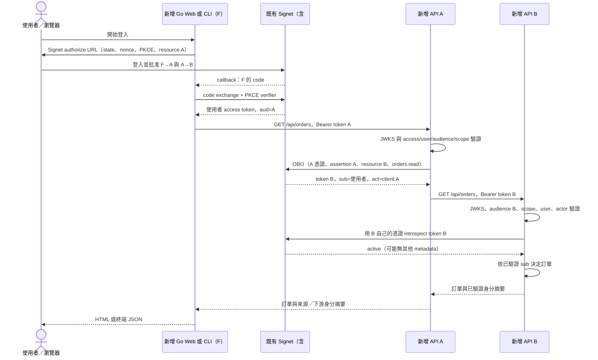

# Plan: Go On-behalf-of 完整範例

## Goal

為整合 Signet 的 Go 開發者新增可獨立執行的 `go-obo` 範例，展示使用者透過 Go Web 前端或 Go CLI 登入，取得 audience 為 API A 的 access token，再由 API A 使用自己的 confidential client 憑證交換 audience 為 API B 的 OBO token，最後由 B 驗證使用者與代理身分、執行訂單讀取授權。交付完整 Go 程式、Go template 頁面、環境設定範本、逐步管理員設定、執行指令、成功輸出與拒絕案例，以及可離線執行的整合測試。

狀態：使用者已批准計畫，Go Web + CLI、API A／B、雙語文件與自動測試已實作。真實 Signet 的人工驗收尚未執行。既有根目錄 `plan.md` 是未追蹤的 Vue SPA 計畫，因此本計畫放在 `go-obo/plan.md`，保留原檔。

## 已核對的上游契約

於 2026-09-12 透過 GitHub API 核對：

- [Signet PR #66](https://github.com/go-signet/signet/pull/66)：已合併，merge commit `7c6a91a5876088eaa25e70a242e55e24a3488b1b`，提供 single-hop OBO。
- [Signet PR #81](https://github.com/go-signet/signet/pull/81)：已合併，merge commit `b7bf2f3e3ca4ebc7addca944dce46bd26462a9e6`，提供 database policy management 與 combined consent。
- [固定版本 OBO 文件](https://github.com/go-signet/signet/blob/b7bf2f3e3ca4ebc7addca944dce46bd26462a9e6/docs/ON_BEHALF_OF_FLOW.md) 與 [繁中串接指南](https://github.com/go-signet/signet/blob/b7bf2f3e3ca4ebc7addca944dce46bd26462a9e6/internal/templates/docs/zh-TW/on-behalf-of.md)。以此版本或包含它的後續版本為主流程前提，不臆測 Signet release tag。
- [sdk-go v1.2.0](https://github.com/go-signet/sdk-go/tree/v1.2.0) 已提供 `oauth.Client.ExchangeOnBehalfOf`、`oauth.OnBehalfOfRequest`、`oauth.Client.Introspect` 與 `jwksauth.TokenInfo.Claims.Actor`。不需要修改 SDK 或本機 `replace`。

| 契約 | 範例的決定 |
| --- | --- |
| 輸入必須是 Signet 使用者 access token，只有 A 一個 audience | Web／CLI 使用 Authorization Code + PKCE，明確請求 resource A |
| OBO 需 A 的機密憑證、管理員 policy、F→A 與 A→B 兩份使用者同意 | 主流程使用 database policy 與 combined consent，設定步驟涵蓋三者 |
| combined consent 只發 F 的 code，A 不取得 code，也不需要 callback | A 只實作受保護 API 與換票，不把 A secret 交給前端 |
| Device Flow 不支援 combined consent | CLI 固定瀏覽器 Authorization Code + PKCE，不自動降級成 Device Flow |
| OBO 使用 jwt-bearer + requested_token_use=on_behalf_of | 使用 SDK；README 另外列出相同 HTTP 表單，不使用 RFC 8693 token-exchange 參數 |
| OBO 結果保留使用者 sub，client_id=A，act.sub=client:A，aud=B | 回應顯示已驗證的身分摘要，測試比較來源與下游 sub |
| OBO 不回傳 refresh／ID token，TTL 最多五分鐘且受來源期限限制 | 不快取 OBO token；每次操作交換一次，來源過期後重新登入 |
| ownership=true 時 B introspect A 的 token 只得到 active | B 先以自己的 audience 驗證 JWT claims，再用自己的機密憑證檢查 active |
| 修改／停用／重新啟用政策可能讓舊 OBO token 線上失效 | B 不快取 active=true；手動驗收測試既有 token 的撤銷效果 |
| 同意不是資料層授權 | 訂單資料依已驗證 sub 決定，不接受前端提供 owner 作為權限依據 |

## Classification: LEAF NODE

套用 classify-change 的六項判斷：

| 面向 | 判斷 |
| --- | --- |
| Q1 傳播範圍 | 新增獨立 Go module，其他範例不依賴它 |
| Q2 變動頻率 | 教學範例，以固定流程與 SDK 公開介面為主 |
| Q3 技術債 | 共用 helper 限於 go-obo/internal，不建立跨範例框架 |
| Q4 類型 | 應用層整合、Web 頁面與 CLI，僅呼叫既有認證能力 |
| Q5 失敗成本 | 限於本機示範服務與測試資料，不修改真實使用者或 Signet schema |
| Q6 驗證 | 介面與負向測試可驗收；授權判斷另外集中人工閱讀 |

建議一位熟悉 OAuth 的 reviewer 檢查範例，特別檢視 callback、JWT/actor 驗證及 secret 邊界。若實作發現需要修改 Signet／SDK 的授權核心，另列問題，不在此範例中順便修補。

## Scope

### May modify

- `go-obo/plan.md`：本計畫。
- `go-obo/go.mod`、`go-obo/go.sum`：Go 1.26、sdk-go v1.2.0，沿用 repo 既有依賴版本。
- `go-obo/cmd/web/main.go`：Go Web 啟動入口。
- `go-obo/cmd/cli/main.go`：Go CLI 登入及呼叫入口。
- `go-obo/cmd/api-a/main.go`、`go-obo/cmd/api-b/main.go`：兩個 API 啟動入口。
- `go-obo/internal/demo/`：僅本範例使用的設定、OAuth callback/session、API handlers、驗證及測試；按責任分檔，不建立通用框架。
- `go-obo/internal/demo/templates/index.html`：使用 `html/template` 與 `go:embed` 提供頁面，無需 Node/Bun 或 SPA 工具链。
- `go-obo/.env.example`、`go-obo/.gitignore`：設定與忽略本機 secrets。
- `go-obo/README.md`：英文完整操作文件，以符合現有 repo 慣例。
- `go-obo/README.zh-TW.md`：繁中完整操作文件，與英文內容一致。
- `go-obo/testdata/obo-policies.example.json`：#66 file 模式的對照設定，含明確占位符。
- 根目錄 `README.md`：Quick Reference、OBO 專節、環境設定例外與 OAuth flow 說明。
- `.github/dependabot.yml`：加入 `/go-obo` 的 gomod 項目。

### Must not modify

- 根目錄既有 `plan.md` 與使用者現有未提交內容。
- 既有 Go／Python／Vue／Kong 範例的程式與 go.mod。
- `../signet`、`../sdk-go`、Signet 核心授權、資料庫 schema、migration 或 SDK 公開介面。
- 實際 `.env`、既有憑證、使用者授權紀錄、遠端管理設定。
- 發版與 CI 流程重構；此任務不含 commit、push、PR 或部署。

## Existing patterns to follow

- `go-oidc/main.go`：OIDC discovery、state/nonce、PKCE、ID token 驗證及 net/http；複用概念，不照抄原始錯誤直接回傳的處理方式。
- `go-cli/main.go`：SDK resource 設定、以 context 傳遞取消；本例刻意不採用會自動降級 Device Flow 的高階自動登入路徑。
- `go-jwks/main.go`：`jwksauth.NewVerifier` 與必要 audience 設定。本例不提供跳過 audience 的開關。
- `go-bearerauth/server/main_test.go`：獨立可測試 handler 的風格；本例只接受 JWT 使用者 access token。
- 每個範例獨立 Go module，`godotenv.Load()` 載入本機 `.env` 且環境變數優先；`testing` 與 `httptest` 驗證行為。

## Verification（先定義可觀察結果）

三個必要端到端驗收案例均對 Web 與 CLI 的共用服務適用：

1. **成功**：同一使用者完成 combined consent；F 持有 aud=A 的 token，呼叫 A；A 換票後 B 回傳 200 與該使用者的示範訂單。來源／下游 sub 一致，B 驗證到 aud=B、client_id=A、act.sub=client:A、orders.read；回應與日誌無原始 token/secret。
2. **錯誤 audience**：把合法但 aud=A 的來源 token 直接送到 B。B 回 401，不回訂單資料；不能因 introspection 回 active=true 就放行。另測合法簽章但錯誤 actor／不足 scope，分別拒絕身分或回 403。
3. **撤銷委派**：成功取得 OBO token 後撤銷 A→B grant，或停用 policy。新交換失敗；尚未過期的舊 OBO token 再呼叫 B 也被拒絕。重新啟用 policy 或重新同意不能讓舊 token 復活。真實 Signet 的此行為需手動／選擇性整合驗收。

自動測試以 `httptest` 的 discovery/JWKS/token/introspection fixture 簽發測試 RSA JWT，啟動真正的 example handlers 與 SDK 呼叫，驗證請求及回應契約；fixture 不宣稱重現 Signet 的 policy engine、管理頁或 consent 交易。必測：

- PKCE challenge/verifier、state 不符／缺少／重播、nonce 不符、回呼 issuer 不符、使用者拒絕授權。
- 合法簽章的錯誤 issuer、過期、非 access type、多 audience、機器 subject、缺少／錯誤 actor，以及不足 scope。
- OBO 表單的五個必要欄位、A 憑證、固定 B resource 與 scope；assertion 必須是收到的來源 token。
- introspection 僅 `{active:true}` 時，授權仍由已驗證 JWT 決定；inactive、429、5xx、timeout、無效 JSON 都不得取得資料。
- 來源 token 可重複使用；B token 不被當來源重新交換；沒有 refresh／ID token 的 OBO 回應可以正常使用。
- 兩個使用者的 session/訂單隔離、登出後 session 無效、輸出與錯誤不洩漏完整憑證。

執行命令（實作完成後於 `go-obo`）：

```bash
go test ./...
go test -race ./...
go vet ./...
go build ./cmd/...
```

人工驗收使用隔離的真實 Signet：依 README 建立 clients/resources/policy/bundles，分別跑 Web、CLI、拒絕同意、撤銷及重新同意流程，記錄版本與結果。未提供測試 instance 或必要 credentials 時，明確記錄「未執行」，不能以 fixture tests 代稱驗收通過。

本範例沒有背景工作、持久 token cache 或新資料庫，不新增負载／soak 計畫；session map 的併發透過 race test 驗證。伺服器日誌僅記錄操作名稱、HTTP status、耗時與去識別的錯誤代碼，不記錄 callback query、Authorization、cookies 或 token endpoint 原始 body。

## Architecture / flow



Web 為 Go server-rendered frontend/BFF，F 的 token 存在伺服器記憶體，瀏覽器只有隨機 session cookie。CLI 是獨立 public client，只持有自身來源 token；A 的 secret 不出現在 CLI。此圖新增的每個服務均對應 `cmd` 入口，唯一既有外部服務是 Signet。

## 管理員設定與角色

主路徑設定：

```dotenv
OBO_ENABLED=true
OBO_POLICY_SOURCE=database
OBO_POLICIES_FILE=
OBO_COMBINED_CONSENT_ENABLED=true
LOGIN_SESSION_TRACKING_ENABLED=true
OBO_TOKEN_EXPIRATION=5m
INTROSPECTION_REQUIRE_OWNERSHIP=true
```

Signet 需已完成上游 migration，並提供可透過 JWKS 驗證的 RS256／ES256 簽章。README 連到上游 migration 文件，不提供操作使用者資料庫的腳本。

| 角色 | Client 類型／scope | Allowed resource | 本機設定 |
| --- | --- | --- | --- |
| F-Web | confidential；Authorization Code；openid、orders.delegate.read | `https://api-a.example.com` | callback `http://127.0.0.1:8090/callback` |
| F-CLI | public；Authorization Code + PKCE；openid、orders.delegate.read | `https://api-a.example.com` | callback `http://127.0.0.1:8093/callback` |
| A | active、confidential、非 CIMD；orders.read | `https://api-b.example.com` | API `http://127.0.0.1:8091`；不需 consent callback 或 Client Credentials grant |
| B-introspection | active、confidential，供 B 認證 introspection | 此流程不要求 token issuance resource | API `http://127.0.0.1:8092`；secret 與 A 分離 |

B resource 本身不需要 OAuth client；B-introspection client 是本例為每次在線查詢額外建立的獨立身分。API resource URI 是 audience 識別字，與本機 HTTP 呼叫地址分開，無須部署 example.com 網域。

管理頁操作必須逐步附在 README：

1. 建立上述 clients，填入精確 callback、scope 與 resource，教學先關閉 SkipConsent。
2. `/admin/api-resources`：新增 enabled A，URI 為 A audience、owner 為 A client；新增 enabled B，owner 留白。
3. A resource 新增 enabled `orders.delegate.read`；B resource 新增 enabled `orders.read`。不要把 openid 註冊成 delegated API scope。
4. A 的 `/admin/clients/<A_CLIENT_ID>/delegations` 建立 enabled policy `orders-a-to-b`，inbound A、target B，mapping `orders.read=orders.delegate.read`。
5. 分別在 F-Web 與 F-CLI 的 consent-bundles 建立 enabled bundle，inbound A，mapping `orders-a-to-b=orders.read`。
6. 使用者登入並批准兩組授權；若使用者在啟用 session tracking 前已登入，重新登入。

兩個 frontend client 各自有 bundle，使用者的 A→B grant 可共用；文件要解釋撤銷這份 grant 會影響同一使用者的 Web 與 CLI。

## Go 實作契約

### Web

- `GET /`：未登入顯示 Sign in；已登入顯示登入狀態、Call API A 與 Sign out。
- `GET /login`：建立獨立、短時效且單次消耗的 OAuth transaction，產生 state、nonce、PKCE S256。
- `GET /callback`：先核對 transaction/state，包括錯誤 callback；核對 authorization-response issuer（依 discovery 宣告要求），交換 code，驗證 ID token 簽章、iss/aud/exp/nonce 及可用的 at_hash。ID token 僅供登入，不送 API。
- `POST /orders`：CSRF 驗證後用 session 的 access token 呼叫 A，模板只顯示已驗證的摘要與業務 JSON。
- `POST /logout`：CSRF 驗證、清除本機 session/token。明示這是範例本機登出；撤銷 Signet grant 另由帳號授權頁示範。
- session 使用 crypto/rand ID、HttpOnly、SameSite=Lax cookie；HTTPS 設 Secure，HTTP 僅限 loopback 開發。記憶體 session 有容量、到期及清理機制；來源 token 到期即要求重新登入，不存 refresh token。
- 使用 `html/template` 自動 escaping；敏感頁面 `Cache-Control: no-store`、適當 Referrer-Policy，callback 完成後 redirect 去除 query。

### CLI

- `go run ./cmd/cli`：在固定 loopback callback port 建 listener，列出 authorization URL 供使用者瀏覽器開啟，完成 PKCE 登入後呼叫 A，列印訂單及 token 身分摘要。
- 使用 F-CLI public client，不使用 F-Web/A/B 的 secret。token 僅存記憶體，不加入既有 keyring/cache。
- 登入總期限五分鐘，支援 Ctrl+C 取消，成功／失敗／逾時都關閉 callback server。README 說明 headless 無瀏覽器不會自動進 Device Flow；此版本需能開登入 URL 並回到本機 callback 的環境。
- CLI callback 使用與 Web 相同的 state/PKCE/nonce/issuer 驗證責任；程式不輸出 token 或含 code 的 callback URL。

### API A

- `GET /healthz`、`GET /api/orders`，其餘路徑 404。
- 嚴格解析單一 Bearer JWT，以 `jwksauth.NewVerifier`/`Verify` 驗證；額外由已驗證 `info.IDToken.Claims` 讀取 `type`、`user_id` 等 SDK 未直接提供的欄位。
- 要求 type=access、單一 aud=A、非空的使用者 sub、user_id 與 sub 一致、非機器 subject、沒有 act、具備 orders.delegate.read。不要把來源 client_id 誤要求為 A，它是 F。
- 使用 `oauth.NewClient(A_ID, endpoints, oauth.WithClientSecret(A_SECRET))` 與 `ExchangeOnBehalfOf(ctx, oauth.OnBehalfOfRequest{Assertion: source, Resource: audienceB, Scopes: []string{"orders.read"}})`。
- target resource、scope 與 B URL 只由可信設定決定，不接受 request query 覆寫。每次請求換票一次，不建立 OBO token cache、不回傳 token 給 frontend。
- 將新 token 放在呼叫 B 的 Authorization header。B 回傳的 user subject 應與 A 驗證的來源一致。

### API B

- `GET /healthz`、`GET /api/orders`。驗證 type=access、單一 aud=B、使用者 sub/user_id、scope orders.read、client_id=A，且 `Claims.Actor.Subject == "client:" + A_ID`。
- 每個受保護請求以 B 的 confidential credentials 呼叫 `Introspect`，只有 active=true 才继续；不能要求跨 client 回應包含 sub/act/aud，也不能依未驗證 decode 取代 JWKS。
- 依已驗證 sub 回傳少量 deterministic demo orders；明確標示為虛構資料。若提供 order lookup，必須驗證 owner；第一版只需目前使用者的 list，不擴張 CRUD。
- 回應包括 user subject、actor subject、client_id、audience、scope、expiry 與 orders，不含 raw token 或任意自訂 claims。

### 共用 HTTP／錯誤處理

- 設定 HTTP client/server timeout、body/header size limit、context cancellation，SDK retry 行為應明確檢查並限制；授權錯誤不循環重試。
- token/introspection/API client 不自動跟隨可能攜帶 credentials 的 redirect；僅允許配置的 issuer/API origins，HTTPS 為一般模式、HTTP 限 loopback。
- 401：token 缺少／無效／過期／錯 audience／無效 actor；403：已驗證但 scope 不足、OBO policy/consent 拒絕；502/503：上游格式錯誤、憑證設定錯誤或不可用，沒有資料回傳。
- 區分上游 OAuth error code 與本服務 HTTP status；例如 A 的 invalid_client 不應變成要求使用者重新登入的 401。
- invalid_grant 不一律宣稱缺少同意：可能是來源失效或 identity/grant 狀態，UI 提示重新登入及檢查授權。只公開穩定錯誤代碼與經整理的提示，不透出 SDK 原始 error body。

## 設定與執行文件

`.env.example` 分段列出每個 process 真正需要的變數；本機可共用檔案，正式服務需各自注入所需設定。所有值均為占位符，不讀取或複製使用者現有 `.env`。

| 變數 | 使用者／預設 |
| --- | --- |
| SIGNET_URL | 全部，必填可信 issuer |
| WEB_CLIENT_ID、WEB_CLIENT_SECRET | Web，必填 |
| CLI_CLIENT_ID | CLI，必填 public client |
| API_A_CLIENT_ID | A 認證；B 用於 expected actor |
| API_A_CLIENT_SECRET | A，必填 |
| API_B_CLIENT_ID、API_B_CLIENT_SECRET | B introspection，必填 |
| API_A_AUDIENCE | 預設 https://api-a.example.com |
| API_B_AUDIENCE | 預設 https://api-b.example.com |
| API_A_URL | Web／CLI，預設 http://127.0.0.1:8091 |
| API_B_URL | A，預設 http://127.0.0.1:8092 |
| WEB_ADDR、API_A_ADDR、API_B_ADDR | 預設 127.0.0.1:8090／8091／8092 |
| WEB_REDIRECT_URL | 預設 http://127.0.0.1:8090/callback |
| CLI_CALLBACK_ADDR | 預設 127.0.0.1:8093；redirect 固定 /callback |

README 各自給出四個終端的執行指令：

```bash
cd go-obo
cp .env.example .env
chmod 600 .env
# 完成 Signet 管理員設定並填妥 .env 後，各開終端：
go run ./cmd/api-b
go run ./cmd/api-a
go run ./cmd/web
go run ./cmd/cli
```

文件需含：角色／token 比較表、Mermaid sequence diagram、設定管理頁的精確欄位、首次登入與同意、預期 JSON、三個验收案例、OAuth 錯誤對照、TTL／重新登入、立即撤銷與 offline 限制、M2M 與 OBO 的差異。

## #66 file 模式相容性附錄

附上有效 policy JSON，欄位為 id、actor_client_id、inbound_audience、target_resource、scope_mapping；輸出 orders.read 對應輸入 orders.delegate.read。說明 file/database 互斥、file policy 啟動時載入，主流程需要 #81。

只部署 #66 或停用 combined consent 時，必須以同一使用者分別完成 F→A 與 A→B 的互動同意。附錄連結上游完整獨立 consent 流程，明示此版 example 的 A 沒有獨立 consent callback，因此不是僅切 env 就能全自動跑的相容模式。不使用假的 grant、SQL 造同意、機器 token 或把 aud=B 的 setup token 作為 OBO assertion。

## 實作順序

1. 建立獨立 module、設定範本與 validation fixture；先驗證 SDK 與 JWT claim 讀取契約。
2. 實作 B 的驗證／introspection／demo orders，完成 audience、actor 與 inactive 的負向測試。
3. 實作 A 的來源驗證／OBO exchange／B 呼叫，完成交換表單、權限拒絕與使用者隔離測試。
4. 實作 Web session/callback/template，完成登入與 CSRF 測試。
5. 實作 CLI PKCE callback/cancellation，複用已測試的 OAuth 協定與 A client。
6. 補齊雙語 README、管理設定與驗收指南，更新根 README 和 Dependabot。
7. 執行本 module 的 test/race/vet/build；有隔離環境時執行真實 Signet 驗收並留下結果。

## Done definition

- [x] 四個 Go entrypoints 可以依 README 獨立執行，不需要修改其他 repo 或未發版 SDK。
- [x] Web 與 CLI 共用 A／B，Authorization Code／PKCE 與 OBO 路徑已由 HTTP fixture 驗證；真實 combined consent 畫面待人工驗收。
- [x] 完整說明 frontend client、actor client、resource audience、使用者 sub 的差別。
- [x] 三項 E2E 必要案例有可重現步驟；fixture 與真實 Signet 結果分開記錄。
- [x] test、race、vet、build 通過；JWT/type/aud/actor/線上撤銷檢查不可省略。
- [x] 不向 browser/CLI 暴露 A/B secrets，不回傳／記錄原始 token。
- [x] 雙語文件、環境範本與根目錄索引完成。
- [x] 變更僅在允許範圍；原始根目錄 plan.md 保留。

## Risks & rollback

- 風險：缺少 combined consent bundle、scope mapping 方向填反或 audience 的尾斜線不同，都會造成換票失敗；README 以固定表格和具體失敗案例降低設定歧義。
- 風險：SDK verifier 驗證簽章和標準 claims 不等於完整 access-token/OBO policy，需本範例補上 type、single audience、user 與 actor 的明確檢查。
- 風險：introspection 不可用即拒絕操作，因此可用性取決於 Signet；不以 cache 或 app-only token 繞過。
- 限制：記憶體 session、loopback HTTP 與虛構訂單是本機教學配置，未涵蓋多副本 session store 或正式部署。
- 回滾：移除新範例、root README 新增段落與 Dependabot 項目即可；此任務不更動 Signet schema 或遠端 policy/grant，亦不執行任何撤銷操作。

## Open questions / approval

- 已確認展示範圍：Go Web 前後端 + Go CLI，四個 entrypoints 共用 A／B。
- 採 #81 database + combined consent 作為可執行主路徑；#66 file mode 為文件附錄，是否需要第二套完整獨立 consent callback 可另列後續需求。
- 真實 Signet 驗收 instance 與 credentials 尚未提供，不影響離線 fixture 開發與測試。
- 使用者已明確批准實作；本機 fixture 已驗證 Web／CLI → A → B，未執行遠端管理設定、發布或部署。

## Implementation verification

- 實作日期：2026-09-12；使用 sdk-go v1.2.0，無本機 replace。
- `go test ./...`、`go test -race ./...`、`go vet ./...`、`go build ./cmd/...`：通過。
- 本環境的預設 Go cache 不可寫，因此檢查時使用 `GOPATH=/tmp/signet-obo-go`、`GOMODCACHE=/tmp/signet-obo-go/pkg/mod`、`GOCACHE=/tmp/signet-obo-build`，未修改全域 Go 設定。
- 重要補強：以完整、大小受限的 JSON 文件檢查阻擋 `active=true` 後接垃圾內容；SDK 不做自動 OAuth 重試，也不追蹤攜帶憑證的 redirect。
- HTTP fixture 使用 RSA/JWKS 和真實 SDK，包含 Web／CLI callback、state/nonce/issuer/PKCE、CSRF、session 隔離、OBO、actor/audience/scope、inactive／逾時／429／5xx，以及 token／secret 不外洩。
- 真實 Signet 的合併同意、policy 停用／重新啟用與舊 token 不復活：**NOT RUN**，需要隔離測試部署及操作憑證。README 已提供人工驗收步驟，不以 fixture 取代上游資料庫行為的證明。
