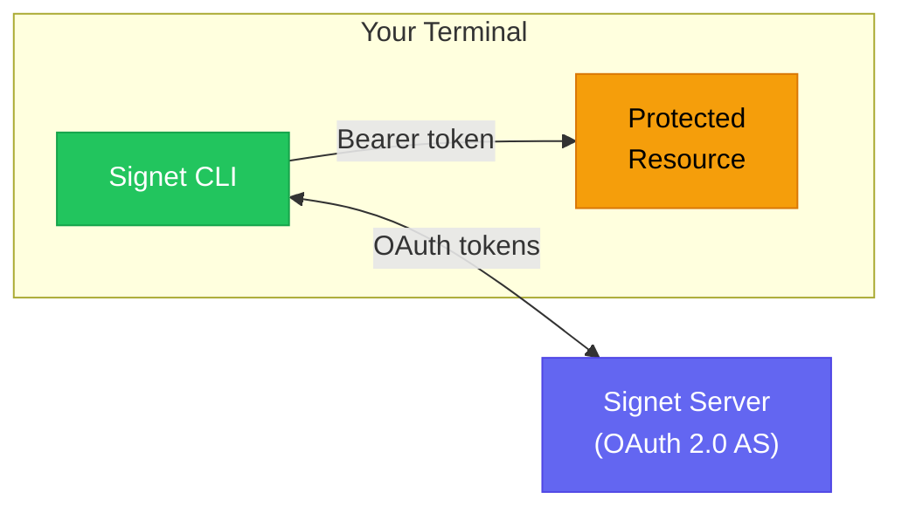
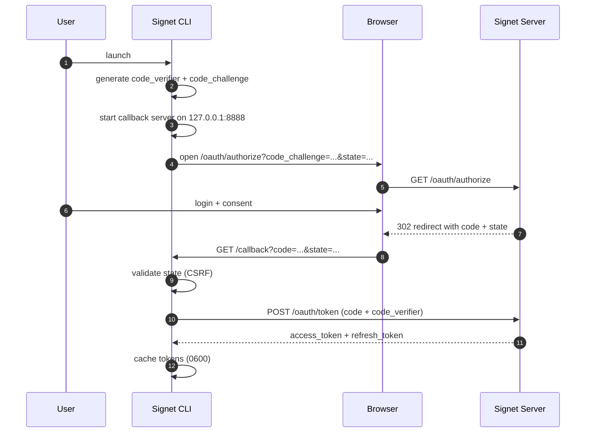
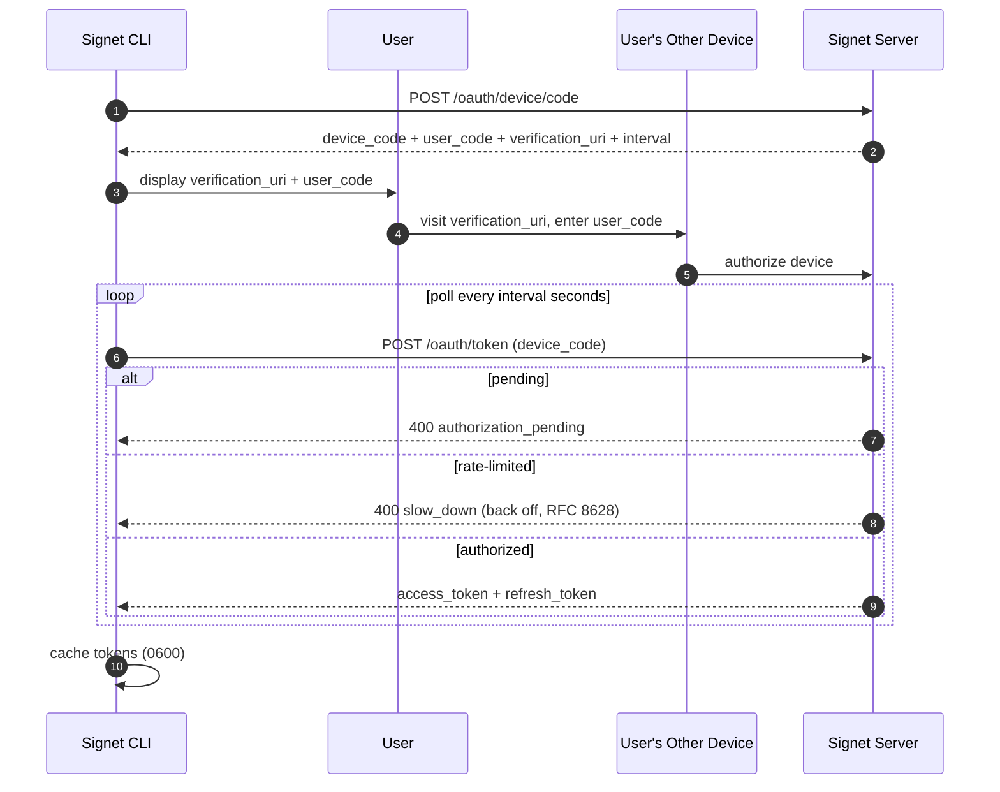

# Signet CLI (go-tui)

**A production-ready OAuth 2.0 CLI authentication reference for Go.**

> **How is this different from [go-cli](../go-cli/)?** `go-cli` is the minimal (~80-line) introduction to CLI login with the Signet SDK; `go-tui` is the full production-grade version — interactive TUI progress display, `token` subcommands, encrypted token cache with file locking, and automatic PKCE/Device Flow selection. Start with `go-cli` to learn the flow, use `go-tui` as the blueprint for a real CLI tool.

Building OAuth 2.0 into a CLI tool means solving the same problems every time: detecting whether a browser is available, implementing PKCE correctly, running a local callback server, caching tokens, handling refresh, and gracefully falling back to a headless device flow for SSH/CI environments. Signet CLI handles all of this so you can focus on your application logic.

This mirrors the authentication strategy used by **GitHub CLI**, **Azure CLI**, and **Google Cloud SDK** — automatically selecting between Authorization Code Flow with PKCE (browser) and Device Authorization Grant (headless/SSH) based on the runtime environment, with no manual configuration required.

---

## Table of Contents

- [Why This CLI?](#why-this-cli)
- [Quick Start](#quick-start)
- [How It Works](#how-it-works)
- [Interactive Terminal UI](#interactive-terminal-ui)
- [Configuration](#configuration)
- [Authentication Flows](#authentication-flows)
- [Token Storage](#token-storage)
- [Token Subcommands](#token-subcommands)
- [Troubleshooting](#troubleshooting)
- [Development](#development)

---

## Why This CLI?

Without Signet CLI, every OAuth-enabled CLI tool must implement the same boilerplate:

| If you implement it yourself                                | Signet CLI handles it for you                         |
| ----------------------------------------------------------- | ------------------------------------------------------- |
| Detect SSH session / headless environment                   | ✅ Auto-selects PKCE or Device Flow                     |
| Generate PKCE `code_verifier` + `code_challenge` (RFC 7636) | ✅ Built-in                                             |
| Spin up a local callback HTTP server                        | ✅ Built-in, bound to `127.0.0.1`                       |
| Add CSRF `state` parameter and validate on callback         | ✅ Built-in                                             |
| Cache tokens to disk with safe file permissions             | ✅ Written as `0600`, multi-client keyed by `CLIENT_ID` |
| Refresh access token silently on expiry                     | ✅ Built-in, with auto-retry on `401`                   |
| Fall back to Device Flow when browser fails or times out    | ✅ Automatic                                            |
| Handle concurrent writes to the token file                  | ✅ File-lock with stale-lock timeout                    |

---

## Quick Start

### Prerequisites

- Go 1.25+
- A running Signet server — get the `CLIENT_ID` UUID from its startup logs (see the [examples repository README](../README.md#environment-setup) for shared environment setup)

### 1. Configure

```bash
cp .env.example .env
```

Edit `.env` and set at minimum:

```bash
SIGNET_URL=http://localhost:8080
CLIENT_ID=<uuid-from-server-logs>   # Required — all other fields have defaults
```

### 2. Run

```bash
go run .
```

The CLI auto-detects your environment and selects the appropriate flow:

- **Local workstation with a browser** → opens a browser tab, completes authorization silently
- **SSH session / no display / CI** → prints a URL and user code for you to authorize from another device

### 3. Build a binary

```bash
make build
# Binary written to bin/signet-cli
./bin/signet-cli
```

---

## How It Works

### System architecture

Signet CLI sits between your terminal and the Signet server. It acquires tokens on your behalf and demonstrates how to use them against a protected resource.



### Flow selection

The CLI automatically picks the right OAuth flow based on the runtime environment. The two flows use different message exchanges between services:

#### Authorization Code Flow with PKCE



#### Device Authorization Grant



The CLI chooses between these flows automatically based on: the `--device` flag, SSH/headless detection, Linux display availability, and callback port reachability. PKCE falls back to Device Flow on browser failure or 2-minute callback timeout.

### Token lifecycle

On each run the CLI follows this order:

1. **Resolve endpoints** — fetch OIDC Discovery (`/.well-known/openid-configuration`); fall back to hardcoded paths if Discovery fails
2. **Load cached tokens** — read from the configured store (keyring or file) keyed by `CLIENT_ID`
3. **Valid access token** — use it directly, skip authentication
4. **Expired access token** — attempt a silent refresh with the refresh token
5. **Expired/missing refresh token** — trigger full re-authentication (browser or device flow)
6. **After selecting a token to use** (cached, refreshed, or newly issued) — verify the token at `/oauth/tokeninfo` and fetch UserInfo from the resolved UserInfo endpoint (default: `/oauth/userinfo`) in parallel, then demonstrate auto-refresh on `401`

The process responds to `SIGINT` / `SIGTERM` and cancels the in-flight flow cleanly.

---

## Interactive Terminal UI

Signet CLI features a rich **interactive Terminal User Interface (TUI)** built with [Bubble Tea](https://github.com/charmbracelet/bubbletea), providing visual feedback during OAuth authentication flows.

### Features

The TUI provides:

- **Visual Progress Indicators**: Step-by-step progress with animated spinners
- **Real-time Timers**: Countdown for browser flow, elapsed time for device flow
- **Progress Bars**: Visual representation of callback timeout
- **Polling Status**: Live updates showing device flow polling count and intervals
- **Backoff Warnings**: Clear notifications when server requests slower polling
- **Clean Layout**: Bordered boxes, color-coded messages, and structured information

### Browser Flow (Authorization Code + PKCE)

```
╭──────────────────────────────────────────────────╮
│   Authorization Code Flow with PKCE              │
╰──────────────────────────────────────────────────╯

● Step 1/3: Opening browser           (green, completed)
● Step 2/3: Waiting for callback      (purple, current)
○ Step 3/3: Exchanging tokens         (gray, pending)

Time remaining: 1:23 / 2:00
████████████░░░░░░░░░░░░░ 48%

⠙ Please complete authorization in your browser

ctrl+c: cancel authentication • ?: toggle help
```

### Device Flow (Device Authorization Grant)

```
╭──────────────────────────────────────────────────╮
│     Device Authorization Grant Flow              │
╰──────────────────────────────────────────────────╯

● Step 1/2: Requesting device code    (green, completed)
● Step 2/2: Waiting for authorization (purple, current)

╔══════════════════════════════════════════════════╗
║  Device Authorization                            ║
║                                                  ║
║  Please authorize this device:                   ║
║                                                  ║
║  Visit: https://auth.example.com/device          ║
║         ?user_code=ABCD-EFGH                     ║
║                                                  ║
║  Or go to: https://auth.example.com/device       ║
║  And enter: ABCD-EFGH                            ║
╚══════════════════════════════════════════════════╝

⠙ Waiting for authorization... (poll #8, interval: 5s)

⚠ Server requested slower polling: 5s → 10s

Elapsed: 0:43

ctrl+c: cancel authentication • ?: toggle help
```

### UI Mode Selection

The CLI automatically chooses the appropriate UI mode:

**Interactive TUI Mode** (default):

- Normal terminal with sufficient size (≥60x20)
- TTY detected
- TERM environment variable set (not "dumb")

**Simple Printf Mode** (automatic fallback):

- CI environments (GitHub Actions, GitLab CI, CircleCI, etc.)
- Output piped to file or another command
- Terminal too small (< 60 columns or < 20 rows)
- `TERM=dumb` or TERM unset
- SSH session without display forwarding

### Note on UI Selection

The CLI automatically detects the environment and selects the appropriate UI mode. No configuration or flags are needed - it just works.

---

## Configuration

Configuration is resolved in priority order: **CLI flag → environment variable → default**.

### Environment variables

| Variable        | Default                 | Description                                   |
| --------------- | ----------------------- | --------------------------------------------- |
| `SIGNET_URL`    | `http://localhost:8080` | Signet server base URL                      |
| `CLIENT_ID`     | _(required)_            | OAuth client ID (UUID from server logs)       |
| `CLIENT_SECRET` | _(empty)_               | Client secret — omit for public/PKCE clients  |
| `CALLBACK_PORT` | `8888`                  | Local port for the redirect callback server   |
| `REDIRECT_URI`  | _(auto-computed)_       | Override computed redirect URI                |
| `SCOPE`         | `email profile`         | Space-separated OAuth scopes                  |
| `TOKEN_FILE`    | `.signet-tokens.json` | Path to the token cache file                  |
| `TOKEN_STORE`   | `auto`                  | Storage backend: `auto`, `file`, or `keyring` |

#### Timeouts and limits

Each OAuth flow step listed below has its own configurable timeout. Duration values (the `*_TIMEOUT` variables and `REFRESH_THRESHOLD`) are parsed with `time.ParseDuration` (e.g. `10s`, `2m`, `1m30s`); invalid or non-positive values fall back to the default (with a warning). Timeout values above 10 minutes are capped, but `REFRESH_THRESHOLD` is **not** capped — a larger threshold only makes the CLI refresh sooner, so values like `30m` or `1h` are honored. `MAX_RESPONSE_BODY_SIZE` is parsed as an integer byte count (not a duration) and is capped separately at 100 MiB. The post-auth auto-refresh demo (`makeAPICallWithAutoRefresh`) reuses the parent context and is bounded by `SIGINT` / `SIGTERM` rather than a dedicated timeout.

| Variable                      | Default           | Description                                                                                                                                                              |
| ----------------------------- | ----------------- | ------------------------------------------------------------------------------------------------------------------------------------------------------------------------ |
| `TOKEN_EXCHANGE_TIMEOUT`      | `10s`             | Authorization-code → token exchange                                                                                                                                      |
| `TOKEN_VERIFICATION_TIMEOUT`  | `10s`             | `/oauth/tokeninfo` request                                                                                                                                               |
| `REFRESH_TOKEN_TIMEOUT`       | `10s`             | Refresh token grant                                                                                                                                                      |
| `DEVICE_CODE_REQUEST_TIMEOUT` | `10s`             | Device authorization request                                                                                                                                             |
| `CALLBACK_TIMEOUT`            | `2m`              | How long the local callback server waits for the browser before falling back                                                                                             |
| `USERINFO_TIMEOUT`            | `10s`             | `/oauth/userinfo` request                                                                                                                                                |
| `DISCOVERY_TIMEOUT`           | `10s`             | OIDC Discovery fetch                                                                                                                                                     |
| `REVOCATION_TIMEOUT`          | `10s`             | RFC 7009 revocation request issued by `token delete`                                                                                                                     |
| `REFRESH_THRESHOLD`           | `5m`              | Refresh the stored access token when it expires within this window; used by `token get` and the main flow. No network request while the token is further from expiry     |
| `MAX_RESPONSE_BODY_SIZE`      | `1048576` (1 MiB) | Bytes read from OAuth responses the CLI parses or prints (token, tokeninfo, userinfo, device-flow); revocation drains a fixed 4 KiB and is unaffected. Capped at 100 MiB |

> Extra JWT claims are configured via the `--extra-claims` / `--extra-claims-file` flags (see below). They have no environment-variable equivalent because each claim is its own key=value entry.

### CLI flags

| Flag                  | Env equivalent      | Description                                                      |
| --------------------- | ------------------- | ---------------------------------------------------------------- |
| `--server-url`        | `SIGNET_URL`        | Signet server URL                                              |
| `--client-id`         | `CLIENT_ID`         | OAuth client ID                                                  |
| `--client-secret`     | `CLIENT_SECRET`     | Client secret (confidential clients only)                        |
| `--redirect-uri`      | `REDIRECT_URI`      | Override computed redirect URI                                   |
| `--port`              | `CALLBACK_PORT`     | Local callback port                                              |
| `--scope`             | `SCOPE`             | OAuth scopes                                                     |
| `--token-file`        | `TOKEN_FILE`        | Token cache file path                                            |
| `--token-store`       | `TOKEN_STORE`       | Storage backend: `auto`, `file`, or `keyring`                    |
| `--refresh-threshold` | `REFRESH_THRESHOLD` | Refresh the access token when it expires within this window (5m) |
| `--device`            | —                   | Force Device Code Flow                                           |
| `--extra-claims`      | —                   | Caller-supplied JWT claim as `key=value` (repeatable)            |
| `--extra-claims-file` | —                   | Path to a `.env`-style file (one `key=value` per line)           |
| `--version`           | —                   | Print version and exit (also available as `version` subcommand)  |

Each timeout / size / threshold environment variable also has a matching flag with the same name in lower-kebab-case (e.g. `--callback-timeout`, `--max-response-body-size`, `--refresh-threshold`).

### Usage examples

```bash
# Auto-detect flow (default)
./bin/signet-cli

# Force Device Code Flow (useful in scripts or CI)
./bin/signet-cli --device

# Override server and client
./bin/signet-cli --server-url https://auth.example.com --client-id <uuid>

# Use a non-default callback port
./bin/signet-cli --port 9999

# Print the stored access token (raw, or as JSON with --json)
./bin/signet-cli token get

# Inspect what the server knows about the stored access token
./bin/signet-cli token inspect

# Decode the stored JWT locally without contacting the server
./bin/signet-cli token decode --field sub

# Revoke and remove the stored token
./bin/signet-cli token delete

# Attach caller-supplied JWT claims (sent on every token grant + refresh)
./bin/signet-cli \
  --extra-claims project=acme-prod \
  --extra-claims trace_id=req-42 \
  --extra-claims count=7

# Or load them from a .env-style file (file values are merged first; flag values override)
./bin/signet-cli --extra-claims-file ./claims.env
```

---

## Caller-supplied extra JWT claims

For workflows where one CLI binary needs to attach per-account or per-request context (project code, trace ID, routing hints, …) to the issued JWT, pass them with `--extra-claims key=value` (repeatable) or load them from a `.env`-style file via `--extra-claims-file`.

```bash
# claims.env
project=acme-prod
code_partition=ap-northeast-1
trace_id=req-42
count=7        # parses as JSON number
enabled=true   # parses as JSON boolean
tags=["a","b"] # parses as JSON array
```

Values are inferred as JSON when they parse (numbers, booleans, arrays, objects, quoted strings, `null`); everything else is treated as a plain string. The CLI sends the merged map as the `extra_claims` form parameter on **every** token request — authorization code, device code, and refresh — so the claims survive a refresh without you having to re-invoke the flag (per-process, not persisted to disk).

> The server enforces reserved-key rejection (`iss`, `sub`, `aud`, `exp`, `nbf`, `iat`, `jti`, `scope`, `client_id`, …), size limits, and admin-managed overrides. Caller-supplied claims are appropriate for trace IDs, request context, and routing hints, but **must not** be trusted by downstream resource servers for authorization decisions without independent verification. See the Signet server docs for the full trust model.

---

## Authentication Flows

### Authorization Code Flow with PKCE (browser)

Used when a local browser and a free callback port are available. Suitable for developer workstations.

```
=== Signet Hybrid CLI (Browser + Device Code Flow) ===
Client mode : public (PKCE)
Server URL  : http://localhost:8080
Client ID   : xxxxxxxx-xxxx-xxxx-xxxx-xxxxxxxxxxxx

Auth method : Authorization Code Flow (browser)
Step 1: Opening browser for authorization...

  http://localhost:8080/oauth/authorize?...

Browser opened. Please complete authorization in your browser.
Step 2: Waiting for callback on http://localhost:8888/callback ...
Step 3: Exchanging authorization code for tokens...
```

**Security properties:**

- PKCE (RFC 7636) — prevents authorization code interception
- `state` parameter — CSRF protection on the callback
- Callback server binds to `127.0.0.1` only
- 2-minute timeout; falls back to Device Code Flow automatically

### Device Authorization Grant (headless/SSH)

Used when no browser is available: SSH sessions without display forwarding, Linux servers, CI environments.

```
=== Signet Hybrid CLI (Browser + Device Code Flow) ===
Auth method : Device Code Flow (SSH session without display forwarding)
Step 1: Requesting device code...
Step 2: Waiting for authorization...

----------------------------------------
Please open this link to authorize:
http://localhost:8080/device?user_code=ABC-12345

Or visit : http://localhost:8080/device
And enter: ABC-12345
----------------------------------------

.....
Authorization successful!
```

**Polling behavior:**

- Respects the server-specified polling interval (default 5 s)
- Implements RFC 8628 exponential backoff on `slow_down` (up to 60 s)

### Public vs. confidential clients

| Mode          | `CLIENT_SECRET` | Token exchange        |
| ------------- | --------------- | --------------------- |
| Public (PKCE) | Not set         | Sends `code_verifier` |
| Confidential  | Set             | Sends `client_secret` |

Public/PKCE is the recommended mode for CLI tools.

---

## Token Storage

The CLI supports multiple storage backends, controlled by `--token-store` / `TOKEN_STORE`:

| Mode      | Description                                                                                         |
| --------- | --------------------------------------------------------------------------------------------------- |
| `auto`    | Keyring-encrypted file first; fall back to a plaintext file if the keyring is unavailable (default) |
| `file`    | Always use a plaintext file (no keyring needed)                                                     |
| `keyring` | AES-256-GCM-encrypt tokens to `TOKEN_FILE.enc`, master key in the OS keyring; fails if unavailable  |

When using file-based storage, tokens are saved to `TOKEN_FILE` (default `.signet-tokens.json`) and keyed by `CLIENT_ID`, so the same file can hold credentials for multiple clients.

```json
{
  "tokens": {
    "<client-id>": {
      "access_token": "...",
      "refresh_token": "...",
      "token_type": "Bearer",
      "expires_at": "2026-01-01T00:00:00Z",
      "client_id": "<client-id>",
      "flow": "browser"
    }
  }
}
```

The `flow` field records whether `browser` or `device` was used.

**Concurrent write safety:** token writes use a `.lock` file with a 30-second stale-lock timeout, ensuring multiple processes can share the same token file without corruption.

**File permissions:** written as `0600` (owner read/write only).

---

## Token Subcommands

`signet-cli token` exposes four utility commands for managing the credentials cached by the main flow. They share the global flags (`--client-id`, `--token-file`, `--token-store`, …); commands that need network access additionally honour `--server-url` and the timeout flags.

### `token get` — print the stored access token

```bash
./bin/signet-cli token get             # prints the access token (raw)
./bin/signet-cli token get --json      # prints access_token, token_type, expires_at, expired, client_id
```

The refresh token is never printed (it is a long-lived secret). Exits non-zero with a hint if no token is stored.

### `token inspect` — server-side introspection

```bash
./bin/signet-cli token inspect
```

Sends an HTTP GET request to `/oauth/tokeninfo` with the stored access token in the `Authorization: Bearer ...` header and pretty-prints the JSON response. Useful when the local cache disagrees with the server.

### `token decode` — local JWT decode

```bash
./bin/signet-cli token decode                 # full claims map
./bin/signet-cli token decode --field aud     # single claim (string values printed raw, others as JSON)
./bin/signet-cli token decode -f sub
```

Base64-decodes the JWT payload locally **without verifying the signature**. Fails with a clear error if the token is opaque (not a JWT).

### `token delete` — revoke and remove

```bash
./bin/signet-cli token delete                 # revokes on the server (RFC 7009), then deletes locally
./bin/signet-cli token delete --local-only    # skip server revocation
```

By default the access token, and the refresh token if present, are revoked concurrently against the resolved revocation endpoint (default: `/oauth/revoke`). If revocation fails (network down, server unreachable) the local token is still deleted — graceful degradation. Use `--local-only` to skip the network round-trip entirely.

---

## Troubleshooting

### Port 8888 is already in use

The callback server cannot start, so the CLI falls back to Device Code Flow automatically. To use a different port for PKCE:

```bash
./bin/signet-cli --port 9999
# or
CALLBACK_PORT=9999 ./bin/signet-cli
```

### Browser does not open automatically

The authorization URL is always printed to the terminal. Copy and paste it into a browser manually. The CLI will continue waiting for the callback.

If you are in a headless environment (SSH without display forwarding), use `--device` to skip the browser flow entirely:

```bash
./bin/signet-cli --device
```

### "CLIENT_ID is required" error

The `CLIENT_ID` must be the UUID shown in the Signet server startup logs. It is not a value you create — it is assigned by the server when a client is registered.

```bash
# Check your .env
cat .env | grep CLIENT_ID

# Or pass it directly
./bin/signet-cli --client-id xxxxxxxx-xxxx-xxxx-xxxx-xxxxxxxxxxxx
```

### Token refresh fails / kept asking to re-authenticate

If the refresh token has expired, the CLI triggers a full re-authentication. Delete the token cache to start fresh:

```bash
rm .signet-tokens.json
./bin/signet-cli
```

### Authorization timeout after 2 minutes

The PKCE callback server waits up to 2 minutes for you to complete the browser flow. If it times out, the CLI falls back to Device Code Flow automatically. No action required.

---

## Development

### Prerequisites

```bash
# Install development tools
make install-golangci-lint   # linter
```

### Common commands

```bash
make build          # Build binary → bin/signet-cli
make test           # Run tests with coverage
make coverage       # Open coverage report in browser
make lint           # Run golangci-lint
make fmt            # Format code
make dev            # Hot reload with air
make clean          # Remove bin/, coverage.txt
make rebuild        # clean + build
```
