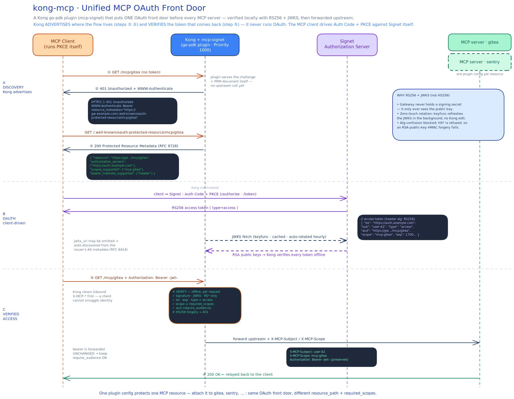
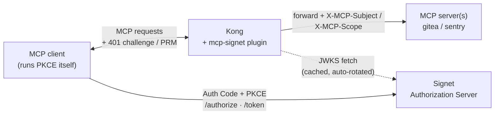
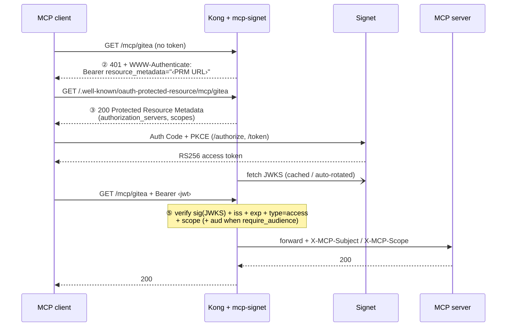

# kong-mcp — Unified MCP OAuth front door (Kong + Signet)

> 繁體中文版本請見 [README.zh-TW.md](README.zh-TW.md)

A Kong [go-pdk](https://github.com/Kong/go-pdk) plugin that puts **one OAuth
front door in front of every MCP server**. Internal MCP services already sit
behind [Kong](https://github.com/Kong/kong); this plugin makes them stop
accepting hand-written PATs and instead require an Signet-issued OAuth access
token — validated locally with **RS256 + JWKS**, then forwarded to the MCP
backend.

## Architecture at a glance



The diagram above walks the whole handshake end to end: **A · Discovery** (Kong
advertises the flow — steps ② ③), **B · OAuth** (the client drives Auth Code +
PKCE against Signet while Kong fetches the JWKS), and **C · Verified access**
(Kong verifies the RS256 token offline at step ⑤, then forwards upstream with
`X-MCP-Subject` / `X-MCP-Scope`). Editable source:
[`architecture.excalidraw`](architecture.excalidraw) — open it at
[excalidraw.com](https://excalidraw.com) to tweak. The two Mermaid diagrams
below are the lightweight, GitHub-rendered version of the same flow.



**Kong does not run the OAuth flow.** It only _advertises where the flow is_
(steps ②③) and _verifies the token that comes back_ (step ⑤). The MCP client
runs Auth Code + PKCE against Signet by itself. One plugin config covers all MCP
servers — attach it to each service with a different `resource_path`.

## The handshake

This is the MCP authorization handshake (the 2025-06 MCP spec on top of RFC 9728
Protected Resource Metadata and RFC 6750 bearer tokens). The numbers map to the
`main.go` comments:



| Step | Who               | What happens                                                                                                                                                                                |
| ---- | ----------------- | ------------------------------------------------------------------------------------------------------------------------------------------------------------------------------------------- |
| ②    | Kong → client     | Request with no/invalid token → `401` + `WWW-Authenticate: Bearer resource_metadata="<PRM URL>"`                                                                                            |
| ③    | Kong → client     | Client fetches `<PRM URL>` → plugin serves Protected Resource Metadata (which Signet, which scopes)                                                                                       |
| —    | client ↔ Signet | Client discovers Signet from the metadata and runs **Auth Code + PKCE** to get an access token                                                                                            |
| ⑤    | Kong              | Client retries with `Authorization: Bearer <jwt>` → plugin verifies **sig (JWKS) + iss + exp + `type=access` + scope** (and **aud** only when `require_audience` is on) → forwards upstream |

## Why RS256 + JWKS (not HS256)

- **No shared secret on the gateway.** With HS256 the gateway would have to hold
  Signet's signing secret — putting a forge-anything key on the edge. With
  RS256 + JWKS, Kong only ever sees the **public** key.
- **Zero-touch key rotation.** Rotate keys in Signet's JWKS; Kong picks them up
  automatically (keyfunc background refresh). No Kong config change.
- **Alg-confusion is blocked.** The plugin pins accepted algorithms to
  `RS256/RS384/RS512` and refuses `HS*`. This defeats the classic
  forgery where an attacker signs HS256 using the RSA _public_ key as the HMAC
  secret. (Validation matrix row 5, last item, tests exactly this.)

The verification engine is [`MicahParks/keyfunc`](https://github.com/MicahParks/keyfunc),
which handles JWKS fetch, in-memory cache, background rotation, and rate-limited
refetch on an unknown `kid` — the parts that are easy to get wrong by hand in Lua.

## Configuration reference

One plugin instance per MCP resource. See `kong.yml` for full examples.

| Field              | Required | Description                                                                                                                                                                                                                                                                                                                                                                                                                                                                                                                                                                |
| ------------------ | -------- | -------------------------------------------------------------------------------------------------------------------------------------------------------------------------------------------------------------------------------------------------------------------------------------------------------------------------------------------------------------------------------------------------------------------------------------------------------------------------------------------------------------------------------------------------------------------------- |
| `issuer`           | ✅       | Signet base URL. Must equal the token's `iss` claim byte-for-byte.                                                                                                                                                                                                                                                                                                                                                                                                                                                                                                       |
| `gateway_origin`   | ✅       | Externally reachable Kong origin, e.g. `https://gw.example.com`. Used to build the PRM URL.                                                                                                                                                                                                                                                                                                                                                                                                                                                                                |
| `resource_path`    | ✅       | This resource's path, e.g. `/mcp/gitea`.                                                                                                                                                                                                                                                                                                                                                                                                                                                                                                                                   |
| `jwks_uri`         |          | Signet JWKS endpoint (RS256). Accepted algs are always pinned to the RS family. Leave empty to **auto-discover** it from the issuer's AS metadata (RFC 8414 `/.well-known/oauth-authorization-server`, falling back to OIDC discovery; cached 1h, the metadata's `issuer` must match). Set it explicitly when Kong reaches Signet on a different host than clients do — e.g. `host.docker.internal` in the compose demos.                                                                                                                                              |
| `required_scopes`  |          | All listed scopes must be present in the token's `scope`, else `403 insufficient_scope`.                                                                                                                                                                                                                                                                                                                                                                                                                                                                                   |
| `audience`         |          | Expected `aud` for **token validation only**. Defaults to `gateway_origin + resource_path`. The PRM `resource` always stays the canonical URL (RFC 9728 §3.3), so set this only when Signet emits a fixed non-URL `aud`.                                                                                                                                                                                                                                                                                                                                                 |
| `require_audience` |          | Enforce `aud` only when `true`. **All shipped configs enable it** (the schema default is `false` only because go-pdk booleans default to false). Signet emits a per-resource `aud` via RFC 8707: the client sends `resource=<gateway_origin + resource_path>` on the token request, and that URL must be on the client's `allowed_resources` allowlist. The expected value is an exact, scheme/slash-sensitive match — a token minted without the matching `aud` gets `401`. Set `false` only temporarily while debugging token issuance (see the replay warning below). |
| `leeway_seconds`   |          | Clock-skew tolerance for `exp`/`nbf`. Recommend `60`. Must be ≥ 0.                                                                                                                                                                                                                                                                                                                                                                                                                                                                                                         |

Only tokens with `type=access` are accepted; Signet refresh tokens (same key,
`iss`, `aud`, and `scope`, differing only by `type` and a longer `exp`) are
rejected with `401 invalid_token`.

> go-pdk schemas can't mark fields required, so the three required fields are
> validated on the first request instead — a missing one fails every request
> with `500 server_error` and a critical log line, not a silent misbehavior.
>
> **Routing gotcha.** Each Kong route must match **both** `resource_path` and its
> PRM path (`/.well-known/oauth-protected-resource` + `resource_path`). Otherwise Kong has no route to
> hand the client's step ③ lookup to and the plugin never serves the metadata.
> See the `paths:` lists in `kong.yml`.
>
> **Cross-resource replay warning (if you disable `require_audience`).** With
> `require_audience: false`, `aud` is **not** checked, so the only thing
> distinguishing one MCP resource from another is `scope`. A token minted with
> multiple scopes (e.g. `mcp:gitea mcp:sentry`) is accepted at **every**
> resource whose scope it carries, and because the raw bearer is forwarded
> upstream unchanged, a backend that receives it can replay it against a
> sibling resource. This is why every shipped config enables `require_audience`;
> if you turn it off to debug token issuance, turn it back on before treating
> resources as isolated.

## 1. Build the plugin

go-pdk plugins are ordinary executables that speak the pluginserver RPC protocol
— no cgo, no `.so`. A full `go build` needs network access for the go-pdk
protobuf transitive deps; run it locally:

```bash
cd kong-mcp
go mod tidy && go build -o mcp-signet .
```

## 2. Wire it into Kong

Register the plugin and point the pluginserver at the binary (env vars, shown in
`docker-compose.yml`):

```bash
KONG_PLUGINS=bundled,mcp-signet
KONG_PLUGINSERVER_NAMES=mcp-signet
KONG_PLUGINSERVER_MCP_SIGNET_START_CMD=/usr/local/bin/mcp-signet
KONG_PLUGINSERVER_MCP_SIGNET_QUERY_CMD=/usr/local/bin/mcp-signet -dump
```

## 3. Run the demo stack

```bash
cd kong-mcp
docker compose up --build
```

This starts DB-less Kong (proxy on `:8000`; the unauthenticated admin API is
bound to container-loopback and not published — see `docker-compose.yml`) with
two stub MCP upstreams. Edit `kong.yml` so `issuer` / `gateway_origin` /
`jwks_uri` point at your real Signet before expecting tokens to validate.

## 4. Validation matrix

After `docker compose up`, exercise the handshake. Replace `$GW` with
`http://localhost:8000` for the demo (or your `gateway_origin`).

> Rows 1–2 work against the stub demo as shipped. Rows 3–5b need real tokens:
> point `issuer` / `jwks_uri` in `kong.yml` at an Signet first (with the
> placeholder config they fail with `503 temporarily_unavailable`, since
> `auth.example.com` has no JWKS to fetch). Because the shipped configs enforce
> `aud`, the tokens for rows 3–5a must be bound to the resource — request them
> with `resource=<gateway_origin + resource_path>` (RFC 8707). Row 5c is the exception — an HS256
> forgery is rejected with `401 invalid_token` _before_ any JWKS fetch (the alg
> is pinned first), so it returns `401` even against the placeholder config.

| #   | Test                         | Command                                                                                 | Expect                                                            |
| --- | ---------------------------- | --------------------------------------------------------------------------------------- | ----------------------------------------------------------------- |
| 1   | Unauthenticated → challenge  | `curl -i $GW/mcp/gitea`                                                                 | `401` + `WWW-Authenticate: Bearer resource_metadata="…"`          |
| 2   | PRM document served          | `curl -s $GW/.well-known/oauth-protected-resource/mcp/gitea`                            | JSON with `resource`, `authorization_servers`, `scopes_supported` |
| 3   | Valid token → forwarded      | `curl -i $GW/mcp/gitea -H "Authorization: Bearer $GOOD"`                                | `200` from the MCP upstream                                       |
| 4   | Expired token                | `curl -i $GW/mcp/gitea -H "Authorization: Bearer $EXPIRED"`                             | `401 invalid_token`                                               |
| 5a  | Missing scope                | token without `required_scopes` → `curl -i $GW/mcp/gitea -H "Authorization: Bearer $X"` | `403 insufficient_scope`                                          |
| 5b  | **Cross-audience**           | token issued for a different resource, with `require_audience: true`                    | `401 invalid_token` (aud mismatch)                                |
| 5c  | **HS256 forgery (key bits)** | forge an HS256 token using the RSA public key as the HMAC secret                        | `401 invalid_token` — **must be rejected** (alg confusion)        |

Rows **5b** and **5c** are the security-critical ones — run them before going
live.

## Signet-side preflight

Before this works end-to-end, confirm three things on Signet (decode a real
**access token**, not just the `id_token`):

1. **JWKS resolves.** `GET <issuer>/.well-known/openid-configuration` → its
   `jwks_uri` returns a non-empty `keys` array.
2. **Access tokens are RS256.** Decode an actual access token; its header `alg`
   is `RS256` (not `HS256`) and its `kid` matches a key in the JWKS. Signet's
   default is often `JWT_SECRET` (HS256) — make sure you've moved **access
   tokens** (not only `id_token`) to asymmetric signing.
3. **Issuer matches.** The token's `iss` equals the plugin's `issuer` config,
   byte-for-byte (mind the trailing slash).
4. **`aud` binds to the resource.** The shipped configs enforce `aud`, so every
   token must be requested with RFC 8707 resource binding: add
   `<gateway_origin + resource_path>` (e.g. `https://gw.example.com/mcp/gitea`)
   to the OAuth client's `allowed_resources` in Signet (an empty allowlist is
   deny-all and the token endpoint answers `invalid_target`), then send
   `resource=<that URL>` on the token request. Decode the token and confirm
   `aud` equals the plugin's expected value exactly.

## Operational notes

- **Auto-discovery adds the metadata endpoint to the availability chain.** With
  `jwks_uri` empty, the first token (and one refresh per hour) also depends on
  the issuer's AS metadata endpoint; a cold-cache discovery failure is answered
  `503` and retried on the next request, while a failed hourly refresh keeps
  serving the last discovered `jwks_uri`.
- **JWKS endpoint must be highly available.** If the **initial** fetch fails,
  token requests get `503 temporarily_unavailable` (not `401`, so clients don't
  re-run OAuth) and it is retried on the next request — a failed initial fetch is
  never cached. Fetch waits are capped at 10s and run under a per-URI lock, so a
  slow Signet can't stall traffic for other resources. Caveat: once keys are
  cached, a token whose `kid` is unknown returns `401 invalid_token` (offline
  validation can't tell "key rotated in mid-outage" from "forged kid"), and an
  hourly refresh that pulls a JWKS containing one malformed key can drop the
  cached keys until a clean refresh. Keep the JWKS valid and overlap keys
  generously during rotation.
- **Browser-based MCP clients need CORS.** A CORS preflight (`OPTIONS`, no
  `Authorization`) is answered with the `401` challenge; put Kong's `cors`
  plugin on the route if web-hosted clients must reach the gateway.
- **Overlap keys during rotation.** Keep the old and new keys in the JWKS
  together for a window so in-flight tokens aren't killed mid-rotation.
- **Keep access-token TTLs short.** Like any offline validation, a revoked token
  stays valid until its `exp` — minutes, not hours.
- **The bearer token is forwarded upstream unchanged.** Kong adds `X-MCP-Subject`
  / `X-MCP-Scope` but does **not** strip or exchange the `Authorization` header,
  so each MCP backend receives a live, replayable token. Trust your MCP backends
  accordingly, and keep `require_audience` enabled (the shipped default in every
  example config) so a backend can't reuse a token against a sibling resource —
  it can still replay it against the _same_ resource until `exp`.
