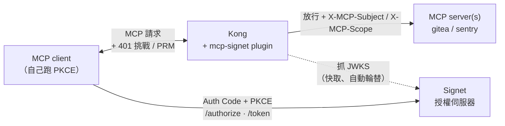
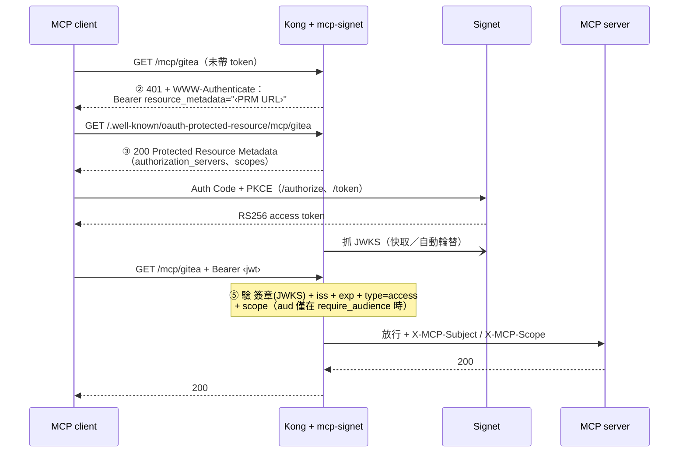

# kong-mcp — MCP 統一 OAuth 入口（Kong + Signet）

> English version: [README.md](README.md)

一個 Kong [go-pdk](https://github.com/Kong/go-pdk) plugin，在**所有 MCP server
前面架起單一的 OAuth 入口**。公司內部的 MCP 服務本來就掛在
[Kong](https://github.com/Kong/kong) 後面；這個 plugin 讓它們不再接受各自手填的
PAT，改成要求 Signet 簽發的 OAuth access token——在本地用 **RS256 + JWKS**
驗證後，再把 token 往後面的 MCP server 送。

## 架構總覽


上圖把整段握手從頭走到尾：**A · 探索（Discovery）**——Kong 告訴 client 流程在哪裡
（步驟 ② ③）；**B · OAuth**——client 自己對 Signet 跑 Auth Code + PKCE，同時 Kong
抓取 JWKS；**C · 驗證後放行（Verified access）**——Kong 在步驟 ⑤ 於本地離線驗證 RS256
token，再帶上 `X-MCP-Subject` / `X-MCP-Scope` 轉送到後端。可編輯原始檔：
[`architecture.excalidraw`](architecture.excalidraw)，到
[excalidraw.com](https://excalidraw.com) 開啟即可調整。下方兩張 Mermaid 圖是同一段
流程、可在 GitHub 直接渲染的輕量版。



**Kong 不跑 OAuth 流程。** 它只負責*告訴 client 流程在哪裡*（步驟 ②③），以及
**驗證跑完流程後拿回來的 token**（步驟 ⑤）。MCP client 自己對 Signet 跑 Auth Code + PKCE。
一套 plugin 設定就能同時罩住所有 MCP server——對每個 service 掛上去、各自填不同的
`resource_path` 即可。

## 認證握手流程

這是 MCP 的授權握手（2025-06 MCP spec，建構在 RFC 9728 Protected Resource
Metadata 與 RFC 6750 bearer token 之上）。編號對應 `main.go` 裡的註解：



| 步驟 | 由誰              | 發生什麼事                                                                                                                                                          |
| ---- | ----------------- | ------------------------------------------------------------------------------------------------------------------------------------------------------------------- |
| ②    | Kong → client     | 沒帶 / 帶錯 token 的請求 → `401` + `WWW-Authenticate: Bearer resource_metadata="<PRM URL>"`                                                                         |
| ③    | Kong → client     | client 去抓 `<PRM URL>` → plugin 回傳 Protected Resource Metadata（要用哪個 Signet、要哪些 scope）                                                                |
| —    | client ↔ Signet | client 從 metadata 找到 Signet，自己跑 **Auth Code + PKCE** 換 access token                                                                                       |
| ⑤    | Kong              | client 帶 `Authorization: Bearer <jwt>` 重試 → plugin 驗 **簽章(JWKS) + iss + exp + `type=access` + scope**（**aud** 僅在 `require_audience` 開啟時驗）→ 放行往後送 |

## 為什麼選 RS256 + JWKS（不是 HS256）

- **gateway 上不放共享密鑰。** 用 HS256 的話，gateway 得持有 Signet 的簽章密鑰
  ——等於把一把「能偽造任何 token」的鑰匙擺在最外緣。RS256 + JWKS 之下，Kong 永遠
  只摸得到**公鑰**。
- **金鑰輪替零接觸。** 在 Signet 的 JWKS 換金鑰，Kong 會自動接手（keyfunc 背景
  輪替），不用改 Kong 設定。
- **擋掉 alg-confusion。** plugin 把接受的演算法鎖死在
  `RS256/RS384/RS512`、拒絕 `HS*`。這擋掉了最經典的偽造手法：攻擊者拿 RSA **公鑰**
  當 HMAC 金鑰去簽 HS256。（驗證矩陣第 5 列最後一項就是專門測這個。）

驗證引擎是 [`MicahParks/keyfunc`](https://github.com/MicahParks/keyfunc)，它把
JWKS 的抓取、記憶體快取、背景輪替、未知 `kid` 的限流補抓全包好了——這些正是用 Lua
自己刻最容易出錯的部分。

## 設定參數

每個 MCP 資源對應一個 plugin 實例。完整範例見 `kong.yml`。

| 參數               | 必填 | 說明                                                                                                                                                                                                                                                                                                                                                                                                                                     |
| ------------------ | ---- | ---------------------------------------------------------------------------------------------------------------------------------------------------------------------------------------------------------------------------------------------------------------------------------------------------------------------------------------------------------------------------------------------------------------------------------------- |
| `issuer`           | ✅   | Signet base URL，必須與 token 的 `iss` claim 逐字元相符。                                                                                                                                                                                                                                                                                                                                                                              |
| `gateway_origin`   | ✅   | 對外可達的 Kong origin，例如 `https://gw.example.com`，用來組出 PRM URL。                                                                                                                                                                                                                                                                                                                                                                |
| `resource_path`    | ✅   | 此資源的路徑，例如 `/mcp/gitea`。                                                                                                                                                                                                                                                                                                                                                                                                        |
| `jwks_uri`         |      | Signet JWKS endpoint（RS256）。接受的演算法固定鎖在 RS 家族。留空則改由 issuer 的 AS metadata **自動發現**（RFC 8414 `/.well-known/oauth-authorization-server`，失敗時退回 OIDC discovery；快取 1 小時，metadata 的 `issuer` 必須與設定值相符）。當 Kong 連 Signet 的位址與 client 不同時（例如 compose 範例裡的 `host.docker.internal`）才需要手動指定。                                                                            |
| `required_scopes`  |      | token 的 `scope` 必須包含全部所列項目，否則 `403 insufficient_scope`。                                                                                                                                                                                                                                                                                                                                                                   |
| `audience`         |      | **只影響 token 的 `aud` 驗證**，預設為 `gateway_origin + resource_path`。PRM 的 `resource` 永遠維持 canonical URL（RFC 9728 §3.3），只有在 Signet 發固定的非 URL `aud` 時才需要設。                                                                                                                                                                                                                                                    |
| `require_audience` |      | 設 `true` 才強制檢查 `aud`。**所有隨附設定檔都已開啟**（schema 預設為 `false` 只是因為 go-pdk 的布林零值）。Signet 透過 RFC 8707 發出 per-resource `aud`：client 在 token 請求帶 `resource=<gateway_origin + resource_path>`，且該 URL 必須在 client 的 `allowed_resources` 白名單內。比對值是逐字元、區分 scheme／斜線的精確比對——沒綁定相符 `aud` 的 token 一律 `401`。只有在除錯 token 簽發時才暫時設回 `false`（見下方重放警告）。 |
| `leeway_seconds`   |      | `exp`/`nbf` 的時鐘偏移容忍秒數，建議 `60`。必須 ≥ 0。                                                                                                                                                                                                                                                                                                                                                                                    |

只接受 `type=access` 的 token；Signet 的 refresh token（金鑰、`iss`、`aud`、
`scope` 都相同，只有 `type` 與較長的 `exp` 不同）會被回 `401 invalid_token` 拒絕。

> go-pdk 產生的 schema 無法標記必填欄位，所以三個必填欄位改在第一個請求時驗證——
> 缺欄位時所有請求都會回 `500 server_error` 並寫一行 critical log，而不是默默地
> 行為異常。
>
> **路由陷阱。** 每條 Kong route 必須**同時**匹配 `resource_path` 與其 PRM 路徑
> （`/.well-known/oauth-protected-resource` + `resource_path`）。否則 client 在步驟 ③ 來抓 metadata 時
> Kong 沒有對應 route 可交給 plugin，plugin 就不會回傳 metadata。請看 `kong.yml`
> 裡每條 route 的 `paths:` 清單。
>
> **跨資源重放警告（若你關掉 `require_audience`）。** 在 `require_audience: false`
> 下不會檢查 `aud`，所以區分不同 MCP 資源的只剩 `scope`。一顆帶多個 scope 的 token
> （例如 `mcp:gitea mcp:sentry`）會在**每個**它帶有對應 scope 的資源上都被接受；
> 又因為原始 bearer 會原封不動往後送，收到它的後端可以拿去重放到另一個資源。
> 這正是所有隨附設定檔都開啟 `require_audience` 的原因；若為了除錯 token 簽發而
> 暫時關掉，把資源視為彼此隔離之前務必改回來。

## 1. 編譯 plugin

go-pdk plugin 是會講 pluginserver RPC 協定的一般執行檔——不用 cgo、也不是 `.so`。
完整 `go build` 需要網路（go-pdk 的 protobuf 相依），請在本機跑：

```bash
cd kong-mcp
go mod tidy && go build -o mcp-signet .
```

## 2. 接進 Kong

註冊 plugin，並把 pluginserver 指向 binary（環境變數，見 `docker-compose.yml`）：

```bash
KONG_PLUGINS=bundled,mcp-signet
KONG_PLUGINSERVER_NAMES=mcp-signet
KONG_PLUGINSERVER_MCP_SIGNET_START_CMD=/usr/local/bin/mcp-signet
KONG_PLUGINSERVER_MCP_SIGNET_QUERY_CMD=/usr/local/bin/mcp-signet -dump
```

## 3. 啟動示範環境

```bash
cd kong-mcp
docker compose up --build
```

這會啟動 DB-less 的 Kong（proxy 在 `:8000`；未認證的 admin API 綁在 container 的
loopback、不對外發布——見 `docker-compose.yml`）加兩個假的 MCP upstream。在期待
token 能通過驗證之前，請先改 `kong.yml` 讓 `issuer` / `gateway_origin` /
`jwks_uri` 指向你們真正的 Signet。

## 4. 驗證矩陣

`docker compose up` 後實際跑一遍握手。示範環境把 `$GW` 換成
`http://localhost:8000`（或你的 `gateway_origin`）。

> 第 1–2 列用內建的 stub demo 就能跑。第 3–5b 列需要真的 token：先把 `kong.yml`
> 的 `issuer` / `jwks_uri` 指向 Signet（用預設的 placeholder 設定會回
> `503 temporarily_unavailable`，因為 `auth.example.com` 抓不到 JWKS）。隨附設定
> 都強制檢查 `aud`，所以第 3–5a 列的 token 必須綁定資源——取 token 時帶
> `resource=<gateway_origin + resource_path>`（RFC 8707）。第 5c 列是
> 例外——HS256 偽造會在抓 JWKS **之前** 就先被擋（演算法先被鎖定），回
> `401 invalid_token`，所以即使用 placeholder 設定也是 `401`。

| #   | 測試項目                   | 指令                                                                                    | 預期結果                                                        |
| --- | -------------------------- | --------------------------------------------------------------------------------------- | --------------------------------------------------------------- |
| 1   | 未認證 → 挑戰              | `curl -i $GW/mcp/gitea`                                                                 | `401` + `WWW-Authenticate: Bearer resource_metadata="…"`        |
| 2   | 回傳 PRM 文件              | `curl -s $GW/.well-known/oauth-protected-resource/mcp/gitea`                            | JSON 含 `resource`、`authorization_servers`、`scopes_supported` |
| 3   | 有效 token → 放行          | `curl -i $GW/mcp/gitea -H "Authorization: Bearer $GOOD"`                                | MCP upstream 回 `200`                                           |
| 4   | 過期 token                 | `curl -i $GW/mcp/gitea -H "Authorization: Bearer $EXPIRED"`                             | `401 invalid_token`                                             |
| 5a  | 缺少 scope                 | 沒有 `required_scopes` 的 token → `curl -i $GW/mcp/gitea -H "Authorization: Bearer $X"` | `403 insufficient_scope`                                        |
| 5b  | **跨 audience**            | 為另一個資源簽發的 token，且 `require_audience: true`                                   | `401 invalid_token`（aud 不符）                                 |
| 5c  | **HS256 偽造（金鑰位元）** | 拿 RSA 公鑰當 HMAC 金鑰偽造一顆 HS256 token                                             | `401 invalid_token` — **必須被擋**（alg confusion）             |

第 **5b** 與 **5c** 列是安全關鍵——上線前務必跑過。

## Signet 端動手前確認

要端到端跑通之前，先在 Signet 確認三件事（解一顆實際的 **access token**，不是只看
`id_token`）：

1. **JWKS 取得出 keys。** `GET <issuer>/.well-known/openid-configuration` →
   其 `jwks_uri` 回傳非空的 `keys` 陣列。
2. **access token 是 RS256 簽。** 解一顆實際的 access token，header 的 `alg` 是
   `RS256`（不是 `HS256`），且 `kid` 對得到 JWKS 裡某把 key。Signet 預設常是
   `JWT_SECRET`（HS256）——請確認你們真的已經把 **access token**（不只 `id_token`）
   切到非對稱簽。
3. **iss 一致。** token 的 `iss` 與 plugin 設定的 `issuer` 逐字元相符（注意結尾斜線）。
4. **`aud` 綁定資源。** 隨附設定都強制檢查 `aud`，所以每顆 token 都要用 RFC 8707
   resource binding 取得：先在 Signet 把 `<gateway_origin + resource_path>`
   （例如 `https://gw.example.com/mcp/gitea`）加進該 OAuth client 的
   `allowed_resources`（空白名單 = 全拒，token endpoint 會回 `invalid_target`），
   再於 token 請求帶 `resource=<該 URL>`。解碼 token 確認 `aud` 與 plugin 的
   預期值完全一致。

## 維運注意事項

- **自動發現會把 metadata endpoint 也納入可用性鏈。** `jwks_uri` 留空時，第一顆
  token（以及每小時一次的更新）還會多依賴 issuer 的 AS metadata endpoint；冷快取
  下發現失敗回 `503`、下一個請求重試，而每小時更新失敗則沿用上次發現的
  `jwks_uri`，不影響線上流量。
- **JWKS endpoint 要高可用。** **初次**抓取失敗時，帶 token 的請求會回
  `503 temporarily_unavailable`（不是 `401`，client 不會誤以為要重跑 OAuth），
  下一個請求會重試——初次抓失敗的結果不會被快取。抓取等待上限 10 秒，且在 per-URI
  鎖下進行，慢的 Signet 不會卡住其他資源的流量。注意：key 一旦進了快取，帶未知
  `kid` 的 token 會回 `401 invalid_token`（離線驗證分不出「輪替期間剛換上的 key」與
  「偽造的 kid」），而且每小時的更新若抓到含一把壞 key 的 JWKS，可能把已快取的 key
  清掉直到下一次乾淨的更新。輪替時請保持 JWKS 有效，並讓新舊 key 充分並存。
- **瀏覽器端的 MCP client 需要 CORS。** CORS preflight（`OPTIONS`、不帶
  `Authorization`）會被回 `401` 挑戰；若有 web client 要直連 gateway，請在
  route 上掛 Kong 的 `cors` plugin。
- **輪替時讓新舊 key 並存。** 讓舊 key 與新 key 在 JWKS 並存一段 overlap 時間，
  在途 token 才不會被誤殺。
- **access token TTL 設短。** 跟所有離線驗證一樣，被撤銷的 token 會一直有效到它的
  `exp`——以分鐘計、不要以小時計。
- **bearer token 會原封不動往後送。** Kong 會加上 `X-MCP-Subject` / `X-MCP-Scope`，
  但**不會**移除或換掉 `Authorization` header，所以每個 MCP 後端都會拿到一顆可重放的
  有效 token。請據此信任你的 MCP 後端，並維持 `require_audience` 開啟（所有範例
  設定的出廠值），讓後端無法拿 token 去重放到另一個資源——但對**同一個**資源仍可
  重放到 `exp` 為止。
