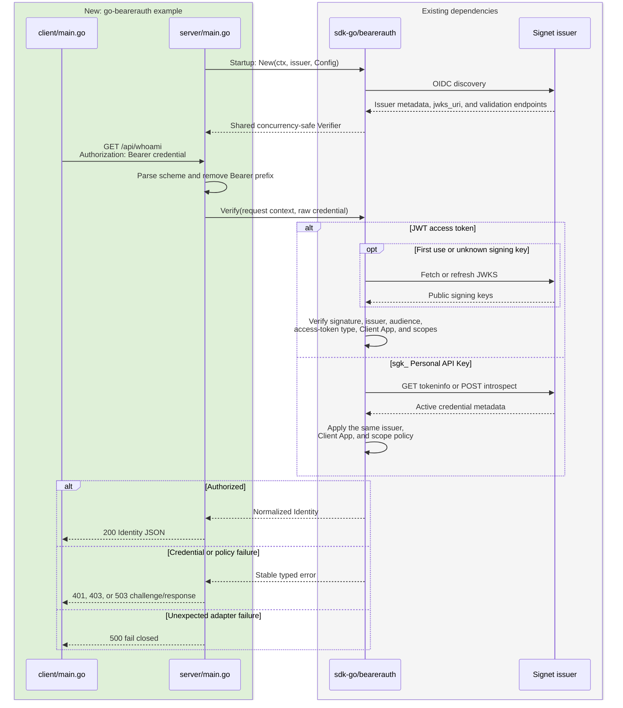

# Plan: `go-bearerauth` 完整 Client/Server 範例

## Goal

為採用 Signet 的 Go 開發者新增一個可直接執行的 `go-bearerauth/` 範例，
示範如何由 HTTP client 傳送 Bearer credential，以及 resource server 如何使用
`github.com/go-signet/sdk-go/bearerauth` 在同一路由接受 JWT access token 或完整的
`sgk_…` Personal API Key。完成後，使用者應能依 README 設定 Signet issuer、
audience、Client App 與 scopes，啟動 server、以 client 或 `curl` 測試兩種成功
流程，並理解缺少／無效 credential、scope 不足及驗證服務不可用時的 HTTP 回應。

## Architecture / flow

綠色區塊是本計畫新增的範例；灰色區塊是既有 SDK 與外部 Signet server。



## Scope

### May modify

- `plan.md`
- `README.md`
- `go-bearerauth/.env.example`
- `go-bearerauth/README.md`
- `go-bearerauth/go.mod`
- `go-bearerauth/go.sum`
- `go-bearerauth/client/main.go`
- `go-bearerauth/client/main_test.go`
- `go-bearerauth/server/main.go`
- `go-bearerauth/server/main_test.go`

### Must not modify

- `../sdk-go/**`
- Existing example directories such as `go-webservice/`, `go-jwks/`, and
  `go-m2m/`
- `.github/**`
- `.goreleaser.yaml`
- `.gitignore`
- Any `go.work` file or workspace-level Go module configuration

## Existing patterns to follow

- Mirror `go-webservice/` for:
  - Standard-library `net/http` routing
  - `.env` loading through `github.com/joho/godotenv`
  - Startup environment validation
  - JSON response helpers
  - HTTP server timeouts and bounded request headers
- Mirror `go-jwks/` for:
  - Secure-by-default audience configuration
  - A documented `.env.example`
  - Resource-server flow explanations, Mermaid documentation, and concrete
    success/error requests
- Mirror `go-m2m/` for:
  - A small executable HTTP client
  - Bounded response-body reads and explicit response status output
- Follow the SDK's `bearerauth` examples for:
  - Constructing one verifier at startup and sharing it
  - Passing only the credential value after `Bearer ` to `Verify`
  - Mapping the five stable error categories to HTTP responses
  - Returning the normalized `Identity` without exposing raw credentials

## Implementation outline

### Module and configuration

- Create the independent module
  `github.com/go-signet/examples/go-bearerauth`.
- Use Go `1.25.10`.
- Pin `github.com/go-signet/sdk-go v1.1.0` directly from GitHub.
- Do not add a local `replace` directive.
- Use `github.com/joho/godotenv v1.5.1` consistently with the other examples.
- Document and load these settings:
  - `SIGNET_URL`: required issuer URL.
  - `CLIENT_ID`: required Client App accepted by the shared policy.
  - `EXPECTED_AUDIENCE`: required JWT audience unless audience checking is
    explicitly disabled.
  - `SKIP_AUDIENCE_CHECK`: optional, secure default `false`; accepting any
    audience requires the explicit value `1`.
  - `REQUIRED_SCOPES`: optional whitespace-separated all-of scope policy.
  - `INTROSPECTION_CLIENT_ID` and `INTROSPECTION_CLIENT_SECRET`: optional
    all-or-nothing pair. When absent, Personal API Keys use tokeninfo; when
    both are present, they use introspection.
  - `SERVER_ADDR`: optional server address, default `:8080`.
  - `API_URL`: optional client target, default
    `http://localhost:8080/api/whoami`.
  - `BEARER_TOKEN`: required by the client; may contain either a JWT access
    token or one complete `sgk_…` key.
- Keep real tokens and secrets out of `.env.example`, source, responses, and
  logs. The repository's existing `*.env` ignore rule protects a local
  `.env`, but the README must still warn that a Personal API Key is revealed
  only once and must be stored securely.

### Server

- Load and validate configuration before listening.
- Reject a missing audience unless `SKIP_AUDIENCE_CHECK=1`.
- Reject a half-configured introspection credential pair at startup.
- Build `bearerauth.Verifier` once with `bearerauth.New` and reuse it across
  requests.
- Provide:
  - `GET /health`: unauthenticated JSON health response.
  - `GET /api/whoami`: protected endpoint returning the normalized fields
    `subject`, `subject_type`, `issuer`, `client_id`, `scopes`, `expires_at`,
    and `credential_type`.
- Implement a small framework adapter around a narrow
  `Verify(context.Context, string) (*bearerauth.Identity, error)` interface so
  HTTP behavior can be tested without a live Signet instance.
- Parse `Authorization` as a case-insensitive Bearer scheme, remove the scheme,
  trim surrounding whitespace, and reject a missing/empty credential before
  calling the SDK.
- Store a successful `Identity` in a private typed context key before invoking
  the protected handler.
- Configure header/read/write/idle timeouts and a small `MaxHeaderBytes`, using
  the existing resource-server examples as the baseline.
- Shut down gracefully on process cancellation or termination.
- Log only startup/shutdown events and a credential-free failure category;
  never log the Authorization header, token, Personal API Key, or client
  secret.

HTTP mapping:

| Condition | Status | `WWW-Authenticate` behavior |
| --- | ---: | --- |
| Missing or malformed Authorization header | 401 | `Bearer` |
| `ErrInvalidCredential`, `ErrUntrustedIssuer`, or `ErrClientAppNotAllowed` | 401 | `Bearer error="invalid_token"` |
| `ErrInsufficientScope` | 403 | `Bearer error="insufficient_scope", scope="<missing>"` |
| `ErrVerifierUnavailable` | 503 | No re-authentication challenge |
| Any unexpected error or missing middleware identity | 500 | Fail closed |

### Client

- Read `API_URL` and `BEARER_TOKEN` from the environment or local `.env`.
- Build a bounded-timeout GET request and set
  `Authorization: Bearer <BEARER_TOKEN>`.
- Never print the token.
- Print the HTTP status, `WWW-Authenticate` header when present, and a response
  body capped at 1 MiB.
- Treat transport failures and non-2xx responses as non-zero process results
  after showing the safe response details.
- Keep the request-building and execution path testable with `httptest.Server`.

### Documentation

`go-bearerauth/README.md` will include:

- What `bearerauth` does and does not do.
- Prerequisites and exact environment-variable reference.
- Signet preparation:
  - Configure the trusted Client App, audience, and scopes.
  - Obtain a JWT through a supported OAuth flow.
  - Create a Personal API Key at `/account/api-keys`, bind it to the same
    Client App, and save the one-time plaintext securely.
- Setup with `.env.example`.
- Separate terminals/commands for server and client.
- Equivalent `curl` commands.
- JWT success and `sgk_…` success responses from the same endpoint.
- Missing header, malformed/invalid credential, insufficient scope, and
  verifier-unavailable behavior.
- Default tokeninfo mode and optional introspection mode, including the
  requirement that introspection credentials normally belong to the same
  Client App that owns the Personal API Key.
- Why JWT verification is offline after key discovery while every Personal API
  Key request needs an online verdict.
- Security, troubleshooting, and credential-rotation notes.

The root `README.md` will add `go-bearerauth` to Quick Reference and add a short
section distinguishing it from the legacy all-online `go-webservice` and the
JWT-only `go-jwks` example.

## Constraints

- The example must compile against the released GitHub module
  `github.com/go-signet/sdk-go v1.1.0`.
- No dependency on the sibling `../sdk-go` checkout.
- No SDK source changes and no copied SDK internals.
- One immutable verifier per policy, constructed at startup rather than per
  request.
- The same issuer, Client App, and required-scope policy applies to both JWT
  and Personal API Key identities.
- Personal API Key tokeninfo/introspection calls remain online and are never
  presented as offline validation.
- Configuration errors fail at startup; request errors fail closed.
- No credential material appears in logs, error bodies, test failure messages,
  or checked-in fixtures.
- Production metrics and a repository-wide CI redesign are outside this
  example's scope.

## Verification

### Automated user-observable tests

1. Happy path:
   - Run the real client request code against an `httptest` API and verify its
     outbound method, path, and Authorization header.
   - Exercise the real server adapter separately with a fake verifier so no
     live Signet instance is required.
   - A JWT identity and a Personal API Key identity both receive `200`.
   - Both responses expose the same normalized Identity shape, with
     `credential_type` set to `jwt` and `personal_api_key` respectively.
   - The fake verifier receives only the raw credential, never the `Bearer `
     prefix.
2. Credential rejection:
   - Missing/malformed Authorization returns `401` plus
     `WWW-Authenticate: Bearer`.
   - `ErrInvalidCredential` returns `401` plus
     `Bearer error="invalid_token"`.
   - The response and captured logs contain no presented credential.
3. Policy rejection:
   - A typed `InsufficientScopeError` returns `403`.
   - The challenge contains `error="insufficient_scope"` and the stable missing
     scope.

Additional adapter tests:

- `ErrUntrustedIssuer` and `ErrClientAppNotAllowed` map to `401`.
- `ErrVerifierUnavailable` maps to `503`.
- An unexpected error and a missing context identity map to `500`.
- Header parsing accepts case-insensitive `Bearer` and rejects other schemes.
- Client output surfaces status/challenge/body without echoing the token.
- The production client refuses redirects before they can receive the
  Authorization header.
- Concurrent protected requests safely reuse one verifier/adapter under the
  race detector.

### Build and static verification

Run inside `go-bearerauth/`:

```bash
go mod tidy
go mod verify
gofmt -w client/*.go server/*.go
go vet ./...
go test -race ./...
go build ./...
```

Run from the repository root:

```bash
git diff --check
```

### Manual verification with a real Signet instance

1. Copy `.env.example` to `.env`, fill in issuer/policy values, and start
   `go run ./server`.
2. Confirm `GET /health` returns `200`.
3. Set `BEARER_TOKEN` to a matching JWT access token and run
   `go run ./client`; confirm `200` with `credential_type: "jwt"`.
4. Set `BEARER_TOKEN` to a complete matching Personal API Key and run the same
   client; confirm `200` with `credential_type: "personal_api_key"`.
5. Run the documented missing-header, invalid-credential, and missing-scope
   requests and compare status/challenge fields with the mapping table.
6. Optionally configure both introspection variables, restart the server, and
   repeat the Personal API Key request.

No separate soak test is required for this example. `go test -race` and the
handler tests cover safe reuse of the adapter; the SDK's released verifier is
documented as immutable and concurrency-safe.

### Observability

- Startup log identifies the listen address and selected Personal API Key mode
  (`tokeninfo` or `introspection`) without printing endpoint credentials.
- Request failures are logged by stable category and HTTP status only.
- The example emits no metrics; the README calls this out for production
  adopters.

## Done definition

- [x] `go-bearerauth/` contains runnable client and server programs, detailed
      README, `.env.example`, and an independent Go module.
- [x] `go.mod` pins `github.com/go-signet/sdk-go v1.1.0` and contains no
      `replace` directive.
- [x] One protected endpoint accepts both supported credential kinds under the
      same policy.
- [x] All documented HTTP error mappings are implemented and tested.
- [x] Client/server tests, race detector, vet, module verification, build, and
      `git diff --check` pass.
- [x] Root `README.md` links to and distinguishes the new example.
- [x] Manual real-Signet commands and expected responses are detailed enough
      to run without reading SDK source.
- [x] No changes exist outside the “May modify” list.

## Risks & rollback

- Risk: A byte-for-byte mismatch in issuer, Client App, audience, or scope
  configuration can look like a rejected credential.
  - Mitigation: fail early on local configuration errors and document each
    policy field with concrete troubleshooting guidance.
- Risk: Personal API Key verification depends on Signet availability and rate
  limits even though JWT verification is offline.
  - Mitigation: preserve `ErrVerifierUnavailable` as `503`, never mislabel it
    as a bad credential, and document retry behavior.
- Risk: Introspection by a Client App that does not own the Personal API Key
  may return incomplete metadata and fail closed.
  - Mitigation: document the ownership requirement next to the optional
    introspection settings.
- Risk: A copied Personal API Key may leak through shell history, logs, or
  fixtures.
  - Mitigation: use environment variables, redact all program output, keep
    `.env` ignored, and commit only placeholders.
- Risk: Future SDK releases may change behavior.
  - Mitigation: pin v1.1.0 so the example and its documentation stay
    reproducible.
- Rollback: remove `go-bearerauth/` and revert the corresponding root
  `README.md` and `plan.md` additions. No SDK, CI, or shared Go workspace state
  is changed.

## Open questions

- None. The user approved the client/server structure, file scope, released
  GitHub dependency, and verification strategy.
